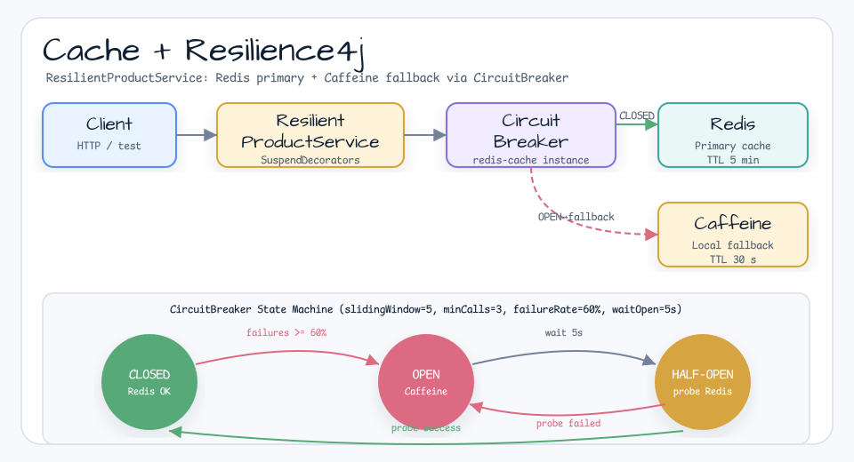

# Spring Boot Cache Resilience

[English](README.md) | 한국어

## 예제 시나리오

이 예제는 **Spring Boot Cache Resilience** 모듈을 실행 가능한 Spring Boot 애플리케이션 기능 예제로 보여줍니다. 개발자가 먼저 확인할 경로인 모듈 설정, 샘플 또는 테스트 실행, 반복적인 인프라 코드를 줄이는 라이브러리 또는 프레임워크 API 사용 방식을 중심으로 설명합니다.

## 흐름 다이어그램

1. `spring-boot-cache-resilience` 예제에 필요한 로컬 런타임을 준비합니다.
2. 예제 시나리오를 담당하는 애플리케이션, 컨트롤러, 서비스 또는 테스트 픽스처를 실행합니다.
3. 반복적인 인프라 처리는 bluetape4k 유틸리티 또는 Spring/Kotlin 통합 기능에 위임합니다.
4. 샘플 출력, HTTP 응답, 저장소 상태, metric, trace 또는 테스트 기대값으로 결과를 검증합니다.

## 시퀀스 다이어그램

핵심 시퀀스는 호출자 또는 테스트 픽스처 -> 워크샵 어댑터 -> bluetape4k 헬퍼/API -> 외부 런타임 또는 인메모리 백엔드 -> 검증/응답 순서입니다. 전용 시퀀스 이미지가 있는 모듈은 아래 이미지가 상호작용 순서를 보여주며, 없는 경우 소스 테스트가 실행 가능한 시퀀스의 기준입니다.

Resilience4j CircuitBreaker를 사용한 Redis 기본 캐시 + Caffeine 로컬 폴백 패턴입니다.
Toxiproxy로 실제 네트워크 장애를 주입해 CircuitBreaker 상태 머신(`CLOSED → OPEN → HALF-OPEN → CLOSED`) 전체를 검증합니다.

## 아키텍처


요청 흐름, CircuitBreaker 상태 머신(CLOSED → OPEN → HALF-OPEN → CLOSED),
통합 테스트에서 사용하는 ToxiproxyServer 카오스 주입을 다이어그램으로 확인할 수 있습니다.



## 이 모듈에서 확인할 내용

- `ResilientProductService`: `SuspendDecorators.ofSupplier { }.withCircuitBreaker(cb).withFallback { ... }`로 Redis 읽기를 래핑.
- CB 전체 상태 머신: CLOSED → OPEN (Redis 장애) → HALF-OPEN (프로브) → CLOSED (복구).
- `bluetape4k-testcontainers`의 `ToxiproxyServer`: `timeout(1ms)` toxic으로 Redis 연결을 빠르게 차단 주입.
- OPEN 상태에서 폴백 저장소로 사용하는 Caffeine 로컬 캐시.
- 복구 테스트: toxic 제거 → CB가 CLOSED로 전환 → Redis 재개.

## 실행

```bash
./gradlew :spring-boot-cache-resilience:bootRun
```

실행 후 다음 주소를 확인합니다.

- Swagger UI: `http://localhost:8090/swagger-ui.html`
- Actuator health (CB 상태 포함): `http://localhost:8090/actuator/health`
- CB 이벤트: `http://localhost:8090/actuator/circuitbreakerevents`

## 테스트 실행

```bash
./gradlew :spring-boot-cache-resilience:test
```

테스트는 Docker 컨테이너(Redis + Toxiproxy)를 시작하고, 장애를 주입하며, 모킹 없이 CB 상태 머신 전체를 검증합니다.

## 사용된 Bluetape4k 기능

| 모듈 | 기능 | 사용 위치 |
|------|------|---------|
| `bluetape4k-logging` | `KLoggingChannel()` | 서비스와 테스트의 코루틴 안전 구조화 로깅 |
| `bluetape4k-resilience4j` | `SuspendDecorators` | suspend 함수를 위한 프로그래매틱 CB + 폴백 체인 |
| `bluetape4k-testcontainers` | `ToxiproxyServer`, `RedisServer` | 통합 테스트에서 실제 네트워크 장애 주입 |
| `bluetape4k-junit5` | `runSuspendIO { }` | suspend 기반 통합 테스트 실행기 |

## 소스 맵

- `CacheResilienceApplication.kt`는 Spring Boot 애플리케이션을 시작합니다.
- `config/ResilientCacheConfig.kt`는 Lettuce, Caffeine 캐시, CircuitBreaker 빈을 설정합니다.
- `service/ResilientProductService.kt`는 `SuspendDecorators`를 사용한 Redis → CB → Caffeine 폴백 패턴을 구현합니다.
- `application.yml`은 `8090` 포트, actuator CB health, Resilience4j 인스턴스 설정을 구성합니다.
- `ResilientCacheServiceTest.kt`는 `ToxiproxyServer` + `RedisServer`로 CLOSED→OPEN→HALF-OPEN→CLOSED 전환을 검증합니다.
