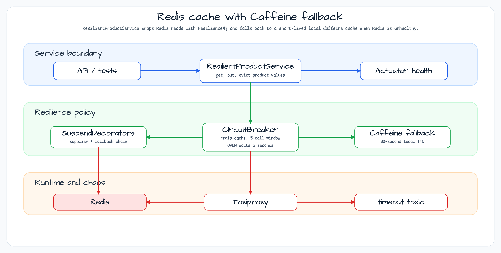
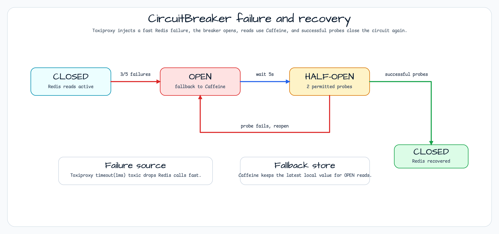

# Spring Boot Cache Resilience

[한국어](README.ko.md) | English

This module demonstrates a resilient cache read path:

- Redis is the primary cache.
- Caffeine is the local fallback cache.
- Resilience4j CircuitBreaker protects Redis reads.
- Toxiproxy injects real Redis network failures in integration tests.

## Architecture



`ResilientProductService` wraps Redis reads with `SuspendDecorators` and a `redis-cache` CircuitBreaker. Writes update Caffeine first and then attempt Redis, so the process keeps a usable fallback value even when Redis is unhealthy.

## CircuitBreaker Flow



The integration test drives the full state machine: healthy Redis keeps the breaker `CLOSED`, injected timeouts push it `OPEN`, the service falls back to Caffeine, and successful probes after the wait duration close the breaker again.

## What This Module Shows

- `ResilientProductService`: Redis read wrapped in `SuspendDecorators.ofSupplier { }.withCircuitBreaker(cb).withFallback { ... }`.
- Full CB state machine: CLOSED → OPEN (Redis failure) → HALF-OPEN (probe) → CLOSED (recovered).
- `ToxiproxyServer` from `bluetape4k-testcontainers`: inject `timeout(1ms)` toxic to drop Redis connections fast.
- Caffeine local cache as fallback store during OPEN state.
- Recovery test: remove toxic → CB transitions to CLOSED → Redis resumes.

## Running

```bash
./gradlew :spring-boot-cache-resilience:bootRun
```

Then open:

- Swagger UI: `http://localhost:8090/swagger-ui.html`
- Actuator health (shows CB state): `http://localhost:8090/actuator/health`
- Actuator CircuitBreaker events: `http://localhost:8090/actuator/circuitbreakerevents`

## Running Tests

```bash
./gradlew :spring-boot-cache-resilience:test
```

Tests start Docker containers (Redis + Toxiproxy), inject failures, and verify the full
circuit breaker state machine without mocking.

## Used Bluetape4k Features

| Module | Feature | Usage |
|--------|---------|-------|
| `bluetape4k-logging` | `KLoggingChannel()` | Coroutine-aware structured logging in service and test |
| `bluetape4k-resilience4j` | `SuspendDecorators` | Programmatic CB + fallback chain for suspend functions |
| `bluetape4k-testcontainers` | `ToxiproxyServer`, `RedisServer` | Real network failure injection in integration tests |
| `bluetape4k-junit5` | `runSuspendIO { }` | Suspend-based integration test runner |

## Source Map

- `CacheResilienceApplication.kt` starts the Spring Boot application.
- `config/ResilientCacheConfig.kt` configures Lettuce, Caffeine cache, and CircuitBreaker bean.
- `service/ResilientProductService.kt` implements Redis → CB → Caffeine fallback pattern with `SuspendDecorators`.
- `application.yml` sets port `8090`, actuator CB health, and Resilience4j instance config.
- `ResilientCacheServiceTest.kt` uses `ToxiproxyServer` + `RedisServer` to verify CLOSED→OPEN→HALF-OPEN→CLOSED transitions.
