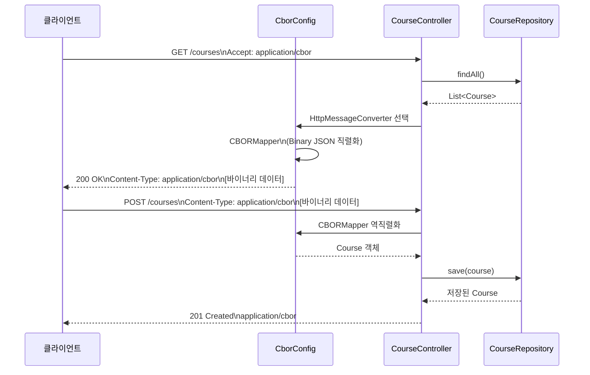

# CBOR in Spring Boot MVC

REST API 통신 프로토콜을 일반적인 JSON이 아닌 Binary JSON 포맷의 일종인 CBOR (Concise Binary Object Representation)로 사용하는 방법을 알아보자.

## CBOR 직렬화 흐름



## CBOR 개념

**CBOR (Concise Binary Object Representation)** 는 RFC 7049로 표준화된 바이너리 JSON 포맷입니다.

| 특성 | JSON | CBOR |
|------|------|------|
| 포맷 | 텍스트 (UTF-8) | 바이너리 |
| 페이로드 크기 | 상대적으로 큼 | 20~50% 절감 |
| 파싱 속도 | 보통 | 빠름 (바이너리 직접 파싱) |
| Content-Type | `application/json` | `application/cbor` |
| 사람이 읽기 | 가능 | 불가 (디코더 필요) |

Jackson의 `CBORMapper`를 사용하며, Spring MVC의 `HttpMessageConverter` 체계에 `JacksonCborHttpMessageConverter`를 등록하면 기존 JSON 컨트롤러와 동일한 코드로 CBOR를 지원합니다.

## 도메인 모델

```
Course
├── id: Int
├── name: String
└── students: List<Student>
        ├── id: Int
        ├── firstName / lastName: String
        ├── email: String
        └── phones: List<Phone>
                ├── number: String
                └── type: PhoneType (MOBILE | LANDLINE)
```

## 주요 기능

| 기능 | 구현 위치 | 설명 |
|------|----------|------|
| CBOR 컨버터 등록 | `CborConfig` | `JacksonCborHttpMessageConverter` 빈 등록 + `WebMvcConfigurer` |
| 과목 조회 | `CourseController.course()` | `GET /courses/{id}` — CBOR 직렬화 응답 |
| 인메모리 저장소 | `CourseRepository` | `Map<Int, Course>` 기반 간단 저장소 |

## API 엔드포인트

| 메서드 | 경로 | 설명 | Content-Type |
|--------|------|------|-------------|
| `GET` | `/courses/{id}` | 특정 과목 조회 | `application/cbor` |

## 사용 예제

### CBOR 요청 (curl)

```bash
# CBOR 응답 수신 (바이너리 — 파일로 저장)
curl -H "Accept: application/cbor" http://localhost:8080/courses/1 -o course.cbor

# JSON 응답 수신 (Accept 헤더 미지정 시 JSON 폴백)
curl http://localhost:8080/courses/1
```

### 테스트 코드에서 CBOR TestRestTemplate 사용

```kotlin
@SpringBootTest(webEnvironment = SpringBootTest.WebEnvironment.RANDOM_PORT)
class CborApplicationTest {

    @Autowired
    lateinit var restTemplate: TestRestTemplate

    @Test
    fun `get course as cbor`() {
        val headers = HttpHeaders().apply {
            accept = listOf(MediaType("application", "cbor"))
        }
        val response = restTemplate.exchange(
            "/courses/1",
            HttpMethod.GET,
            HttpEntity<Any>(headers),
            Course::class.java
        )
        response.statusCode shouldBe HttpStatus.OK
    }
}
```

## 설정

### `cbor` 프로파일 활성화

`JacksonCborHttpMessageConverter`는 `@Profile("cbor")`로 조건부 등록됩니다.

```yaml
# application.yml
spring:
  profiles:
    active: cbor
```
