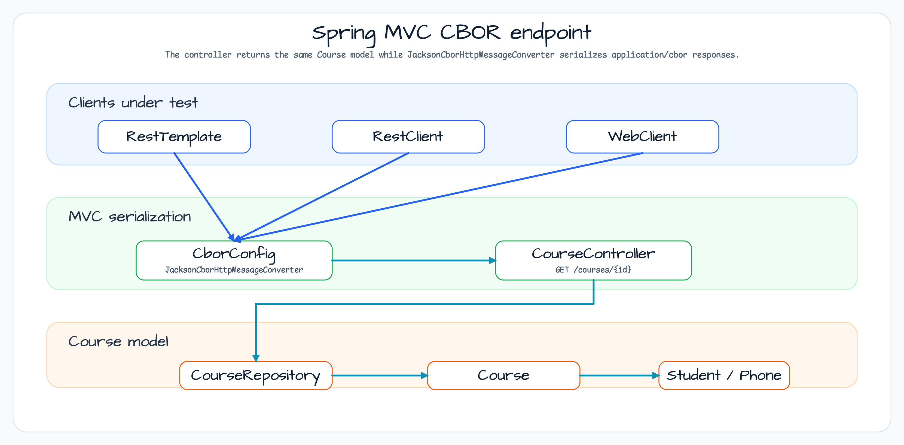
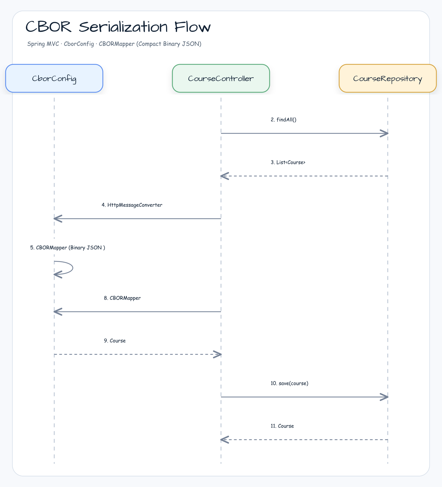

# CBOR in Spring Boot MVC

[한국어](README.ko.md) | English

This module shows Spring MVC returning `Course` resources as CBOR (`application/cbor`) instead of JSON. The controller code stays ordinary; the important piece is registering `JacksonCborHttpMessageConverter` in the MVC message converter chain.

## Architecture



`CborConfig` registers the CBOR converter and seeds an in-memory `CourseRepository`. The tests exercise the endpoint with `RestTemplate`, `RestClient`, and `WebClient`, each configured with CBOR encoder/decoder support.

## Request Flow



This example shows how to use CBOR (Concise Binary Object Representation), a binary JSON format, as the REST API communication format instead of regular JSON.

## CBOR Concepts

**CBOR (Concise Binary Object Representation)** is a binary JSON format standardized by RFC 7049.

| Feature | JSON | CBOR |
|------|------|------|
| Format | Text (UTF-8) | Binary |
| Payload size | Relatively large | 20-50% smaller |
| Parsing speed | Moderate | Fast (direct binary parsing) |
| Content-Type | `application/json` | `application/cbor` |
| Human-readable | Yes | No (requires a decoder) |

It uses Jackson's `CBORMapper`. Registering `JacksonCborHttpMessageConverter` in Spring MVC's `HttpMessageConverter` system enables CBOR support with the same controller code used for JSON.

## Domain Model

```
Course
├── id: Int
├── name: String
└── students: List<Student>
        ├── id: Int
        ├── firstName / lastName: String
        ├── email: String
        └── phones: List<Phone>
                ├── number: String
                └── type: PhoneType (MOBILE | LANDLINE)
```

## Key Features

| Feature | Implementation Location | Description |
|------|----------|------|
| CBOR converter registration | `CborConfig` | Registers the `JacksonCborHttpMessageConverter` bean + `WebMvcConfigurer` |
| Course lookup | `CourseController.course()` | `GET /courses/{id}` — CBOR-serialized response |
| In-memory repository | `CourseRepository` | Simple repository based on `Map<Int, Course>` |

## API Endpoints

| Method | Path | Description | Content-Type |
|--------|------|------|-------------|
| `GET` | `/courses/{id}` | Retrieves a specific course | `application/cbor` |

## Usage Examples

### CBOR Request (curl)

```bash
# Receive a CBOR response (binary, saved to a file)
curl -H "Accept: application/cbor" http://localhost:8080/courses/1 -o course.cbor

# Receive a JSON response (falls back to JSON when no Accept header is specified)
curl http://localhost:8080/courses/1
```

### Using CBOR TestRestTemplate in Test Code

```kotlin
@SpringBootTest(webEnvironment = SpringBootTest.WebEnvironment.RANDOM_PORT)
class CborApplicationTest {

    @Autowired
    lateinit var restTemplate: TestRestTemplate

    @Test
    fun `get course as cbor`() {
        val headers = HttpHeaders().apply {
            accept = listOf(MediaType("application", "cbor"))
        }
        val response = restTemplate.exchange(
            "/courses/1",
            HttpMethod.GET,
            HttpEntity<Any>(headers),
            Course::class.java
        )
        response.statusCode shouldBe HttpStatus.OK
    }
}
```

## Configuration

### Activating the `cbor` Profile

`JacksonCborHttpMessageConverter` is registered conditionally with `@Profile("cbor")`.

```yaml
# application.yml
spring:
  profiles:
    active: cbor
```
