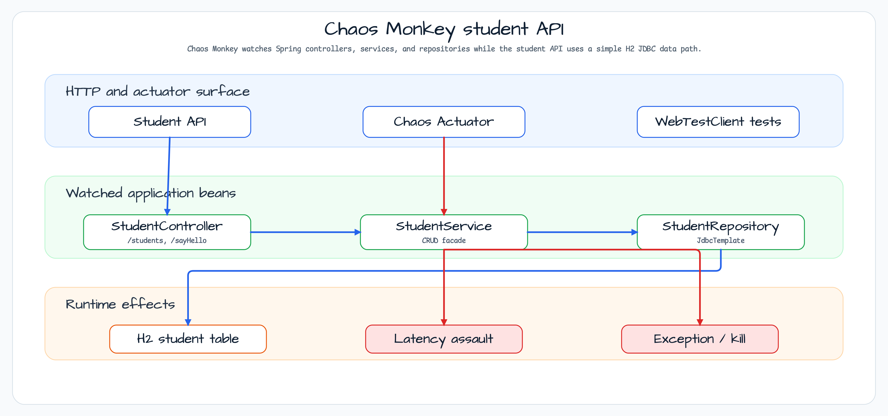
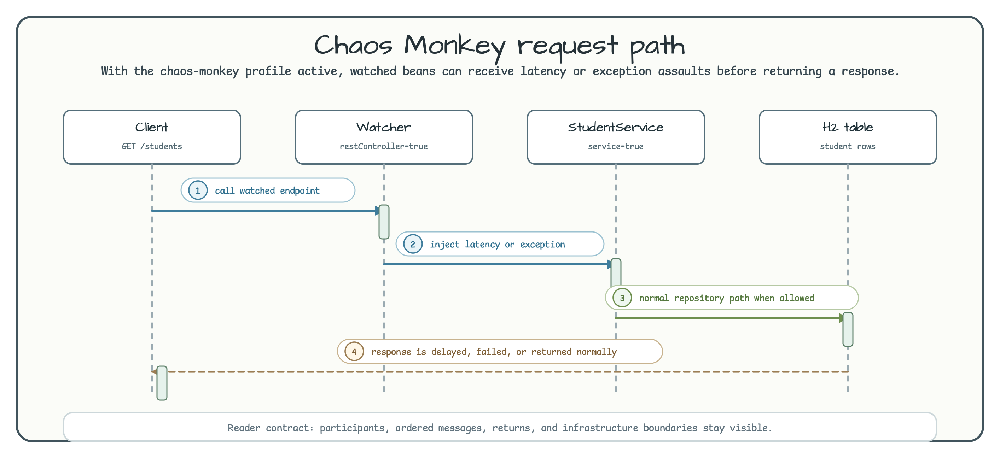

# Chaos Monkey + Spring Boot 4 Demo

[English](README.md) | 한국어

이 모듈은 Chaos Monkey for Spring Boot가 활성화된 작은 Student CRUD API를 실행합니다. 어떤 Spring bean이 감시 대상인지, latency/exception/kill assault가 일반 controller/service/repository 호출에 어떻게 영향을 주는지 확인하기 위한 예제입니다.

## 아키텍처



애플리케이션은 `application.properties`에서 `chaos-monkey` profile을 활성화합니다. Controller, REST controller, service, repository watcher가 켜져 있습니다. Student data path는 의도적으로 단순합니다: `StudentController` → `StudentService` → `StudentJdbcRepository` → H2 `student` table.

## Assault 흐름



Chaos Monkey는 정상 student API가 끝나기 전에 watched method call을 지연시키거나 실패시킬 수 있습니다. 기본 설정은 10-15초 latency assault를 활성화하고, actuator endpoint를 통해 런타임 상태 확인과 변경을 허용합니다.

## 주요 엔드포인트

| Method | Path | Purpose |
|---|---|---|
| `GET` | `/students` | H2에서 student 목록 조회 |
| `GET` | `/students/{id}` | student 1건 조회 |
| `POST` | `/students` | student 추가 |
| `PUT` | `/students/{id}` | student 수정 |
| `DELETE` | `/students/{id}` | student 삭제 |
| `GET` | `/actuator/chaosmonkey` | Chaos Monkey 상태 확인 |
| `POST` | `/actuator/chaosmonkey/enable` | assault 활성화 |
| `POST` | `/actuator/chaosmonkey/disable` | assault 비활성화 |
| `GET` | `/actuator/chaosmonkey/assaults` | assault 설정 확인 |

## 설정 핵심

```properties
spring.profiles.active=chaos-monkey
chaos.monkey.enabled=true
chaos.monkey.assaults.level=5
chaos.monkey.assaults.latencyActive=true
chaos.monkey.assaults.latencyRangeStart=10000
chaos.monkey.assaults.latencyRangeEnd=15000
chaos.monkey.watcher.controller=true
chaos.monkey.watcher.restController=true
chaos.monkey.watcher.service=true
chaos.monkey.watcher.repository=true
management.endpoints.web.exposure.include=*
```

## 실행

```bash
./gradlew :spring-boot:chaos-monkey:bootRun
curl http://localhost:8080/students
curl http://localhost:8080/actuator/chaosmonkey
```

Controller 테스트를 실행합니다.

```bash
./gradlew :spring-boot:chaos-monkey:test
```

## 참고

- [Chaos Monkey for Spring Boot](https://codecentric.github.io/chaos-monkey-spring-boot/)
- [Principles of Chaos Engineering](https://principlesofchaos.org/)
