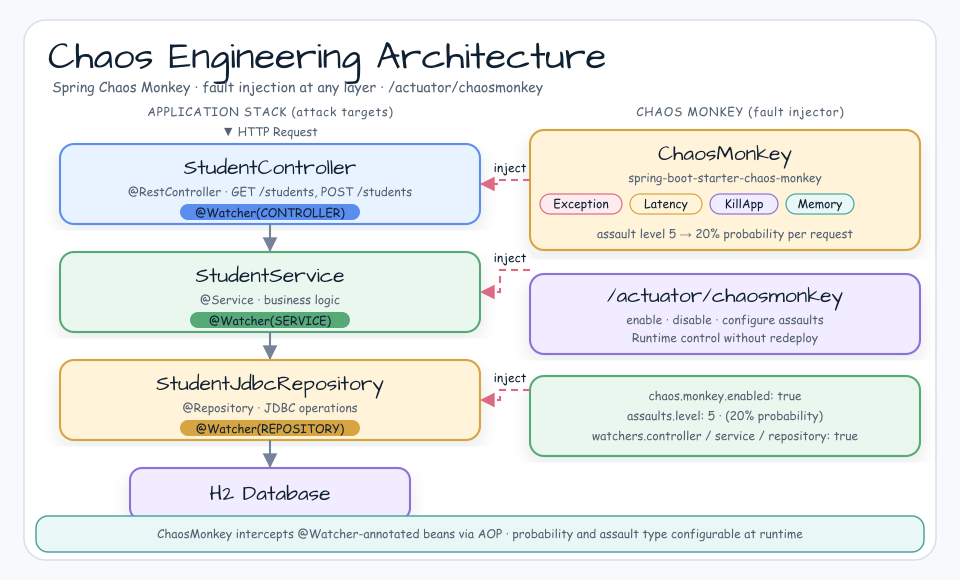

# Chaos Monkey + Spring Boot 4 Demo

[English](README.md) | 한국어

## 예제 시나리오

이 예제는 **Chaos Monkey + Spring Boot 4 Demo**를 실행 가능한 Spring Boot 애플리케이션 기능 워크숍 조각으로 다룹니다. 개발자가 먼저 확인할 경로인 모듈 설정, 샘플 또는 테스트 실행, 반복적인 인프라 코드를 줄여 주는 라이브러리와 프레임워크 API 관찰에 초점을 둡니다.

## 아키텍처 다이어그램


이 모듈은 샘플 진입점 또는 테스트 픽스처, bluetape4k 확장 계층, 예제가 사용하는 런타임 의존성을 중심으로 구성됩니다. README와 코드를 비교할 때는 `io.bluetape4k.workshop.springboot` 패키지를 기준으로 삼습니다.



## 흐름 다이어그램

1. `spring-boot-chaos-monkey`에 필요한 로컬 런타임을 준비합니다.
2. 예제 시나리오를 담당하는 애플리케이션, 컨트롤러, 서비스 또는 테스트 픽스처를 실행합니다.
3. 반복적인 인프라 작업을 bluetape4k 유틸리티 또는 Spring/Kotlin 통합에 위임합니다.
4. 샘플 출력, HTTP 응답, 저장소 상태, metric, trace 또는 테스트 기대값으로 보이는 결과를 검증합니다.

## 시퀀스 다이어그램

핵심 시퀀스는 호출자 또는 테스트 픽스처 -> 워크숍 어댑터 -> bluetape4k 헬퍼/API -> 외부 런타임 또는 인메모리 백엔드 -> 검증/응답 순서입니다. 이 모듈에 전용 시퀀스 자산이 있으면 아래 이미지가 상호작용 순서를 보여 줍니다. 없으면 소스 테스트가 실행 가능한 시퀀스의 기준입니다.

원본 소스: [chaos-monkey-springboot](https://github.com/vaquarkhan/chaos-monkey-springboot)

## 개요

이 예제는 Spring Boot용 Chaos Monkey를 보여 줍니다.

## Springboot와 Chaos Monkey

----------------------------------

## Chaos Engineering 흐름


## CHAOS ENGINEERING 원칙

- https://principlesofchaos.org/?lang=ENcontent

Chaos Monkey는 Netflix 도구의 아이디어를 바탕으로 Spring Boot 애플리케이션을 테스트하도록 설계된 솔루션입니다.
Spring Boot 애플리케이션에서 Chaos Monkey를 활성화하려면 두 단계가 필요합니다.

----------------------------------

### 먼저 프로젝트 의존성에 chaos-monkey-spring-boot 라이브러리를 추가합니다.

```xml
<dependency>
    <groupId>de.codecentric</groupId>
    <artifactId>chaos-monkey-spring-boot</artifactId>
    <version>4.0.0</version>
</dependency>
```


----------------------------------

### 그런 다음 애플리케이션 시작 시 chaos-monkey 프로필을 활성화해야 합니다.

```
-  spring.profiles.active=chaos-monkey

- $ java -jar target/order-service-1.0-SNAPSHOT.jar --spring.profiles.active=chaos-monkey

- inside eclipse enable profile
```

## Spring Boot Actuator 엔드포인트 활성화

```yaml
management:
    endpoint:
    chaosmonkey:
        enabled: true
        endpoints:
    web:
        exposure:
        include: health,info,chaosmonkey
```

또는

#### End point

```properties
management.endpoint.chaosmonkey.enabled:true
management.endpoint.chaosmonkeyjmx.enabled=true
```

#### 모든 엔드포인트 포함

     management.endpoints.web.exposure.include=*

#### 특정 엔드포인트 포함

```properties
     management.endpoints.web.exposure.include=health,info,metrics,chaosmonkey
```

--------------------------

http://localhost:8080/students

http://localhost:8080/student?id=10001

--------------------------

### GET

http://localhost:8080/actuator/chaosmonkey

```json
{
  "chaosMonkeyProperties": {
    "enabled": true
  },
  "assaultProperties": {
    "level": 5,
    "latencyRangeStart": 10000,
    "latencyRangeEnd": 15000,
    "latencyActive": false,
    "exceptionsActive": false,
    "exception": {
      "type": null,
      "arguments": null
    },
    "killApplicationActive": false,
    "memoryActive": false,
    "memoryMillisecondsHoldFilledMemory": 90000,
    "memoryMillisecondsWaitNextIncrease": 1000,
    "memoryFillIncrementFraction": 0.15,
    "memoryFillTargetFraction": 0.25,
    "runtimeAssaultCronExpression": "OFF",
    "watchedCustomServices": null
  },
  "watcherProperties": {
    "controller": true,
    "restController": true,
    "service": true,
    "repository": true,
    "component": false
  }
}
```

### GET

http://localhost:8080/actuator/chaosmonkey/status

      Ready to be evil!

### POST

http://localhost:8080/actuator/chaosmonkey/enable

### POST

http://localhost:8080/actuator/chaosmonkey/disable

### GET

http://localhost:8080/actuator/chaosmonkey/watchers

```json
{
  "controller": true,
  "restController": false,
  "service": true,
  "repository": false,
  "component": false
}
```

### GET

http://localhost:8080/actuator/chaosmonkey/assaults

```json
{
  "level": 5,
  "latencyRangeStart": 10000,
  "latencyRangeEnd": 15000,
  "latencyActive": false,
  "exceptionsActive": false,
  "exception": {
    "type": null,
    "arguments": null
  },
  "killApplicationActive": false,
  "memoryActive": false,
  "memoryMillisecondsHoldFilledMemory": 90000,
  "memoryMillisecondsWaitNextIncrease": 1000,
  "memoryFillIncrementFraction": 0.15,
  "memoryFillTargetFraction": 0.25,
  "runtimeAssaultCronExpression": "OFF",
  "watchedCustomServices": null
}
```

## 예외

### POST

http://localhost:8080/actuator/chaosmonkey/assaults

```json
{
  "level": 3,
  "latencyRangeStart": 20000,
  "latencyRangeEnd": 50000,
  "latencyActive": false,
  "exceptionsActive": true,
  "killApplicationActive": false,
  "exception": {
    "type": "java.lang.IllegalArgumentException",
    "arguments": [
      {
        "className": "java.lang.String",
        "value": "custom illegal argument exception"
      }
    ]
  }
}
```

## 지연 시간

### POST

http://localhost:8080/actuator/chaosmonkey/assaults

```json
{
  "level": 1,
  "latencyRangeStart": 20000,
  "latencyRangeEnd": 50000,
  "latencyActive": true,
  "exceptionsActive": false,
  "killApplicationActive": false,
  "restartApplicationActive": false
}
```

## 메서드 테스트

`watchedCustomServices` 속성으로 모든 watcher의 동작을 사용자 지정하고, 어떤 클래스와 public 메서드를 공격할지 결정할 수 있습니다.
저장된 signature가 없으면 watcher가 인식하는 모든 클래스와 public 메서드가 기본적으로 공격 대상이 됩니다.
목록은 application properties에서 관리하거나 Spring Boot Actuator Endpoint를 사용해 런타임에 조정할 수 있습니다.

### POST

http://localhost:8080/actuator/chaosmonkey/assaults \

```json
{
  "level": 1,
  "latencyRangeStart": 20000,
  "latencyRangeEnd": 50000,
  "latencyActive": true,
  "exceptionsActive": false,
  "killApplicationActive": false,
  "restartApplicationActive": false,
  "watchedCustomServices": [
    "com.khan.vaquar.demo.controller.StudentController.findAll"
  ]
}
```

findAll 메서드에 assault를 추가하면 findAll 메서드 내부에서만 latency를 확인할 수 있습니다.

`http://localhost:8080/students`

다른 메서드는 문제없이 동작합니다.

`http://localhost:8080/student?id=10001`

예외에도 같은 로직을 적용할 수 있습니다.

```json
{
  "level": 1,
  "latencyRangeStart": 20000,
  "latencyRangeEnd": 50000,
  "latencyActive": false,
  "exceptionsActive": true,
  "exception": {
    "type": "java.lang.IllegalArgumentException",
    "arguments": [
      {
        "className": "java.lang.String",
        "value": "custom illegal argument exception"
      }
    ]
  },
  "killApplicationActive": false,
  "restartApplicationActive": false,
  "watchedCustomServices": [
    "com.khan.vaquar.demo.controller.StudentController.findAll"
  ]
}
```

findAll 메서드에 assault를 추가하면 findAll 메서드 내부에서만 exception을 확인할 수 있습니다.

`http://localhost:8080/students`

다른 메서드는 문제없이 동작합니다.

`http://localhost:8080/student?id=10001`

### POST

http://localhost:8080/actuator/chaosmonkey/assaults \

```json
{
  "level": 1,
  "latencyRangeStart": 1000,
  "latencyRangeEnd": 3000,
  "latencyActive": true,
  "exceptionsActive": false,
  "killApplicationActive": false,
  "memoryActive": false,
  "memoryMillisecondsHoldFilledMemory": 90000,
  "memoryMillisecondsWaitNextIncrease": 1000,
  "memoryFillIncrementFraction": 0.15,
  "memoryFillTargetFraction": 0.25,
  "runtimeAssaultCronExpression": "OFF",
  "watchedCustomServices": null
}
```

또는

```json
{
  "level": 2,
  "latencyRangeStart": 1000,
  "latencyRangeEnd": 3000,
  "latencyActive": true,
  "exceptionsActive": false,
  "killApplicationActive": false,
  "memoryActive": true,
  "memoryMillisecondsHoldFilledMemory": 90000,
  "memoryMillisecondsWaitNextIncrease": 1000,
  "memoryFillIncrementFraction": 99.10,
  "memoryFillTargetFraction": 99.10,
  "runtimeAssaultCronExpression": "OFF",
  "watchedCustomServices": null
}
```

### POST

http://localhost:8080/actuator/chaosmonkey/assaults

```json
{
  "latencyRangeStart": 2000,
  "latencyRangeEnd": 5000,
  "latencyActive": true,
  "exceptionsActive": false,
  "killApplicationActive": false
}
```

### POST

http://localhost:8080/actuator/chaosmonkey/assaults

```json
{
  "latencyActive": false,
  "exceptionsActive": true,
  "killApplicationActive": false
}
```

### POST

http://localhost:8080/actuator/chaosmonkey/assaults

```json
{
  "latencyActive": false,
  "exceptionsActive": false,
  "killApplicationActive": true
}
```

```json
{
  "chaosMonkeyProperties": {
    "enabled": true
  },
  "assaultProperties": {
    "level": 3,
    "latencyRangeStart": 1000,
    "latencyRangeEnd": 3000,
    "latencyActive": true,
    "exceptionsActive": false,
    "killApplicationActive": false,
    "watchedCustomServices": []
  },
  "watcherProperties": {
    "controller": true,
    "restController": false,
    "service": true,
    "repository": false,
    "component": false
  }
}
```

-----------------------------------

## Chaos Eng 소개와 첫 chaos experiment 시작 방법

https://www.gremlin.com/community/tutorials/chaos-engineering-the-history-principles-and-practice/

## chaos experiment를 수행하는 사람, 도구, 회사에 대한 좋은 요약

https://coggle.it/diagram/WiKceGDAwgABrmyv/t/chaos-engineeringcompanies%2C-people%2C-tools-practices/0a2d4968c94723e48e1256e67df51d0f4217027143924b23517832f53c536e62

## 도구

ChaosMonkey for SpringBoot: https://chaostoolkit.org/. 지침을 따라 하기 쉽습니다.
Spring profile로 쉽게 켜고 끌 수 있습니다.

Spinnaker: https://www.spinnaker.io/. Netflix Chaos Monkey는 Spinnaker 이외의 방식으로 관리되는 배포를 지원하지 않습니다.
따라서 Netflix의 Chaos Monkey를 사용하기가 꽤 어렵습니다.

Chaos Toolkit - https://chaostoolkit.org/. 이 도구는 Cloud Foundry에 배포된 애플리케이션을 다루는 상황에서 특히 유용합니다.
CloudFoundry extension이 있기 때문입니다. 꽤 정교하지만 지침을 따라 하기 쉽습니다. 현재까지 선호하는 도구입니다.

Chaos Lemur - https://content.pivotal.io/blog/chaos-lemur-testing-high-availability-on-pivotal-cloud-foundry. 이 도구는 가능성이 있지만,
네트워크 관리자가 Pivotal cells를 건드릴 수 있도록 AWS credentials를 공유하지 않을 것입니다.

Gramlin -https://www.gremlin.com/

- https://www.youtube.com/watch?v=-smx0-qeurw
- https://www.youtube.com/embed/cefJd2v037U
- https://netflix.github.io/chaosmonkey/
- https://chaostoolkit.org/
- https://codecentric.github.io/chaos-monkey-spring-boot/

---------------------------
