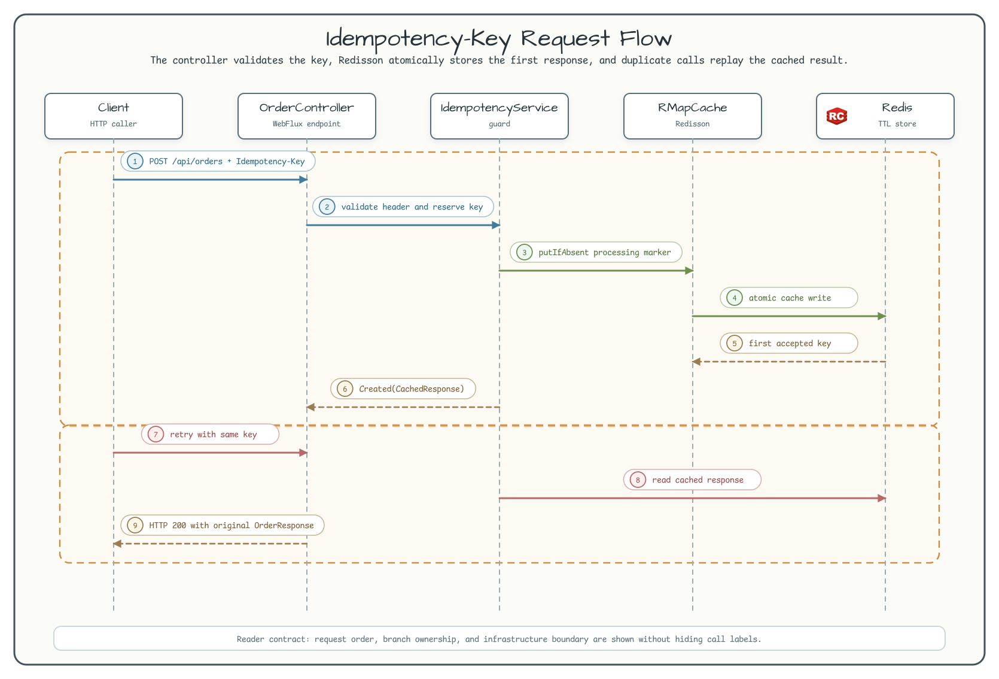
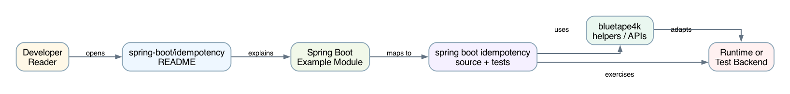

# spring-boot/idempotency

[한국어](README.ko.md) | English

## Example Scenario

This example exercises **spring-boot/idempotency** as a runnable Spring Boot application feature workshop slice. It focuses on the path a developer would inspect first: configure the module, run the sample or tests, and observe the library or framework APIs that remove repetitive infrastructure code.

## Flow Diagram

1. Prepare the local runtime required by `spring-boot-idempotency`.
2. Execute the application, controller, service, or test fixture that owns the example scenario.
3. Delegate repetitive infrastructure work to bluetape4k utilities or Spring/Kotlin integrations.
4. Assert the visible result through the sample output, HTTP response, repository state, metric, trace, or test expectation.

## Sequence Diagram

The core sequence is: caller or test fixture -> workshop adapter -> bluetape4k helper/API -> external runtime or in-memory backend -> assertion/response. When this module has a dedicated sequence asset, the image below shows that interaction order; otherwise the source tests are the authoritative executable sequence.



Duplicate-safe command handling with **Idempotency Key** pattern using Redis (Redisson) and Spring Boot WebFlux + Kotlin Coroutines.

## Architecture




## Core Features

| Feature | Detail |
|---|---|
| **Duplicate detection** | `Idempotency-Key` request header matched against Redis cache |
| **Storage backend** | Redisson `RMapCache` — atomic `putIfAbsent` (SET NX semantics) |
| **TTL** | 5 minutes per key |
| **Concurrency** | First writer wins via `putIfAbsent`; concurrent late writers receive the cached response |
| **Missing header** | HTTP 400 Bad Request |
| **First creation** | HTTP 201 Created |
| **Replay** | HTTP 200 OK with original response body |

## Before / After

### Before — Raw Redis SET NX (Lettuce)

```kotlin
// Low-level approach: manual serialization, no TTL refresh, no type safety
val commands: RedisCommands<String, String> = ...
val json = objectMapper.writeValueAsString(response)
val result = commands.set(key, json, SetArgs().nx().ex(300))
if (result == null) {
    // key already existed — deserialize cached value
    val cached = objectMapper.readValue(commands.get(key), OrderResponse::class.java)
    return ResponseEntity.ok(cached)
}
return ResponseEntity.status(201).body(response)
```

### After — bluetape4k Redisson `RMapCache` (this module)

```kotlin
// High-level approach: type-safe, TTL managed automatically
val cache = redisson.getMapCache<String, CachedResponse>("idempotency:orders")
val previous = cache.putIfAbsent(key, newCached, 5, TimeUnit.MINUTES)
return if (previous == null) IdempotencyResult.Created(newCached)
       else IdempotencyResult.Replay(previous)
```

`RMapCache.putIfAbsent` combines the check-and-set atomically; no separate lock or Lua script needed.

## Usage

### Start the application

```bash
./gradlew :spring-boot-idempotency:bootRun
```

The embedded `RedisServer.Launcher.redis` Testcontainer starts automatically.

### Example request

```bash
# First call → 201 Created
http POST :8080/api/orders \
  "Idempotency-Key: $(uuidgen)" \
  productId=prod-001 quantity:=2 userId=user-123

# Retry with same key → 200 OK, identical orderId
http POST :8080/api/orders \
  "Idempotency-Key: <same-uuid>" \
  productId=prod-001 quantity:=2 userId=user-123
```

### Without Idempotency-Key → 400

```bash
http POST :8080/api/orders productId=prod-001 quantity:=2 userId=user-123
# HTTP/1.1 400 Bad Request
```

## Configuration

| Property | Default | Description |
|---|---|---|
| `spring.data.redis.host` | `localhost` | Redis host |
| `spring.data.redis.port` | `6379` | Redis port |

## Running Tests

```bash
./gradlew :spring-boot-idempotency:test
```

Tests use `RedisServer.Launcher.redis` singleton Testcontainer with `@DynamicPropertySource` for port binding.

## Dependencies

- `bluetape4k-redis` / `bluetape4k-redisson` — Redisson client helpers
- `bluetape4k-testcontainers` — `RedisServer.Launcher` singleton
- `bluetape4k-coroutines` — coroutine utilities
- `spring-boot-starter-webflux` — reactive HTTP + coroutine support

## Known Limitations / Future Enhancements

- **Body-hash mismatch detection**: this module does not detect when the same key is submitted with a different request body (a full implementation would return 422 Unprocessable Entity in that case).
- **Concurrent in-flight policy**: concurrent first-time requests resolve via `putIfAbsent`; no 409 is returned — the loser simply receives the winner's cached response.
