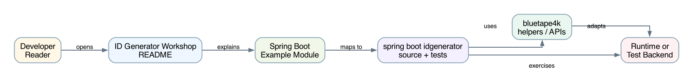
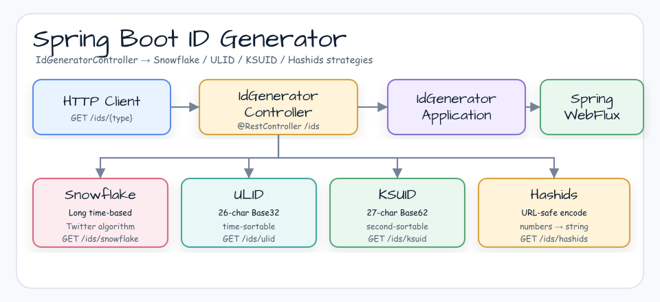

# ID Generator Workshop

[한국어](README.ko.md) | English

## Example Scenario

This example exercises **ID Generator Workshop** as a runnable Spring Boot application feature workshop slice. It focuses on the path a developer would inspect first: configure the module, run the sample or tests, and observe the library or framework APIs that remove repetitive infrastructure code.

## Architecture Diagram



The module is organized around the sample entry point or test fixture, the bluetape4k extension layer, and the runtime dependency used by the example. Keep the package under `io.bluetape4k.workshop.springboot` as the source of truth when comparing this README with the code.



## Flow Diagram

1. Prepare the local runtime required by `spring-boot-idgenerator`.
2. Execute the application, controller, service, or test fixture that owns the example scenario.
3. Delegate repetitive infrastructure work to bluetape4k utilities or Spring/Kotlin integrations.
4. Assert the visible result through the sample output, HTTP response, repository state, metric, trace, or test expectation.

## Sequence Diagram

The core sequence is: caller or test fixture -> workshop adapter -> bluetape4k helper/API -> external runtime or in-memory backend -> assertion/response. When this module has a dedicated sequence asset, the image below shows that interaction order; otherwise the source tests are the authoritative executable sequence.

`bluetape4k-idgenerators`의 4가지 분산 ID 생성기를 Spring Boot WebFlux REST API로 노출하는 통합 예제입니다.
Snowflake, ULID, KSUID, Hashids 각 알고리즘의 특성과 운영 시 주의사항을 다룹니다.

## 아키텍처


## API 엔드포인트

| 메서드 | 경로 | 설명 |
|---|---|---|
| `GET` | `/ids/snowflake` | Snowflake Long ID 생성 + 파싱된 구성요소 |
| `GET` | `/ids/snowflake/parse/{id}` | 기존 Snowflake ID 역파싱 |
| `GET` | `/ids/snowflake/batch?count=N` | Snowflake ID N개 일괄 생성 (최대 1000) |
| `GET` | `/ids/ulid` | ULID 생성 (26자 Crockford Base32) |
| `GET` | `/ids/ulid/batch?count=N` | ULID N개 일괄 생성 |
| `GET` | `/ids/ksuid` | KSUID 생성 (27자 Base62) |
| `GET` | `/ids/ksuid/batch?count=N` | KSUID N개 일괄 생성 |
| `GET` | `/ids/hashids/encode?numbers=1,2,3` | 숫자 배열 → Hashids 인코딩 |
| `GET` | `/ids/hashids/decode/{hash}` | Hashids 문자열 → 숫자 배열 디코딩 |

## ID 알고리즘 비교

| 알고리즘 | 타입 | 길이 | 정렬성 | 특징 |
|---|---|---|---|---|
| **Snowflake** | `Long` | 64-bit | 시간순 | 머신ID 포함, 역파싱 가능, 초당 4096개/노드 |
| **ULID** | `String` | 26자 | 사전순 = 시간순 | 밀리초 정밀도, UUID 호환 |
| **KSUID** | `String` | 27자 | 사전순 = 시간순 | 초 정밀도, 128-bit 랜덤 페이로드 |
| **Hashids** | `String` | 가변 | ❌ | 숫자 난독화(obfuscation), 역산 가능 |

## 사용된 bluetape4k 기능

| 기능 | 아티팩트 | 코드 위치 | 이점 |
|---|---|---|---|
| `Snowflakers.Default` | `bluetape4k-idgenerators` | `IdGeneratorController` | 싱글톤 DefaultSnowflake — 머신ID 자동 결정 |
| `Snowflake.parse(id)` | `bluetape4k-idgenerators` | `parseSnowflakeId()` | Long ID → timestamp/machineId/sequence 역파싱 |
| `Snowflake.nextIds(size)` | `bluetape4k-idgenerators` | `snowflakeBatch()` | Sequence 기반 일괄 생성 |
| `UlidGenerator` | `bluetape4k-idgenerators` | `IdGeneratorController` | 단조 증가 ULID, StatefulMonotonic 내장 |
| `KsuidGenerator` | `bluetape4k-idgenerators` | `IdGeneratorController` | 초 기반 정렬 가능 ID |
| `Hashids` | `bluetape4k-idgenerators` | `IdGeneratorController` | salt + minLength 설정으로 난독화 강도 조정 |
| `KLogging` | `bluetape4k-logging` | companion object | Lazy 람다 로깅 |

## bluetape4k Before / After

### Snowflake ID 생성

```kotlin
// Before — Twitter Snowflake 직접 구현 또는 외부 라이브러리
val snowflake = SnowflakeIdWorker(workerId = 1, datacenterId = 1)
val id: Long = snowflake.nextId()

// After — bluetape4k Snowflakers.Default (머신ID 자동, 싱글톤)
val id: Long = Snowflakers.Default.nextId()
val parsed: SnowflakeId = Snowflakers.Default.parse(id)
// parsed.timestamp, parsed.machineId, parsed.sequence 접근 가능
```

### ULID 생성

```kotlin
// Before — UlidCreator 외부 라이브러리
val id = UlidCreator.getUlid().toString()

// After — bluetape4k UlidGenerator (StatefulMonotonic 내장)
val generator = UlidGenerator()
val id: String = generator.nextId()   // 26자, 동일 밀리초 내 단조 증가 보장
```

## 운영 주의사항

### Snowflake — Machine ID 관리

```
⚠️ 동일 머신 ID를 가진 두 노드가 동시에 실행되면 ID 충돌이 발생합니다.

Snowflakers.Default: 네트워크 인터페이스 MAC 기반 자동 결정 (단일 NIC 환경 권장)
Snowflakers.default(machineId = N): 명시적 지정 — Pod/Container 환경에서 권장

Redis 기반 worker-id 동적 할당: Redisson RAtomicLong 또는 SET NX/EXPIRE로 구현 가능
(해당 패턴은 issue #62 후속 작업에서 다룹니다)
```

### Snowflake — Clock Rollback

```
⚠️ 서버 시간이 뒤로 돌아가면 ID 중복이 발생할 수 있습니다.

DefaultSnowflake은 clock rollback 감지 시 IllegalStateException을 발생시킵니다.
NTP 동기화와 클라우드 인스턴스 재시작 시 특히 주의가 필요합니다.
```

### Hashids — 보안 주의

```
⚠️ Hashids는 암호화 알고리즘이 아닙니다. 난독화(obfuscation) 전용입니다.

salt 없이 사용하면 공개 Hashids 참조 구성과 동일하여 trivially reversible합니다.
보안 토큰, 인증 ID, 민감한 식별자에 절대 사용하지 마세요.
실제 사용 시: Hashids(salt = "프로젝트 고유 secret", minHashLength = 8)
```

### ULID vs KSUID 선택 기준

| 상황 | 권장 |
|---|---|
| UUID 대체, DB 인덱스 효율 (밀리초 정밀도) | **ULID** |
| 초(seconds) 정밀도로 충분, 더 짧은 랜덤 페이로드 | **KSUID** |
| Long 타입 필요, 분산 노드 식별, 역파싱 필요 | **Snowflake** |
| URL에 숫자 ID 노출 방지 (PKs, 시퀀스) | **Hashids** |

## 실행

```bash
./gradlew :spring-boot-idgenerator:bootRun

# Snowflake ID 생성
curl http://localhost:8080/ids/snowflake

# Snowflake 10개 일괄 생성
curl "http://localhost:8080/ids/snowflake/batch?count=10"

# ULID 생성
curl http://localhost:8080/ids/ulid

# KSUID 생성
curl http://localhost:8080/ids/ksuid

# Hashids 인코딩
curl "http://localhost:8080/ids/hashids/encode?numbers=1,2,3"
```

## 테스트

```bash
./gradlew :spring-boot-idgenerator:test
```

## 참고

- [bluetape4k-idgenerators](https://github.com/bluetape4k/bluetape4k-projects)
- [Snowflake ID (Twitter)](https://blog.twitter.com/engineering/en_us/a/2010/announcing-snowflake)
- [ULID Specification](https://github.com/ulid/spec)
- [KSUID](https://github.com/segmentio/ksuid)
- [Hashids](https://hashids.org/)
