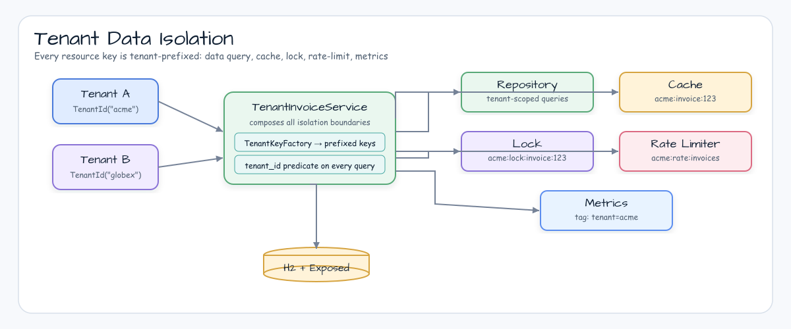

# 멀티 테넌트 데이터 격리

[English](README.md) | [한국어](README.ko.md)

테넌트별 데이터 접근, 캐시 키, 락 키, rate-limit 버킷, 메트릭 태그를 안전하게 분리하는 고급 Spring Boot 워크숍입니다.

## 개요

Repository 쿼리, 캐시 키, 락 키, rate-limit 버킷이 공용 리소스 ID만 사용하면 테넌트 간 데이터가 새어 나갈 수 있습니다. 이 모듈은 H2, 인메모리 lock, fixed-window rate-limit bucket으로 실행 환경을 가볍게 유지하고, 테스트로 격리 경계를 증명합니다.

## 시나리오



## 주요 구성

| 클래스 | 역할 |
|---|---|
| `TenantId` | 모든 격리 경계에 사용하는 정규화된 테넌트 값 |
| `InvoiceTable` | 필수 `tenant_id` 컬럼을 가진 공유 테이블 |
| `TenantInvoiceRepository` | tenant predicate를 강제하는 안전한 `LongJdbcRepository` 구현 |
| `UnsafeInvoiceRepository` | tenant predicate를 빠뜨린 baseline 경로 |
| `TenantKeyFactory` | 테넌트 prefix가 붙은 캐시, 락, rate-limit 키 생성 |
| `TenantInvoiceService` | repository, cache, lock, rate-limit, metrics 경로 조합 |

## 사용된 Bluetape4k 기능

| 기능 | 모듈/아티팩트 | 코드 위치 | 이점 |
|---|---|---|---|
| Exposed JDBC repository helper | `bluetape4k-exposed-jdbc` | `TenantInvoiceRepository : LongJdbcRepository` | Bluetape4k repository 기본 동작을 재사용하면서 tenant predicate를 명시 |
| Spring Boot support | `bluetape4k-spring-boot4-core` | `build.gradle.kts` | Spring Boot 4 워크숍 모듈과 일관성 유지 |
| Logging | `bluetape4k-logging` | `KLogging` companion | 공통 Bluetape4k 로깅 관례 사용 |
| Metrics bridge | `bluetape4k-micrometer` | `TenantMetrics` | 테넌트 태그가 붙은 Micrometer counter를 Bluetape4k 의존성 집합 안에서 사용 |
| JUnit support and assertions | `bluetape4k-junit5`, `bluetape4k-assertions` | `TenantIsolationTest` | 저장소 표준 테스트 lifecycle과 matcher 사용 |

## Before / After

### Repository

```kotlin
// Before: ID만 조회하면 다른 테넌트 row가 노출될 수 있습니다.
InvoiceTable.selectAll()
    .where { InvoiceTable.id eq invoiceId }
    .firstOrNull()

// After: tenant와 ID가 모두 맞아야 합니다.
InvoiceTable.selectAll()
    .where {
        (InvoiceTable.tenantId eq tenantId.value) and (InvoiceTable.id eq invoiceId)
    }
    .firstOrNull()
```

### 캐시, 락, Rate Limit 키

```kotlin
// Before
invoice:42

// After
tenant:tenant-alpha:invoice:42
tenant:tenant-alpha:lock:invoice:42
tenant:tenant-alpha:rate-limit:reader
```

## 실행

```bash
./gradlew :spring-boot-multi-tenant-data-isolation:test
```

## 테스트가 증명하는 것

- ID만 사용하는 baseline repository/cache 경로는 테넌트 데이터를 누출합니다.
- 테넌트가 다른 invoice ID 조회는 `null`을 반환합니다.
- 테넌트가 다른 write는 invoice 상태를 변경하지 못합니다.
- 캐시 키, 락 키, rate-limit 키, 메트릭이 tenant scope를 포함합니다.

## Gap Notes

이 모듈은 인메모리 상태로 lock/rate-limit 격리를 보여줍니다. 실제 Redis/Redisson 락과 Bucket4j backend는 의도적으로 제외해서 tenant key 설계에 집중합니다.
