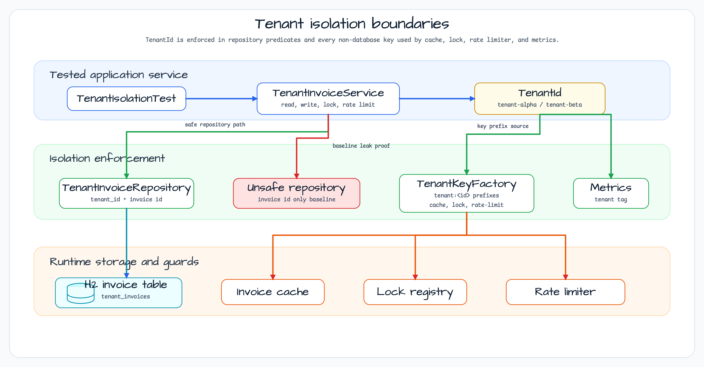
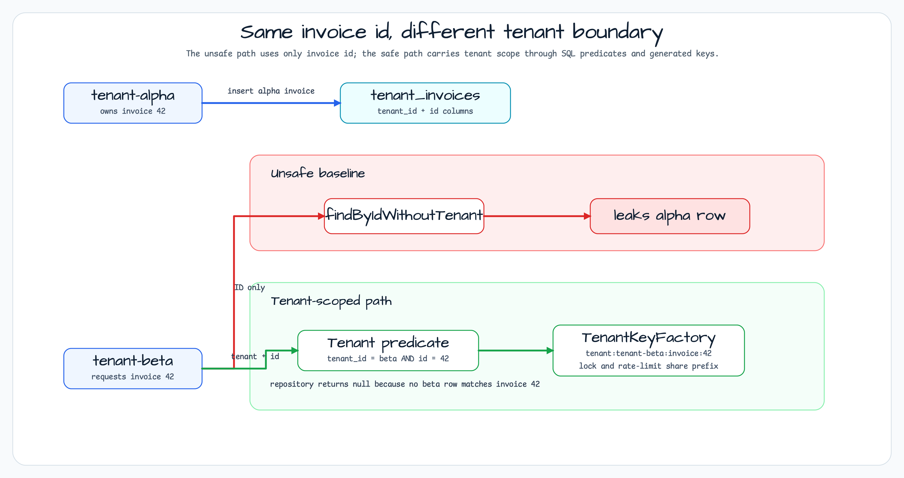

# Multi-Tenant Data Isolation

[한국어](README.ko.md) | English

This module demonstrates tenant-safe reads, writes, cache keys, lock keys,
rate-limit buckets, and Micrometer tags. It deliberately keeps runtime storage
simple with H2 and in-memory helpers so the isolation contract is easy to inspect
in tests.

## Architecture Diagram



## Isolation Scenario



Advanced Spring Boot workshop for tenant-safe data access, cache keys, lock keys, rate-limit buckets, and metrics tags.

## Overview

Tenant isolation fails when a repository query, cache key, lock key, or rate-limit bucket uses only a shared resource ID. This module keeps the infrastructure lightweight with H2, in-memory locks, and fixed-window rate-limit buckets, then proves the isolation boundary with executable tests.

## Main Components

| Class | Role |
|---|---|
| `TenantId` | Normalized tenant value used by all isolation boundaries |
| `InvoiceTable` | Shared table with mandatory `tenant_id` column |
| `TenantInvoiceRepository` | Safe `LongJdbcRepository` implementation with tenant predicates |
| `UnsafeInvoiceRepository` | Baseline path that omits tenant predicates |
| `TenantKeyFactory` | Tenant-prefixed cache, lock, and rate-limit keys |
| `TenantInvoiceService` | Composes repository, cache, lock, rate-limit, and metrics behavior |

## Used Bluetape4k Features

| Feature | Module/artifact | Code reference | Benefit |
|---|---|---|---|
| Exposed JDBC repository helper | `bluetape4k-exposed-jdbc` | `TenantInvoiceRepository : LongJdbcRepository` | Reuses Bluetape4k repository defaults while keeping tenant predicates explicit |
| Spring Boot support | `bluetape4k-spring-boot4-core` | `build.gradle.kts` | Aligns with Spring Boot 4 workshop modules |
| Logging | `bluetape4k-logging` | `KLogging` companions | Uses the common Bluetape4k logging convention |
| Metrics bridge | `bluetape4k-micrometer` | `TenantMetrics` | Keeps tenant-tagged Micrometer counters in the Bluetape4k dependency set |
| JUnit support and assertions | `bluetape4k-junit5`, `bluetape4k-assertions` | `TenantIsolationTest` | Uses repository-standard test lifecycle and matchers |

## Before / After

### Repository

```kotlin
// Before: ID-only lookup can leak rows across tenants.
InvoiceTable.selectAll()
    .where { InvoiceTable.id eq invoiceId }
    .firstOrNull()

// After: tenant and ID must both match.
InvoiceTable.selectAll()
    .where {
        (InvoiceTable.tenantId eq tenantId.value) and (InvoiceTable.id eq invoiceId)
    }
    .firstOrNull()
```

### Cache, Lock, and Rate Limit Keys

```kotlin
// Before
invoice:42

// After
tenant:tenant-alpha:invoice:42
tenant:tenant-alpha:lock:invoice:42
tenant:tenant-alpha:rate-limit:reader
```

## Run

```bash
./gradlew :spring-boot-multi-tenant-data-isolation:test
```

## What the Tests Prove

- Baseline ID-only repository and cache paths leak tenant data.
- Tenant-scoped reads return `null` for another tenant's invoice ID.
- Tenant-scoped writes do not update another tenant's invoice.
- Cache keys, lock keys, rate-limit keys, and metrics use tenant scope.

## Gap Notes

This module demonstrates lock and rate-limit isolation with in-memory state. Real Redis/Redisson locks and Bucket4j backends are deliberately out of scope so the workshop focuses on tenant key design.
