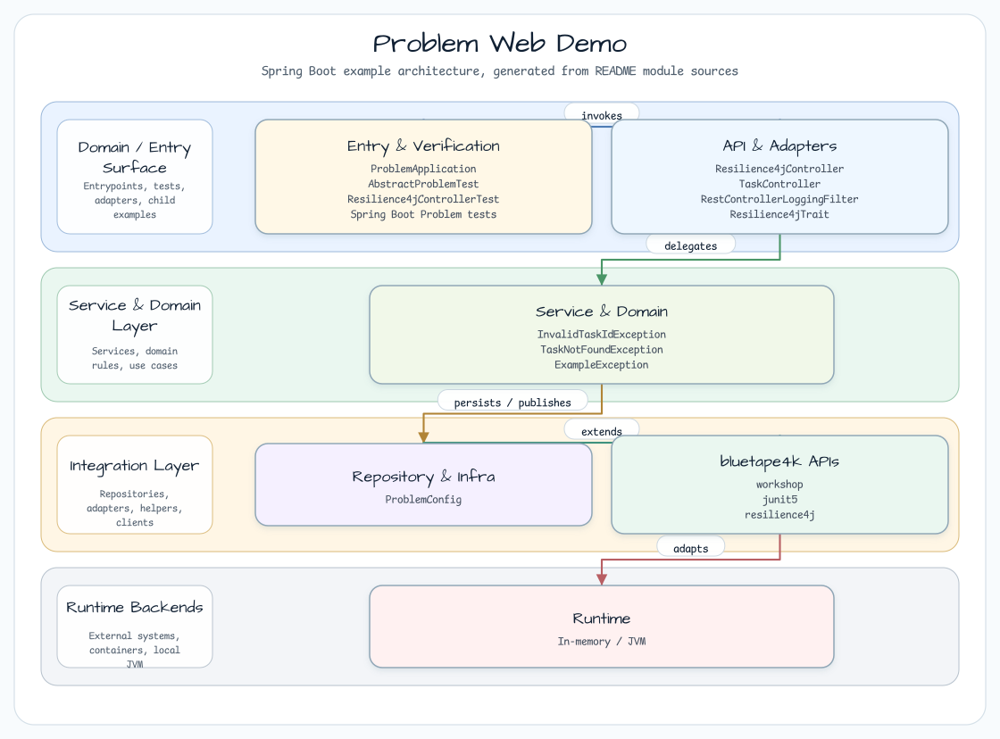

# Problem Web Demo

[English](README.md) | 한국어

## 예제 시나리오

이 예제는 **Problem Web Demo**를 실행 가능한 Spring Boot 애플리케이션 기능 워크숍 조각으로 다룹니다. 개발자가 먼저 확인할 경로인 모듈 설정, 샘플 또는 테스트 실행, 반복적인 인프라 코드를 줄여 주는 라이브러리와 프레임워크 API 관찰에 초점을 둡니다.

## 아키텍처 다이어그램



이 모듈은 샘플 진입점 또는 테스트 픽스처, bluetape4k 확장 계층, 예제가 사용하는 런타임 의존성을 중심으로 구성됩니다. README와 코드를 비교할 때는 `io.bluetape4k.workshop.springboot` 패키지를 기준으로 삼습니다.

## 시퀀스 다이어그램

이 오류 처리 예제는 RFC 9457 Problem Details를 내장 지원하는 Spring Boot 4와 Zalando Problem Spring Web을 함께 사용합니다.
bluetape4k `KLogging`과 `bluetape4k-resilience4j`를 사용해 Circuit Breaker 관련 예외를 RFC 9457 형식으로 변환합니다.

## RFC 9457 Problem Details 개념

Problem Details(`application/problem+json`)는 API 오류 응답을 표준화하기 위한 명세입니다.

### 표준 오류 응답 구조

```json
{
  "type": "https://example.com/problems/task-not-found",
  "title": "Task Not Found",
  "status": 404,
  "detail": "No task was found for TaskId[42].",
  "instance": "/tasks/42"
}
```

| 필드 | 설명 |
|---|---|
| `type` | 오류 타입을 식별하는 URI(선택 사항) |
| `title` | 사람이 읽을 수 있는 오류 요약 |
| `status` | HTTP 상태 코드 |
| `detail` | 오류에 대한 상세 설명 |
| `instance` | 오류가 발생한 특정 리소스의 URI |

## 주요 구성 요소

| 클래스 | 역할 |
|---|---|
| `RestApiExceptionHandler` | `@ControllerAdvice` — `ProblemHandling` + `TaskAdviceTrait` + `Resilience4jTrait` 조합 |
| `TaskAdviceTrait` | `TaskNotFoundException`을 404로, `InvalidTaskIdException`을 400으로 변환 |
| `Resilience4jTrait` | Resilience4j 예외를 Circuit Breaker/Bulkhead/RateLimit Problem 응답으로 변환 |
| `RestControllerLoggingFilter` | 요청/응답 로깅을 위한 WebFilter |
| `TaskController` | 코루틴 `suspend` 함수로 구현한 `/tasks` CRUD |
| `Resilience4jController` | Circuit Breaker와 통합된 예제 컨트롤러 |

## 예외 계층

```
ExampleException (base exception)
├── TaskNotFoundException     → 404 Not Found
└── InvalidTaskIdException    → 400 Bad Request
BulkheadFullException         → 429 Too Many Requests
CallNotPermittedException     → 503 Service Unavailable
RequestNotPermitted           → 509 Bandwidth Limit Exceeded
MaxRetriesExceededException   → 500 Internal Server Error
```

## 사용한 bluetape4k 기능

| 기능 | 아티팩트 | 코드 위치 | 이점 |
|---|---|---|---|
| `KLogging` | `bluetape4k-logging` | 모든 companion object | 지연 lambda 로깅과 구조적 예외 로깅 |
| `bluetape4k-resilience4j` | `bluetape4k-resilience4j` | `Resilience4jTrait` | Resilience4j 예외를 Problem JSON으로 변환하는 trait 제공 |

## bluetape4k 적용 전 / 후

### `KLogging`과 기존 Logger 비교

```kotlin
// Before — Direct SLF4J LoggerFactory usage
private val logger = LoggerFactory.getLogger(TaskController::class.java)
logger.info("Task requested: {}", taskId)  // Always interpolates the message

// After — KLogging (lazy lambda, simplified exception logging)
companion object: KLogging()

log.info { "Task requested: $taskId" }         // Lambda is not executed when disabled
log.warn(e) { "Task not found: $taskId" }      // Combines exception + message
```

### Resilience4j 예외 처리 — AdviceTrait Mixin

```kotlin
// Before — Repeated @ExceptionHandler methods for each exception
@ControllerAdvice
class GlobalExceptionHandler {
    @ExceptionHandler(CallNotPermittedException::class)
    fun handleCircuitBreaker(ex: CallNotPermittedException): ResponseEntity<ErrorDto> {
        return ResponseEntity.status(503).body(ErrorDto("SERVICE_UNAVAILABLE", ex.message))
    }
    // ... repeated ...
}

// After — Automatic handling with the bluetape4k Resilience4jTrait mixin
@ControllerAdvice
class RestApiExceptionHandler : ProblemHandling, TaskAdviceTrait, Resilience4jTrait {
    override fun isCausalChainsEnabled(): Boolean = true
    // Automatically converts Resilience4j exceptions to RFC 9457 Problem JSON
}
```

## AdviceTrait 패턴

```kotlin
// TaskAdviceTrait — Creates Problem responses per exception
interface TaskAdviceTrait : AdviceTrait {
    @ExceptionHandler
    fun handleTaskNotFoundException(ex: TaskNotFoundException, request: ServerWebExchange)
        : Mono<ResponseEntity<Problem>> {
        val problem = Problem.builder()
            .withInstance(URI.create("/tasks/${ex.taskId}"))
            .withStatus(Status.NOT_FOUND)
            .withTitle("Task Not Found")
            .build()
        return create(ex, problem, request)
    }
}

// Resilience4jTrait — BT-provided Circuit Breaker/Bulkhead/RateLimit handling
interface Resilience4jTrait : AdviceTrait {
    @ExceptionHandler
    fun handleCircuitBreakerCallNotPermitted(
        ex: CallNotPermittedException, request: ServerWebExchange
    ): Mono<ResponseEntity<Problem>> {
        val headers = HttpHeaders().apply { add(HttpHeaders.RETRY_AFTER, "10") }
        return create(Status.SERVICE_UNAVAILABLE, ex, request, headers)
    }
    // ...
}
```

## 실행 방법

```bash
./gradlew :problem:bootRun

# Query a nonexistent task -> 404 Problem JSON response
curl http://localhost:8080/tasks/999

# Invalid ID -> 400 Bad Request
curl http://localhost:8080/tasks/-1
```

## 참고

- [Problem Spring Web](https://github.com/zalando/problem-spring-web)
- [RFC 9457 Problem Details](https://www.rfc-editor.org/rfc/rfc9457)
- [Spring Boot - Error Responses](https://docs.spring.io/spring-boot/reference/web/servlet.html#web.servlet.spring-mvc.error-handling)
- [bluetape4k-resilience4j](https://github.com/bluetape4k/bluetape4k-projects)
