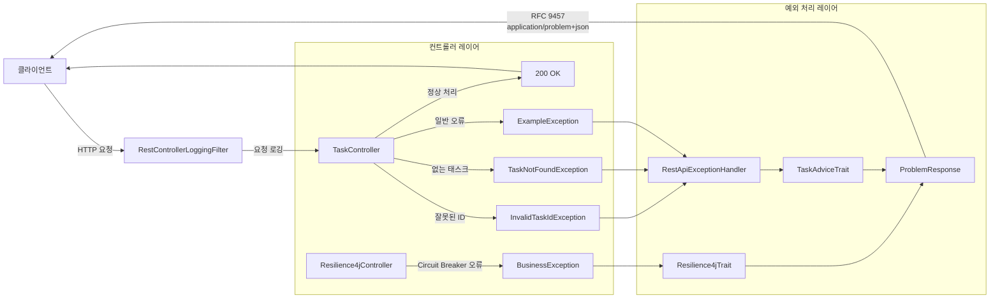

# Problem Web Demo

## 에러 처리 흐름



## 참고

- [Problem Spring Web](https://github.com/zalando/problem-spring-web)
- [A Guide to the Problem Spring Web Library](https://www.baeldung.com/problem-spring-web)
- [Handling API errors with Problem JSON](https://engineering.celonis.com/blog/handling-api-errors-with-problem-json/)

Spring Boot 4 에서는 Problem Details (RFC 9457)가 기본 지원됩니다.

- [Building Standardized API Error Responses in Spring Boot With The Problem Details Specification](https://betterprogramming.pub/building-standardized-api-error-responses-in-spring-boot-3-with-the-problem-details-specification-226ca2626620)
- [Spring Boot - Error Responses](https://docs.spring.io/spring-boot/reference/web/servlet.html#web.servlet.spring-mvc.error-handling)

## RFC 9457 Problem Details 개념

Problem Details(`application/problem+json`)는 API 에러 응답을 표준화하기 위한 스펙입니다. 기존 서비스마다 다르던 에러 응답 형식을 통일하여, 클라이언트가 에러를 일관되게 처리할 수 있도록 합니다.

### 표준 에러 응답 구조

```json
{
  "type": "https://example.com/problems/task-not-found",
  "title": "찾는 Task 없음",
  "status": 404,
  "detail": "TaskId[42]에 해당하는 Task를 찾을 수 없습니다.",
  "instance": "/tasks/42"
}
```

| 필드 | 설명 |
|---|---|
| `type` | 에러 유형을 나타내는 URI (선택) |
| `title` | 사람이 읽을 수 있는 에러 요약 |
| `status` | HTTP 상태 코드 |
| `detail` | 에러에 대한 구체적인 설명 |
| `instance` | 에러가 발생한 특정 리소스 URI |

## 주요 컴포넌트

| 클래스 | 역할 |
|---|---|
| `RestApiExceptionHandler` | `@ControllerAdvice` — `ProblemHandling` + `TaskAdviceTrait` + `Resilience4jTrait` 조합 |
| `TaskAdviceTrait` | `TaskNotFoundException` → 404, `InvalidTaskIdException` → 400 변환 |
| `Resilience4jTrait` | `BusinessException` → Circuit Breaker 관련 Problem 응답 변환 |
| `RestControllerLoggingFilter` | 요청/응답 로깅 WebFilter |
| `TaskController` | `/tasks` CRUD, 코루틴 `suspend` 함수로 구현 |
| `Resilience4jController` | Circuit Breaker 연동 예제 컨트롤러 |

## 예외 계층 구조

```
ExampleException (기반 예외)
├── TaskNotFoundException     → 404 Not Found
└── InvalidTaskIdException    → 400 Bad Request
BusinessException             → Circuit Breaker 관련 에러
```

## AdviceTrait 패턴

Zalando Problem Spring Web 라이브러리는 `AdviceTrait` 인터페이스를 통해 예외 처리 로직을 믹스인 방식으로 조합할 수 있습니다.

```kotlin
@ControllerAdvice
class RestApiExceptionHandler : ProblemHandling, TaskAdviceTrait, Resilience4jTrait {
    override fun isCausalChainsEnabled(): Boolean = true
}

// TaskAdviceTrait — 예외별 Problem 응답 생성
interface TaskAdviceTrait : AdviceTrait {
    @ExceptionHandler
    fun handleTaskNotFoundException(ex: TaskNotFoundException, request: ServerWebExchange)
        : Mono<ResponseEntity<Problem>> {
        val problem = Problem.builder()
            .withInstance(URI.create("/tasks/${ex.taskId}"))
            .withStatus(Status.NOT_FOUND)
            .withTitle("찾는 Task 없음")
            .build()
        return create(ex, problem, request)
    }
}
```

## 실행 방법

```bash
./gradlew :problem:bootRun
# 존재하지 않는 Task 조회 → 404 Problem JSON 응답
curl http://localhost:8080/tasks/999
# 잘못된 ID → 400 Bad Request
curl http://localhost:8080/tasks/-1
```
