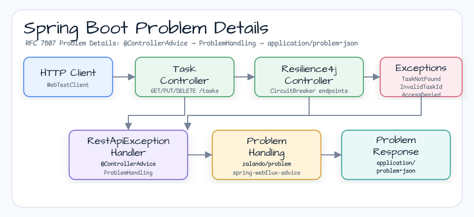

# Problem Web Demo

[한국어](README.ko.md) | English

## Example Scenario

This example exercises **Problem Web Demo** as a runnable Spring Boot application feature workshop slice. It focuses on the path a developer would inspect first: configure the module, run the sample or tests, and observe the library or framework APIs that remove repetitive infrastructure code.

## Architecture Diagram



The module is organized around the sample entry point or test fixture, the bluetape4k extension layer, and the runtime dependency used by the example. Keep the package under `io.bluetape4k.workshop.springboot` as the source of truth when comparing this README with the code.

## Sequence Diagram

This error-handling example combines Spring Boot 4, which includes built-in RFC 9457 Problem Details support, with Zalando Problem Spring Web.
It uses bluetape4k `KLogging` and `bluetape4k-resilience4j` to convert Circuit Breaker related exceptions into the RFC 9457 format.

## RFC 9457 Problem Details Concepts

Problem Details (`application/problem+json`) is a specification for standardizing API error responses.

### Standard Error Response Structure

```json
{
  "type": "https://example.com/problems/task-not-found",
  "title": "Task Not Found",
  "status": 404,
  "detail": "No task was found for TaskId[42].",
  "instance": "/tasks/42"
}
```

| Field | Description |
|---|---|
| `type` | URI that identifies the error type (optional) |
| `title` | Human-readable error summary |
| `status` | HTTP status code |
| `detail` | Detailed description of the error |
| `instance` | URI of the specific resource where the error occurred |

## Main Components

| Class | Role |
|---|---|
| `RestApiExceptionHandler` | `@ControllerAdvice` — combines `ProblemHandling` + `TaskAdviceTrait` + `Resilience4jTrait` |
| `TaskAdviceTrait` | Converts `TaskNotFoundException` to 404 and `InvalidTaskIdException` to 400 |
| `Resilience4jTrait` | Converts Resilience4j exceptions into Circuit Breaker/Bulkhead/RateLimit Problem responses |
| `RestControllerLoggingFilter` | WebFilter for request/response logging |
| `TaskController` | `/tasks` CRUD implemented with coroutine `suspend` functions |
| `Resilience4jController` | Example controller integrated with Circuit Breaker |

## Exception Hierarchy

```
ExampleException (base exception)
├── TaskNotFoundException     → 404 Not Found
└── InvalidTaskIdException    → 400 Bad Request
BulkheadFullException         → 429 Too Many Requests
CallNotPermittedException     → 503 Service Unavailable
RequestNotPermitted           → 509 Bandwidth Limit Exceeded
MaxRetriesExceededException   → 500 Internal Server Error
```

## bluetape4k Features Used

| Feature | Artifact | Code Location | Benefit |
|---|---|---|---|
| `KLogging` | `bluetape4k-logging` | All companion objects | Lazy lambda logging and structured exception logging |
| `bluetape4k-resilience4j` | `bluetape4k-resilience4j` | `Resilience4jTrait` | Provides traits that convert Resilience4j exceptions into Problem JSON |

## bluetape4k Before / After

### `KLogging` vs Traditional Logger

```kotlin
// Before — Direct SLF4J LoggerFactory usage
private val logger = LoggerFactory.getLogger(TaskController::class.java)
logger.info("Task requested: {}", taskId)  // Always interpolates the message

// After — KLogging (lazy lambda, simplified exception logging)
companion object: KLogging()

log.info { "Task requested: $taskId" }         // Lambda is not executed when disabled
log.warn(e) { "Task not found: $taskId" }      // Combines exception + message
```

### Resilience4j Exception Handling — AdviceTrait Mixin

```kotlin
// Before — Repeated @ExceptionHandler methods for each exception
@ControllerAdvice
class GlobalExceptionHandler {
    @ExceptionHandler(CallNotPermittedException::class)
    fun handleCircuitBreaker(ex: CallNotPermittedException): ResponseEntity<ErrorDto> {
        return ResponseEntity.status(503).body(ErrorDto("SERVICE_UNAVAILABLE", ex.message))
    }
    // ... repeated ...
}

// After — Automatic handling with the bluetape4k Resilience4jTrait mixin
@ControllerAdvice
class RestApiExceptionHandler : ProblemHandling, TaskAdviceTrait, Resilience4jTrait {
    override fun isCausalChainsEnabled(): Boolean = true
    // Automatically converts Resilience4j exceptions to RFC 9457 Problem JSON
}
```

## AdviceTrait Pattern

```kotlin
// TaskAdviceTrait — Creates Problem responses per exception
interface TaskAdviceTrait : AdviceTrait {
    @ExceptionHandler
    fun handleTaskNotFoundException(ex: TaskNotFoundException, request: ServerWebExchange)
        : Mono<ResponseEntity<Problem>> {
        val problem = Problem.builder()
            .withInstance(URI.create("/tasks/${ex.taskId}"))
            .withStatus(Status.NOT_FOUND)
            .withTitle("Task Not Found")
            .build()
        return create(ex, problem, request)
    }
}

// Resilience4jTrait — BT-provided Circuit Breaker/Bulkhead/RateLimit handling
interface Resilience4jTrait : AdviceTrait {
    @ExceptionHandler
    fun handleCircuitBreakerCallNotPermitted(
        ex: CallNotPermittedException, request: ServerWebExchange
    ): Mono<ResponseEntity<Problem>> {
        val headers = HttpHeaders().apply { add(HttpHeaders.RETRY_AFTER, "10") }
        return create(Status.SERVICE_UNAVAILABLE, ex, request, headers)
    }
    // ...
}
```

## How to Run

```bash
./gradlew :problem:bootRun

# Query a nonexistent task -> 404 Problem JSON response
curl http://localhost:8080/tasks/999

# Invalid ID -> 400 Bad Request
curl http://localhost:8080/tasks/-1
```

## References

- [Problem Spring Web](https://github.com/zalando/problem-spring-web)
- [RFC 9457 Problem Details](https://www.rfc-editor.org/rfc/rfc9457)
- [Spring Boot - Error Responses](https://docs.spring.io/spring-boot/reference/web/servlet.html#web.servlet.spring-mvc.error-handling)
- [bluetape4k-resilience4j](https://github.com/bluetape4k/bluetape4k-projects)
