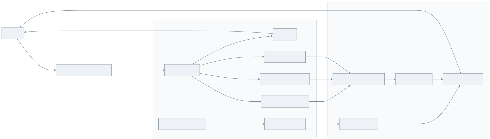

# Problem Web Demo

[한국어](README.ko.md) | English

## Example Scenario

This example exercises **Problem Web Demo** as a runnable Spring Boot application feature workshop slice. It focuses on the path a developer would inspect first: configure the module, run the sample or tests, and observe the library or framework APIs that remove repetitive infrastructure code.

## Architecture Diagram


The module is organized around the sample entry point or test fixture, the bluetape4k extension layer, and the runtime dependency used by the example. Keep the package under `io.bluetape4k.workshop.springboot` as the source of truth when comparing this README with the code.


## Flow Diagram

1. Prepare the local runtime required by `spring-boot-problem`.
2. Execute the application, controller, service, or test fixture that owns the example scenario.
3. Delegate repetitive infrastructure work to bluetape4k utilities or Spring/Kotlin integrations.
4. Assert the visible result through the sample output, HTTP response, repository state, metric, trace, or test expectation.



## Sequence Diagram

The core sequence is: caller or test fixture -> workshop adapter -> bluetape4k helper/API -> external runtime or in-memory backend -> assertion/response. When this module has a dedicated sequence asset, the image below shows that interaction order; otherwise the source tests are the authoritative executable sequence.

Spring Boot 4 (RFC 9457 Problem Details 기본 지원)와 Zalando Problem Spring Web을 조합한 에러 처리 예제입니다.
bluetape4k의 `KLogging`과 `bluetape4k-resilience4j`를 통해 Circuit Breaker 관련 예외를 RFC 9457 형식으로 변환합니다.

## 에러 처리 흐름


## RFC 9457 Problem Details 개념

Problem Details(`application/problem+json`)는 API 에러 응답을 표준화하기 위한 스펙입니다.

### 표준 에러 응답 구조

```json
{
  "type": "https://example.com/problems/task-not-found",
  "title": "찾는 Task 없음",
  "status": 404,
  "detail": "TaskId[42]에 해당하는 Task를 찾을 수 없습니다.",
  "instance": "/tasks/42"
}
```

| 필드 | 설명 |
|---|---|
| `type` | 에러 유형을 나타내는 URI (선택) |
| `title` | 사람이 읽을 수 있는 에러 요약 |
| `status` | HTTP 상태 코드 |
| `detail` | 에러에 대한 구체적인 설명 |
| `instance` | 에러가 발생한 특정 리소스 URI |

## 주요 컴포넌트

| 클래스 | 역할 |
|---|---|
| `RestApiExceptionHandler` | `@ControllerAdvice` — `ProblemHandling` + `TaskAdviceTrait` + `Resilience4jTrait` 조합 |
| `TaskAdviceTrait` | `TaskNotFoundException` → 404, `InvalidTaskIdException` → 400 변환 |
| `Resilience4jTrait` | Resilience4j 예외 → Circuit Breaker/Bulkhead/RateLimit Problem 응답 변환 |
| `RestControllerLoggingFilter` | 요청/응답 로깅 WebFilter |
| `TaskController` | `/tasks` CRUD, 코루틴 `suspend` 함수로 구현 |
| `Resilience4jController` | Circuit Breaker 연동 예제 컨트롤러 |

## 예외 계층 구조

```
ExampleException (기반 예외)
├── TaskNotFoundException     → 404 Not Found
└── InvalidTaskIdException    → 400 Bad Request
BulkheadFullException         → 429 Too Many Requests
CallNotPermittedException     → 503 Service Unavailable
RequestNotPermitted           → 509 Bandwidth Limit Exceeded
MaxRetriesExceededException   → 500 Internal Server Error
```

## 사용된 bluetape4k 기능

| 기능 | 아티팩트 | 코드 위치 | 이점 |
|---|---|---|---|
| `KLogging` | `bluetape4k-logging` | 모든 companion object | Lazy 람다 로깅, 구조적 예외 로깅 |
| `bluetape4k-resilience4j` | `bluetape4k-resilience4j` | `Resilience4jTrait` | Resilience4j 예외 → Problem JSON 변환 trait 제공 |

## bluetape4k Before / After

### `KLogging` vs 기존 로거

```kotlin
// Before — SLF4J LoggerFactory 직접 사용
private val logger = LoggerFactory.getLogger(TaskController::class.java)
logger.info("Task requested: {}", taskId)  // 항상 문자열 보간

// After — KLogging (lazy 람다, 예외 로깅 단순화)
companion object: KLogging()

log.info { "Task requested: $taskId" }         // DISABLED 시 람다 미실행
log.warn(e) { "Task not found: $taskId" }      // 예외 + 메시지 조합
```

### Resilience4j 예외 처리 — AdviceTrait 믹스인

```kotlin
// Before — 각 예외마다 @ExceptionHandler 반복 작성
@ControllerAdvice
class GlobalExceptionHandler {
    @ExceptionHandler(CallNotPermittedException::class)
    fun handleCircuitBreaker(ex: CallNotPermittedException): ResponseEntity<ErrorDto> {
        return ResponseEntity.status(503).body(ErrorDto("SERVICE_UNAVAILABLE", ex.message))
    }
    // ... 반복 ...
}

// After — bluetape4k Resilience4jTrait 믹스인으로 자동 처리
@ControllerAdvice
class RestApiExceptionHandler : ProblemHandling, TaskAdviceTrait, Resilience4jTrait {
    override fun isCausalChainsEnabled(): Boolean = true
    // Resilience4j 예외 → RFC 9457 Problem JSON 자동 변환
}
```

## AdviceTrait 패턴

```kotlin
// TaskAdviceTrait — 예외별 Problem 응답 생성
interface TaskAdviceTrait : AdviceTrait {
    @ExceptionHandler
    fun handleTaskNotFoundException(ex: TaskNotFoundException, request: ServerWebExchange)
        : Mono<ResponseEntity<Problem>> {
        val problem = Problem.builder()
            .withInstance(URI.create("/tasks/${ex.taskId}"))
            .withStatus(Status.NOT_FOUND)
            .withTitle("찾는 Task 없음")
            .build()
        return create(ex, problem, request)
    }
}

// Resilience4jTrait — BT가 제공하는 Circuit Breaker/Bulkhead/RateLimit 처리
interface Resilience4jTrait : AdviceTrait {
    @ExceptionHandler
    fun handleCircuitBreakerCallNotPermitted(
        ex: CallNotPermittedException, request: ServerWebExchange
    ): Mono<ResponseEntity<Problem>> {
        val headers = HttpHeaders().apply { add(HttpHeaders.RETRY_AFTER, "10") }
        return create(Status.SERVICE_UNAVAILABLE, ex, request, headers)
    }
    // ...
}
```

## 실행 방법

```bash
./gradlew :problem:bootRun

# 존재하지 않는 Task 조회 → 404 Problem JSON 응답
curl http://localhost:8080/tasks/999

# 잘못된 ID → 400 Bad Request
curl http://localhost:8080/tasks/-1
```

## 참고

- [Problem Spring Web](https://github.com/zalando/problem-spring-web)
- [RFC 9457 Problem Details](https://www.rfc-editor.org/rfc/rfc9457)
- [Spring Boot - Error Responses](https://docs.spring.io/spring-boot/reference/web/servlet.html#web.servlet.spring-mvc.error-handling)
- [bluetape4k-resilience4j](https://github.com/bluetape4k/bluetape4k-projects)
