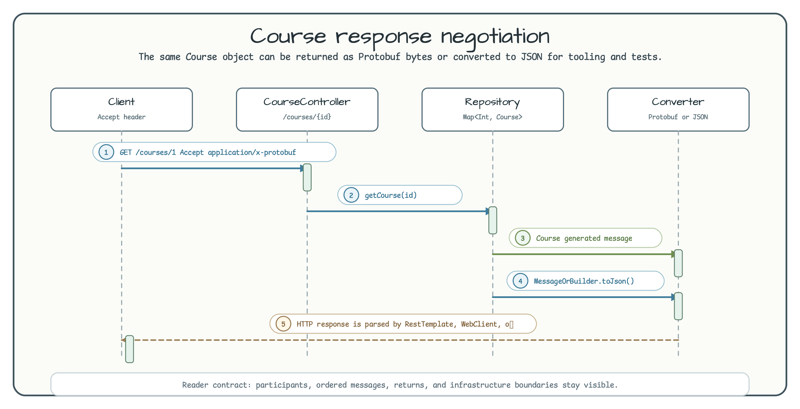

# Module Protobuf in Spring Boot MVC

[English](README.md) | 한국어

이 모듈은 Spring MVC content negotiation으로 generated Protobuf message를 반환하는 흐름을 보여줍니다.
`CourseController`가 반환한 generated `Course` message는 `ProtobufHttpMessageConverter`가 직렬화하고,
`ProtobufConverter`는 테스트와 도구에서 JSON 상호 변환을 확인할 때 사용합니다.

## 아키텍처 다이어그램


## 요청 흐름



이 예제는 서버 데이터를 Protobuf 형식으로 보내고 받는 방법을 보여 줍니다.

## Protobuf 개념

**Protocol Buffers(Protobuf)**는 Google이 개발한 언어 및 플랫폼 중립 바이너리 직렬화 형식입니다.

| 기능 | JSON | Protobuf |
|------|------|----------|
| 형식 | 텍스트 | 바이너리 |
| 스키마 | 선택 사항 | `.proto` 파일로 강제 |
| 페이로드 크기 | 상대적으로 큼 | 3-10배 더 작음 |
| Content-Type | `application/json` | `application/x-protobuf` |
| 코드 생성 | 필요 없음 | `protoc` 컴파일러로 자동 생성 |

Spring Boot에서는 `ProtobufHttpMessageConverter` 빈을 등록하면 `application/x-protobuf` Content-Type 요청과 응답을 자동으로 처리합니다.

## 도메인 모델(`.proto` 스키마)

```protobuf
// school.proto
message Course {
  int32 id = 1;
  string course_name = 2;
  repeated Student student = 3;
}

message Student {
  int32 id = 1;
  string first_name = 2;
  string last_name = 3;
  string email = 4;
  repeated PhoneNumber phone = 5;

  enum PhoneType { MOBILE = 0; LANDLINE = 1; }
  message PhoneNumber {
    string number = 1;
    PhoneType type = 2;
  }
}
```

Kotlin DSL 빌더(`course { }`, `student { }`, `phoneNumber { }`)로 Protobuf 메시지를 간결하게 만들 수 있습니다.

## 주요 기능

| 기능 | 구현 위치 | 설명 |
|------|----------|------|
| Protobuf 컨버터 등록 | `ConurceConfig` | `ProtobufHttpMessageConverter` 빈 등록 |
| Course 조회 | `CourseController.course()` | `GET /courses/{id}` — Protobuf 직렬화 응답 |
| JSON 변환 유틸리티 | `ProtobufConverter` | `MessageOrBuilder.toJson()`, `messageFromJsonOrNull<T>()` |
| 인메모리 저장소 | `CourseRepository` | `Map<Int, Course>` 기반 단순 저장소 |

## API 엔드포인트

| 메서드 | 경로 | 설명 | Content-Type |
|--------|------|------|-------------|
| `GET` | `/courses/{id}` | 특정 course를 조회합니다. | `application/x-protobuf` |

## 사용 예제

### Protobuf 요청(curl)

```bash
# Receive a Protobuf response (binary)
curl -H "Accept: application/x-protobuf" http://localhost:8080/courses/1 -o course.pb

# JSON can also be received through Spring Content Negotiation
curl -H "Accept: application/json" http://localhost:8080/courses/1
```

### Kotlin DSL로 Protobuf 메시지 만들기

```kotlin
val newCourse = course {
    id = 1
    courseName = "Kotlin Programming"
    student.addAll(listOf(
        student {
            id = 1
            firstName = "John"
            lastName = "Doe"
            email = "john.doe@example.com"
            phone.add(phoneNumber {
                number = "010-1234-5678"
                type = Student.PhoneType.MOBILE
            })
        }
    ))
}
```

### Protobuf와 JSON 상호 변환

```kotlin
// Convert a Protobuf message to a JSON string
val json: String = course.toJson()

// Convert a JSON string to a Protobuf message
val course: Course? = messageFromJsonOrNull<Course>(json)
```

## 빌드 설정

`.proto` 파일은 `src/main/proto/` 아래에 있으며, `protobuf-gradle-plugin`이 빌드 중 Kotlin/Java 소스를 자동 생성합니다.

```kotlin
// build.gradle.kts
plugins {
    id("com.google.protobuf") version "..."
}
protobuf {
    protoc { artifact = "com.google.protobuf:protoc:..." }
    generateProtoTasks { all().forEach { it.builtins { id("kotlin") } } }
}
```
