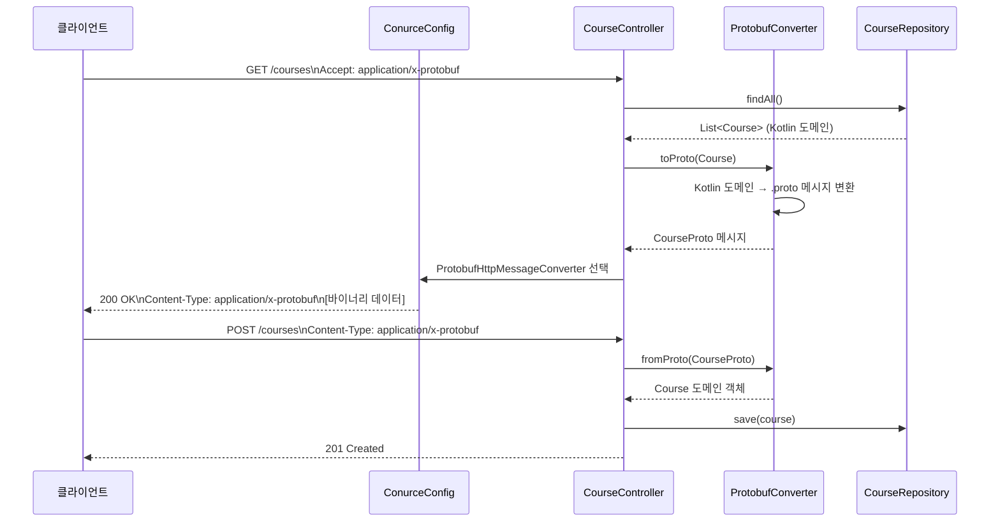

# Module Protobuf in Spring Boot MVC

서버의 데이터를 Protobuf 형식으로 주고 받는 방법을 알아보자.

## Protobuf 직렬화 흐름



## Protobuf 개념

**Protocol Buffers (Protobuf)** 는 Google이 개발한 언어·플랫폼 중립적인 바이너리 직렬화 포맷입니다.

| 특성 | JSON | Protobuf |
|------|------|----------|
| 포맷 | 텍스트 | 바이너리 |
| 스키마 | 선택적 | `.proto` 파일로 강제 정의 |
| 페이로드 크기 | 상대적으로 큼 | 3~10배 절감 |
| Content-Type | `application/json` | `application/x-protobuf` |
| 코드 생성 | 불필요 | `protoc` 컴파일러로 자동 생성 |

Spring Boot에서는 `ProtobufHttpMessageConverter` 빈을 등록하면 `application/x-protobuf` Content-Type 요청·응답을 자동으로 처리합니다.

## 도메인 모델 (`.proto` 스키마)

```protobuf
// school.proto
message Course {
  int32 id = 1;
  string course_name = 2;
  repeated Student student = 3;
}

message Student {
  int32 id = 1;
  string first_name = 2;
  string last_name = 3;
  string email = 4;
  repeated PhoneNumber phone = 5;

  enum PhoneType { MOBILE = 0; LANDLINE = 1; }
  message PhoneNumber {
    string number = 1;
    PhoneType type = 2;
  }
}
```

Kotlin DSL 빌더(`course { }`, `student { }`, `phoneNumber { }`)로 Protobuf 메시지를 간결하게 생성합니다.

## 주요 기능

| 기능 | 구현 위치 | 설명 |
|------|----------|------|
| Protobuf 컨버터 등록 | `ConurceConfig` | `ProtobufHttpMessageConverter` 빈 등록 |
| 과목 조회 | `CourseController.course()` | `GET /courses/{id}` — Protobuf 직렬화 응답 |
| JSON 변환 유틸 | `ProtobufConverter` | `MessageOrBuilder.toJson()`, `messageFromJsonOrNull<T>()` |
| 인메모리 저장소 | `CourseRepository` | `Map<Int, Course>` 기반 간단 저장소 |

## API 엔드포인트

| 메서드 | 경로 | 설명 | Content-Type |
|--------|------|------|-------------|
| `GET` | `/courses/{id}` | 특정 과목 조회 | `application/x-protobuf` |

## 사용 예제

### Protobuf 요청 (curl)

```bash
# Protobuf 응답 수신 (바이너리)
curl -H "Accept: application/x-protobuf" http://localhost:8080/courses/1 -o course.pb

# JSON으로도 수신 가능 (Spring의 Content Negotiation)
curl -H "Accept: application/json" http://localhost:8080/courses/1
```

### Kotlin DSL로 Protobuf 메시지 빌드

```kotlin
val newCourse = course {
    id = 1
    courseName = "Kotlin Programming"
    student.addAll(listOf(
        student {
            id = 1
            firstName = "John"
            lastName = "Doe"
            email = "john.doe@example.com"
            phone.add(phoneNumber {
                number = "010-1234-5678"
                type = Student.PhoneType.MOBILE
            })
        }
    ))
}
```

### Protobuf ↔ JSON 변환

```kotlin
// Protobuf 메시지를 JSON 문자열로
val json: String = course.toJson()

// JSON 문자열을 Protobuf 메시지로
val course: Course? = messageFromJsonOrNull<Course>(json)
```

## 빌드 설정

`.proto` 파일은 `src/main/proto/` 에 위치하며, `protobuf-gradle-plugin`이 빌드 시 Kotlin/Java 소스를 자동 생성합니다.

```kotlin
// build.gradle.kts
plugins {
    id("com.google.protobuf") version "..."
}
protobuf {
    protoc { artifact = "com.google.protobuf:protoc:..." }
    generateProtoTasks { all().forEach { it.builtins { id("kotlin") } } }
}
```
