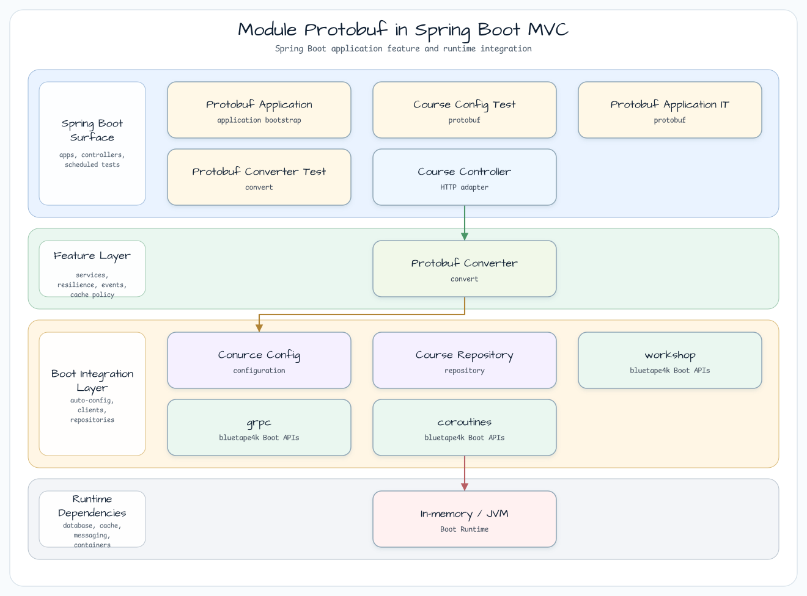
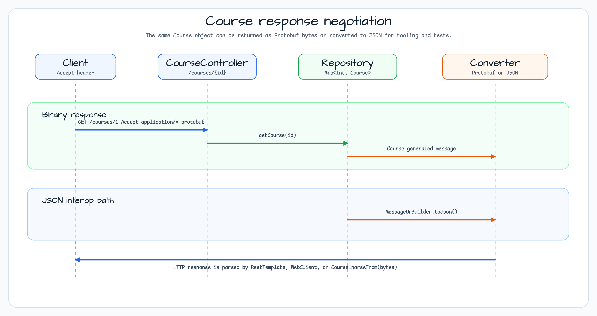

# Module Protobuf in Spring Boot MVC

[한국어](README.ko.md) | English

This module shows Spring MVC content negotiation for generated Protobuf messages.
`ProtobufHttpMessageConverter` serializes the generated `Course` message returned
by `CourseController`, while `ProtobufConverter` demonstrates JSON interop for
tests and tooling.

## Architecture Diagram



## Request Flow



This example shows how to send and receive server data in Protobuf format.

## Protobuf Concepts

**Protocol Buffers (Protobuf)** is a language- and platform-neutral binary serialization format developed by Google.

| Feature | JSON | Protobuf |
|------|------|----------|
| Format | Text | Binary |
| Schema | Optional | Enforced with a `.proto` file |
| Payload size | Relatively large | 3-10x smaller |
| Content-Type | `application/json` | `application/x-protobuf` |
| Code generation | Not required | Automatically generated by the `protoc` compiler |

In Spring Boot, registering a `ProtobufHttpMessageConverter` bean automatically handles requests and responses with the `application/x-protobuf` Content-Type.

## Domain Model (`.proto` Schema)

```protobuf
// school.proto
message Course {
  int32 id = 1;
  string course_name = 2;
  repeated Student student = 3;
}

message Student {
  int32 id = 1;
  string first_name = 2;
  string last_name = 3;
  string email = 4;
  repeated PhoneNumber phone = 5;

  enum PhoneType { MOBILE = 0; LANDLINE = 1; }
  message PhoneNumber {
    string number = 1;
    PhoneType type = 2;
  }
}
```

Kotlin DSL builders (`course { }`, `student { }`, `phoneNumber { }`) make Protobuf message construction concise.

## Key Features

| Feature | Implementation Location | Description |
|------|----------|------|
| Protobuf converter registration | `ConurceConfig` | Registers the `ProtobufHttpMessageConverter` bean |
| Course lookup | `CourseController.course()` | `GET /courses/{id}` — Protobuf-serialized response |
| JSON conversion utility | `ProtobufConverter` | `MessageOrBuilder.toJson()`, `messageFromJsonOrNull<T>()` |
| In-memory repository | `CourseRepository` | Simple repository based on `Map<Int, Course>` |

## API Endpoints

| Method | Path | Description | Content-Type |
|--------|------|------|-------------|
| `GET` | `/courses/{id}` | Retrieves a specific course | `application/x-protobuf` |

## Usage Examples

### Protobuf Request (curl)

```bash
# Receive a Protobuf response (binary)
curl -H "Accept: application/x-protobuf" http://localhost:8080/courses/1 -o course.pb

# JSON can also be received through Spring Content Negotiation
curl -H "Accept: application/json" http://localhost:8080/courses/1
```

### Building Protobuf Messages with the Kotlin DSL

```kotlin
val newCourse = course {
    id = 1
    courseName = "Kotlin Programming"
    student.addAll(listOf(
        student {
            id = 1
            firstName = "John"
            lastName = "Doe"
            email = "john.doe@example.com"
            phone.add(phoneNumber {
                number = "010-1234-5678"
                type = Student.PhoneType.MOBILE
            })
        }
    ))
}
```

### Protobuf to/from JSON Conversion

```kotlin
// Convert a Protobuf message to a JSON string
val json: String = course.toJson()

// Convert a JSON string to a Protobuf message
val course: Course? = messageFromJsonOrNull<Course>(json)
```

## Build Configuration

`.proto` files are located under `src/main/proto/`, and `protobuf-gradle-plugin` automatically generates Kotlin/Java sources during the build.

```kotlin
// build.gradle.kts
plugins {
    id("com.google.protobuf") version "..."
}
protobuf {
    protoc { artifact = "com.google.protobuf:protoc:..." }
    generateProtoTasks { all().forEach { it.builtins { id("kotlin") } } }
}
```
