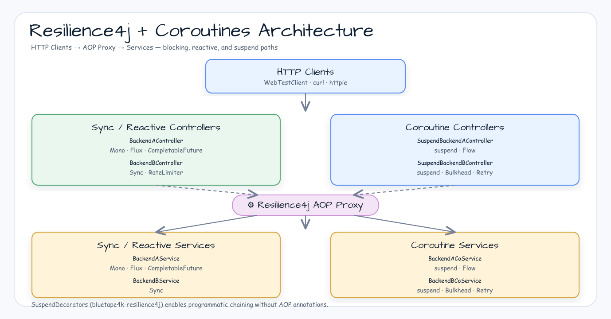

# Spring Boot 4 + Resilience4j + Coroutines 워크샵

[English](README.md) | 한국어

## 예제 시나리오

이 예제는 **Spring Boot 4 + Resilience4j + Coroutines 워크샵** 모듈을 실행 가능한 Spring Boot 애플리케이션 기능 예제로 보여줍니다. 개발자가 먼저 확인할 경로인 모듈 설정, 샘플 또는 테스트 실행, 반복적인 인프라 코드를 줄이는 라이브러리 또는 프레임워크 API 사용 방식을 중심으로 설명합니다.

## 흐름 다이어그램

1. `spring-boot-resilience4j-coroutines` 예제에 필요한 로컬 런타임을 준비합니다.
2. 예제 시나리오를 담당하는 애플리케이션, 컨트롤러, 서비스 또는 테스트 픽스처를 실행합니다.
3. 반복적인 인프라 처리는 bluetape4k 유틸리티 또는 Spring/Kotlin 통합 기능에 위임합니다.
4. 샘플 출력, HTTP 응답, 저장소 상태, metric, trace 또는 테스트 기대값으로 결과를 검증합니다.

## 시퀀스 다이어그램

핵심 시퀀스는 호출자 또는 테스트 픽스처 -> 워크샵 어댑터 -> bluetape4k 헬퍼/API -> 외부 런타임 또는 인메모리 백엔드 -> 검증/응답 순서입니다. 전용 시퀀스 이미지가 있는 모듈은 아래 이미지가 상호작용 순서를 보여주며, 없는 경우 소스 테스트가 실행 가능한 시퀀스의 기준입니다.

원본: [resilience4j-spring-boot3-demo](https://github.com/resilience4j/resilience4j-spring-boot3-demo)

## 아키텍처




### Circuit Breaker 상태 전이


## 개요

Resilience4j 2.4.0을 Spring Boot 4 환경에서 Kotlin 코루틴과 함께 사용하는 예제입니다.
CircuitBreaker, Bulkhead, Retry, TimeLimiter, RateLimiter를 블로킹 및 논블로킹
(suspend / Flow / Mono / Flux / CompletableFuture) 코드 경로에 적용하는 방법을 다룹니다.

## 사용된 Bluetape4k 기능

| 모듈 | 기능 | 사용 위치 |
|---|---|---|
| `bluetape4k-logging` | `KLogging()` / `KLoggingChannel()` | 서비스 및 테스트의 구조화된 로깅 |
| `bluetape4k-junit5` | `runSuspendIO { }` | 실제 I/O를 포함한 suspend 테스트 블록 실행 |
| `bluetape4k-resilience4j` | `SuspendDecorators` | suspend 함수용 프로그래밍 방식 내결함성 데코레이터 체인 |
| `bluetape4k-assertions` | `shouldBeEqualTo`, `shouldBeTrue` 등 | 타입 안전한 테스트 단언문 |

## Resilience4j 패턴 설명

### Circuit Breaker (서킷 브레이커)

실패율이 설정된 임계값을 초과하면 OPEN 상태로 전환하여 장애 백엔드 호출을 차단합니다.
HALF-OPEN 상태에서 프로브 호출이 성공하면 CLOSED로 복귀합니다.

```kotlin
@CircuitBreaker(name = "backendA", fallbackMethod = "fallback")
fun failureWithFallback(): String { throw IOException("BAM!") }

// 예외 타입별 fallback 오버로드
private fun fallback(ex: HttpServerErrorException): String = "Recovered: ${ex.message}"

// suspend 함수 — 동일한 어노테이션, fallback은 suspend여서는 안 됨
@CircuitBreaker(name = "backendA", fallbackMethod = "suspendFallback")
override suspend fun suspendFailureWithFallback(): String = suspendFailure()

private fun suspendFallback(ex: Throwable): String = "Recovered: ${ex.message}"
```

### Retry (재시도)

실패한 호출을 설정된 최대 횟수까지 재시도합니다. `BusinessException` 등 특정 예외는 재시도에서 제외할 수 있습니다.

```kotlin
@CircuitBreaker(name = "backendA")
@Bulkhead(name = "backendA")
@Retry(name = "backendA")
override suspend fun suspendFailure(): String { throw IOException("BAM!") }
```

> **Flow 반환 시 주의:** `@Retry` 어노테이션은 `Flow`를 반환하는 함수에 적용되지 않습니다.
> `Flow.retry(retry)` 확장 함수를 사용하세요.

### Bulkhead (격벽)

동시 실행 수를 제한하여 스레드 고갈을 방지합니다. 코루틴용 세마포어 방식과
`CompletableFuture` 기반 코드용 스레드 풀 방식을 모두 지원합니다.

```kotlin
@CircuitBreaker(name = "backendA")
@Bulkhead(name = "backendA")
override suspend fun suspendSuccess(): String = "Hello World"
```

### TimeLimiter (시간 제한)

호출에 타임아웃을 적용합니다. `Mono`, `Flux`, `CompletableFuture`와 함께 작동합니다.

> **⚠️ 경고:** `@TimeLimiter`는 Resilience4j 2.4.x에서 Kotlin `suspend` 함수에
> **호환되지 않습니다**. 설정된 시간 후 실제 `TimeoutException`을 발생시킵니다 (무시되지 않음).
> 코루틴 타임아웃에는 `kotlinx.coroutines.withTimeout`을 사용하세요:
>
> ```kotlin
> withTimeout(2_000L) { slowSuspendOperation() }
> ```

### Rate Limiter (속도 제한)

시간 윈도우 내의 호출 수를 제한합니다. Backend B는 IP 기반 속도 제한을 시연합니다.

## 코루틴 통합 핵심 발견 사항

| 패턴 | 지원 여부 | 비고 |
|---|---|---|
| `@CircuitBreaker` + `suspend` | ✅ | AOP 프록시가 suspend 함수를 올바르게 래핑 |
| `@Bulkhead` + `suspend` | ✅ | 세마포어 bulkhead가 suspend와 함께 작동 |
| `@Retry` + `suspend` | ⚠️ | 어노테이션 기반 재시도는 알려진 버그 있음; `CoDecorators` 사용 권장 |
| `@TimeLimiter` + `suspend` | ❌ | 실제 `TimeoutException` 발생; `withTimeout {}` 사용 권장 |
| `@Retry` + `Flow` | ❌ | 적용 안 됨; `Flow.retry(retry)` 확장 함수 사용 |
| suspend용 CircuitBreaker fallback | ⚠️ | fallback 메서드는 suspend여서는 안 됨 |
| suspend/리액티브 메트릭 업데이트 | ⚠️ | 비동기 경로는 레지스트리를 동기적으로 업데이트하지 않음 |

## 설정

전체 설정은 `src/main/resources/application.yml` 참조. 핵심 항목:

```yaml
resilience4j:
  circuitbreaker:
    instances:
      backendA:
        slidingWindowSize: 10
        permittedNumberOfCallsInHalfOpenState: 3
        waitDurationInOpenState: 1s
        failureRateThreshold: 50
        ignoreExceptions:
          - io.bluetape4k.workshop.resilience.exception.BusinessException

  retry:
    instances:
      backendA:
        maxAttempts: 3
        waitDuration: 500ms

  bulkhead:
    instances:
      backendA:
        maxConcurrentCalls: 10

  timelimiter:
    instances:
      backendA:
        timeoutDuration: 2s
```

## 실행

```bash
# 애플리케이션 시작
./gradlew :spring-boot-resilience4j-coroutines:bootRun

# Actuator 엔드포인트
curl http://localhost:8080/actuator/circuitbreakers
curl http://localhost:8080/actuator/health
curl http://localhost:8080/actuator/metrics/resilience4j.circuitbreaker.calls

# API 호출 예시
curl http://localhost:8080/backendA/suspendFailureWithFallback
curl http://localhost:8080/coroutines/backendA/suspendSuccess
```

## 테스트

```bash
./gradlew :spring-boot-resilience4j-coroutines:test
```

테스트: 73개 통과, 6개 스킵 (`@Disabled` — Resilience4j + 코루틴 알려진 제한사항).

## 참고 자료

- [Resilience4j Spring Boot 3 Demo](https://github.com/resilience4j/resilience4j-spring-boot3-demo)
- [Resilience4j Kotlin Coroutines 지원](https://resilience4j.readme.io/docs/getting-started-3)
- [bluetape4k-leader](https://github.com/bluetape4k/bluetape4k-leader) — 분산 리더 선출

[English](README.md)
