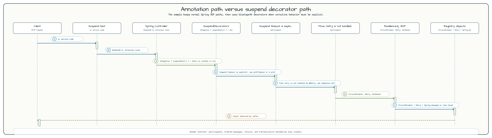

# Spring Boot 4 + Resilience4j + Coroutines Workshop

[English](README.md) | 한국어

## 이 예제가 보여 주는 것

이 모듈은 Spring Boot 4 애플리케이션에서 Resilience4j 적용 방식이 달라지는 지점을 비교합니다.
blocking controller, Reactor `Mono`/`Flux`, `CompletableFuture`, Kotlin `suspend` 함수, Kotlin `Flow`,
그리고 bluetape4k `SuspendDecorators` API를 같은 설정 위에서 확인합니다. 어떤 resilience 규칙을
annotation으로 둘지, Reactor/Future wrapper로 둘지, 명시적인 coroutine decorator로 둘지 판단할 때 유용합니다.

## 아키텍처


## 요청 및 Decorator 흐름



## Circuit Breaker 상태 머신


## 개요

Spring Boot 4 애플리케이션에서 Kotlin 코루틴과 함께 Resilience4j 2.4.0 장애 허용 패턴을 적용하는 방법을 보여 줍니다.
CircuitBreaker, Bulkhead, Retry, TimeLimiter, RateLimiter를 blocking 경로와 non-blocking(suspend / Flow / Mono / Flux / CompletableFuture) 코드 경로 모두에서 다룹니다.

## 사용한 Bluetape4k 기능

| 모듈 | 기능 | 사용 방식 |
|---|---|---|
| `bluetape4k-logging` | `KLogging()` / `KLoggingChannel()` | 서비스와 테스트의 구조적 로깅 |
| `bluetape4k-junit5` | `runSuspendIO { }` | 실제 I/O를 사용하는 suspend 테스트 블록 실행 |
| `bluetape4k-resilience4j` | `SuspendDecorators` | suspend 함수용 프로그래밍 방식 resilience decorator chain |
| `bluetape4k-testcontainers` | 테스트 인프라 | 이 모듈에는 외부 인프라가 필요하지 않음 |
| `bluetape4k-assertions` | `shouldBeEqualTo`, `shouldBeTrue` 등 | 타입 안전 테스트 assertion |

## Resilience4j 패턴

### Circuit Breaker

실패율이 설정된 임계값을 초과하면 열려서 성능이 저하된 백엔드 호출을 막습니다.
HALF-OPEN 상태에서 probe 호출이 성공하면 CLOSED 상태로 돌아갑니다.

```kotlin
@CircuitBreaker(name = "backendA", fallbackMethod = "fallback")
fun failureWithFallback(): String { throw IOException("BAM!") }

// Fallback overloaded per exception type
private fun fallback(ex: HttpServerErrorException): String = "Recovered: ${ex.message}"

// suspend function — same annotation, fallback must NOT be suspend
@CircuitBreaker(name = "backendA", fallbackMethod = "suspendFallback")
override suspend fun suspendFailureWithFallback(): String = suspendFailure()

private fun suspendFallback(ex: Throwable): String = "Recovered: ${ex.message}"
```

### Retry

실패한 호출을 설정된 최대 횟수까지 재시도합니다. `BusinessException` 같은 특정 예외는 재시도에서 제외할 수 있습니다.

```kotlin
@CircuitBreaker(name = "backendA")
@Bulkhead(name = "backendA")
@Retry(name = "backendA")
override suspend fun suspendFailure(): String { throw IOException("BAM!") }
```

> **Flow 참고:** `@Retry` 애노테이션은 `Flow`를 반환하는 함수에 적용되지 않습니다.
> 대신 `Flow.retry(retry)` 확장을 사용합니다.

### Bulkhead

동시 실행 수를 제한해 스레드 고갈을 방지합니다. 코루틴용 semaphore bulkhead와 `CompletableFuture` 기반 코드용 thread-pool bulkhead를 모두 지원합니다.

```kotlin
@CircuitBreaker(name = "backendA")
@Bulkhead(name = "backendA")
override suspend fun suspendSuccess(): String = "Hello World"
```

### TimeLimiter

호출에 마감 시간을 강제합니다. `Mono`, `Flux`, `CompletableFuture`와 함께 동작합니다.

> **Coroutine 참고:** 이 모듈은 Kotlin `suspend` 함수에 `@TimeLimiter`를 의도적으로 적용하지 않습니다.
> `suspendTimeout()`은 3초 동안 지연된 뒤 정상 완료됩니다. 해당 endpoint 주변에 Resilience4j timeout
> wrapper가 없기 때문입니다. coroutine 호출에 deadline이 필요하다면 `kotlinx.coroutines.withTimeout`
> 또는 명시적인 programmatic decorator를 사용합니다.
>
> ```kotlin
> withTimeout(2_000L) { slowSuspendOperation() }
> ```

### Rate Limiter

시간 창 안의 호출 수를 제한합니다. Backend B는 IP 기반 rate limiting을 보여 줍니다.

## 주요 코루틴 통합 결과

| 패턴 | 지원 | 참고 |
|---|---|---|
| `@CircuitBreaker` + `suspend` | ✅ | AOP proxy가 suspend 함수를 올바르게 감쌉니다. |
| `@Bulkhead` + `suspend` | ✅ | Semaphore bulkhead가 suspend와 동작합니다. |
| `@Retry` + `suspend` | ⚠️ | Annotation 동작에는 제한이 있습니다. 명시적인 retry chain에는 `SuspendDecorators`를 사용합니다. |
| `@TimeLimiter` + `suspend` | ❌ | 이 endpoint에서는 사용하지 않습니다. `withTimeout {}` 또는 programmatic decorator를 사용합니다. |
| `@Retry` + `Flow` | ❌ | 적용되지 않습니다. `Flow.retry(retry)` 확장을 사용합니다. |
| suspend용 CircuitBreaker fallback | ⚠️ | fallback 메서드는 non-suspend여야 합니다. |
| suspend/reactive metric 업데이트 | ⚠️ | async 경로는 registry를 동기적으로 갱신하지 않습니다. |

## 설정

전체 설정은 `src/main/resources/application.yml`을 참고합니다. 주요 섹션은 다음과 같습니다.

```yaml
resilience4j:
  circuitbreaker:
    instances:
      backendA:
        slidingWindowSize: 10
        permittedNumberOfCallsInHalfOpenState: 3
        waitDurationInOpenState: 1s
        failureRateThreshold: 50
        ignoreExceptions:
          - io.bluetape4k.workshop.resilience.exception.BusinessException

  retry:
    instances:
      backendA:
        maxAttempts: 3
        waitDuration: 500ms

  bulkhead:
    instances:
      backendA:
        maxConcurrentCalls: 10

  timelimiter:
    instances:
      backendA:
        timeoutDuration: 2s
```

## 실행

```bash
# Start the application
./gradlew :spring-boot-resilience4j-coroutines:bootRun

# Actuator endpoints
curl http://localhost:8080/actuator/circuitbreakers
curl http://localhost:8080/actuator/health
curl http://localhost:8080/actuator/metrics/resilience4j.circuitbreaker.calls

# Example API calls
curl http://localhost:8080/backendA/suspendFailureWithFallback
curl http://localhost:8080/coroutines/backendA/suspendSuccess
```

## 테스트

```bash
./gradlew :spring-boot-resilience4j-coroutines:test
```

테스트 범위: 73 tests, 6 skipped(알려진 Resilience4j + coroutine 제한 때문에 `@Disabled` 처리).

## 참고

- [Resilience4j Spring Boot 3 Demo](https://github.com/resilience4j/resilience4j-spring-boot3-demo)
- [Resilience4j Kotlin Coroutines support](https://resilience4j.readme.io/docs/getting-started-3)
- [bluetape4k-leader](https://github.com/bluetape4k/bluetape4k-leader) — distributed leader election
