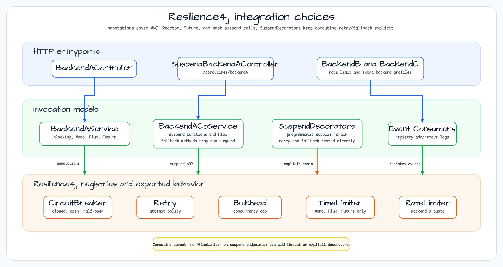
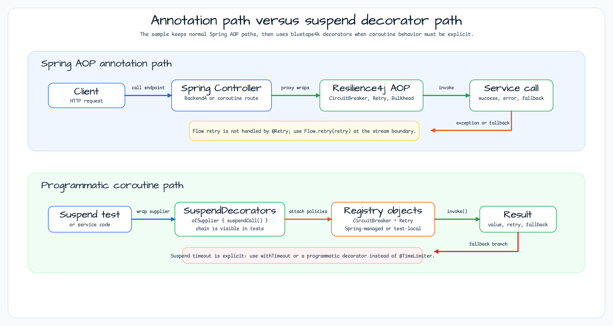
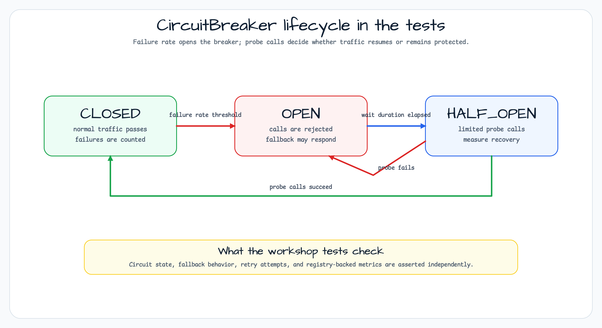

# Spring Boot 4 + Resilience4j + Coroutines Workshop

[한국어](README.ko.md) | English

## What this example shows

This module compares the Resilience4j paths that behave differently in a Spring Boot 4 application:
blocking controllers, Reactor `Mono`/`Flux`, `CompletableFuture`, Kotlin `suspend` functions, Kotlin `Flow`,
and the bluetape4k `SuspendDecorators` API. It is useful when deciding whether a resilience rule should be
an annotation, a Reactor/Future wrapper, or an explicit coroutine decorator.

## Architecture



## Request and Decorator Flow



## Circuit Breaker State Machine



## Overview

Demonstrates applying Resilience4j 2.4.0 fault-tolerance patterns in a Spring Boot 4 application with
Kotlin coroutines. Covers CircuitBreaker, Bulkhead, Retry, TimeLimiter, and RateLimiter for both
blocking and non-blocking (suspend / Flow / Mono / Flux / CompletableFuture) code paths.

## Used Bluetape4k Features

| Module | Feature | Usage |
|---|---|---|
| `bluetape4k-logging` | `KLogging()` / `KLoggingChannel()` | Structured logging in services and tests |
| `bluetape4k-junit5` | `runSuspendIO { }` | Running suspend test blocks with real I/O |
| `bluetape4k-resilience4j` | `SuspendDecorators` | Programmatic resilience decorator chain for suspend functions |
| `bluetape4k-testcontainers` | Test infrastructure | (no external infra required for this module) |
| `bluetape4k-assertions` | `shouldBeEqualTo`, `shouldBeTrue`, etc. | Type-safe test assertions |

## Resilience4j Patterns

### Circuit Breaker

Opens when the failure rate exceeds the configured threshold, preventing calls to a degraded backend.
Returns to CLOSED when probe calls succeed from HALF-OPEN state.

```kotlin
@CircuitBreaker(name = "backendA", fallbackMethod = "fallback")
fun failureWithFallback(): String { throw IOException("BAM!") }

// Fallback overloaded per exception type
private fun fallback(ex: HttpServerErrorException): String = "Recovered: ${ex.message}"

// suspend function — same annotation, fallback must NOT be suspend
@CircuitBreaker(name = "backendA", fallbackMethod = "suspendFallback")
override suspend fun suspendFailureWithFallback(): String = suspendFailure()

private fun suspendFallback(ex: Throwable): String = "Recovered: ${ex.message}"
```

### Retry

Retries failed calls up to the configured maximum. Specific exceptions (e.g., `BusinessException`)
can be excluded from retry.

```kotlin
@CircuitBreaker(name = "backendA")
@Bulkhead(name = "backendA")
@Retry(name = "backendA")
override suspend fun suspendFailure(): String { throw IOException("BAM!") }
```

> **Note for Flow:** `@Retry` annotation is NOT applied to `Flow`-returning functions.
> Use `Flow.retry(retry)` extension instead.

### Bulkhead

Limits concurrent executions to prevent thread starvation. Supports both semaphore (for coroutines)
and thread-pool bulkhead (for `CompletableFuture`-based code).

```kotlin
@CircuitBreaker(name = "backendA")
@Bulkhead(name = "backendA")
override suspend fun suspendSuccess(): String = "Hello World"
```

### TimeLimiter

Enforces a deadline on calls. Works with `Mono`, `Flux`, and `CompletableFuture`.

> **Coroutine note:** this module deliberately does not apply `@TimeLimiter` to Kotlin `suspend`
> functions. `suspendTimeout()` delays for three seconds and completes normally because there is no
> Resilience4j timeout wrapper around that endpoint. Use `kotlinx.coroutines.withTimeout` or a
> programmatic decorator when a coroutine call needs a deadline:
>
> ```kotlin
> withTimeout(2_000L) { slowSuspendOperation() }
> ```

### Rate Limiter

Limits the number of calls within a time window. Backend B demonstrates IP-based rate limiting.

## Key Coroutine Integration Findings

| Pattern | Supported | Notes |
|---|---|---|
| `@CircuitBreaker` + `suspend` | ✅ | AOP proxy wraps suspend function correctly |
| `@Bulkhead` + `suspend` | ✅ | Semaphore bulkhead works with suspend |
| `@Retry` + `suspend` | ⚠️ | Annotation behavior is limited; use `SuspendDecorators` for explicit retry chains |
| `@TimeLimiter` + `suspend` | ❌ | Not used in this endpoint; use `withTimeout {}` or a programmatic decorator |
| `@Retry` + `Flow` | ❌ | Not applied; use `Flow.retry(retry)` extension |
| CircuitBreaker fallback for `suspend` | ⚠️ | Fallback method must be non-suspend |
| Metrics update for suspend/reactive | ⚠️ | Async paths do not update registry synchronously |

## Configuration

See `src/main/resources/application.yml` for full configuration. Key sections:

```yaml
resilience4j:
  circuitbreaker:
    instances:
      backendA:
        slidingWindowSize: 10
        permittedNumberOfCallsInHalfOpenState: 3
        waitDurationInOpenState: 1s
        failureRateThreshold: 50
        ignoreExceptions:
          - io.bluetape4k.workshop.resilience.exception.BusinessException

  retry:
    instances:
      backendA:
        maxAttempts: 3
        waitDuration: 500ms

  bulkhead:
    instances:
      backendA:
        maxConcurrentCalls: 10

  timelimiter:
    instances:
      backendA:
        timeoutDuration: 2s
```

## Running

```bash
# Start the application
./gradlew :spring-boot-resilience4j-coroutines:bootRun

# Actuator endpoints
curl http://localhost:8080/actuator/circuitbreakers
curl http://localhost:8080/actuator/health
curl http://localhost:8080/actuator/metrics/resilience4j.circuitbreaker.calls

# Example API calls
curl http://localhost:8080/backendA/suspendFailureWithFallback
curl http://localhost:8080/coroutines/backendA/suspendSuccess
```

## Tests

```bash
./gradlew :spring-boot-resilience4j-coroutines:test
```

Test coverage: 73 tests, 6 skipped (annotated `@Disabled` for known Resilience4j + coroutine limitations).

## References

- [Resilience4j Spring Boot 3 Demo](https://github.com/resilience4j/resilience4j-spring-boot3-demo)
- [Resilience4j Kotlin Coroutines support](https://resilience4j.readme.io/docs/getting-started-3)
- [bluetape4k-leader](https://github.com/bluetape4k/bluetape4k-leader) — distributed leader election
