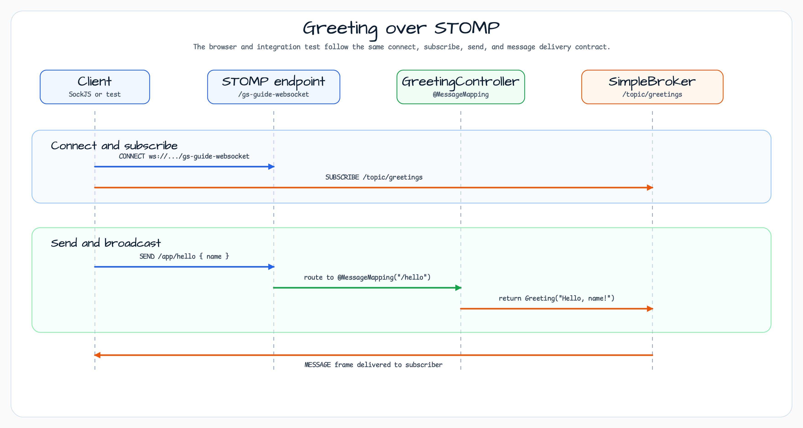

# STOMP WebSocket Example

[English](README.md) | 한국어

## 이 예제가 보여 주는 것

이 모듈은 Spring Boot STOMP WebSocket의 가장 작은 흐름을 보여 줍니다. SockJS/STOMP 클라이언트가
`/gs-guide-websocket`에 연결하고, `/app/hello`로 `HelloMessage`를 보낸 뒤, `/topic/greetings`에서
broadcast된 `Greeting`을 받습니다. Tomcat은 virtual-thread executor를 사용하므로 blocking controller
delay가 있어도 별도 broker 구현 없이 런타임 경계를 확인할 수 있습니다.

## 아키텍처 다이어그램


아키텍처는 transport 설정, application destination routing, simple broker topic, 그리고 같은 메시지
계약을 검증하는 테스트/static client를 나누어 보여 줍니다.

## Greeting 흐름



Spring Boot에서 STOMP 프로토콜을 사용하는 WebSocket 서버 예제입니다.
SockJS endpoint를 등록하고, `/app` destination은 controller method로 라우팅하며, `/topic` 메시지는
Spring의 in-memory simple broker가 broadcast합니다.

## 구성 요소

| 클래스 | 역할 |
|---|---|
| `WebSocketConfig` | STOMP 엔드포인트와 메시지 브로커를 구성합니다. |
| `TomcatConfig` | Tomcat에 Virtual Thread Executor를 적용합니다. |
| `GreetingController` | `/topic/greetings`로 `@MessageMapping("/hello")`를 발행합니다. |
| `HelloMessage` | 클라이언트에서 서버로 보내는 메시지 모델입니다. |
| `Greeting` | 서버에서 클라이언트로 보내는 응답 모델입니다. |

## 주요 설정

```kotlin
@Configuration
@EnableWebSocketMessageBroker
class WebSocketConfig : WebSocketMessageBrokerConfigurer {
    override fun registerStompEndpoints(registry: StompEndpointRegistry) {
        registry.addEndpoint("/gs-guide-websocket")
    }
    override fun configureMessageBroker(config: MessageBrokerRegistry) {
        config.enableSimpleBroker("/topic")
        config.setApplicationDestinationPrefixes("/app")
    }
}
```

## 실행

```bash
./gradlew :stomp-websocket:bootRun
```

## STOMP 프로토콜 개념

STOMP(Simple Text Oriented Messaging Protocol)는 WebSocket 위에서 동작하는 메시징 프로토콜입니다. 일반 WebSocket과 달리 목적지 기반 publish/subscribe 모델을 제공해 메시지 브로커와의 통합을 단순화합니다.

| 개념 | 설명 |
|---|---|
| **CONNECT** | 클라이언트가 서버에 STOMP 세션을 연결합니다. |
| **SEND** | 클라이언트가 서버로 메시지를 보냅니다(대상: `/app/...`). |
| **SUBSCRIBE** | 클라이언트가 특정 topic을 구독합니다(대상: `/topic/...`). |
| **MESSAGE** | 브로커가 구독자에게 메시지를 전달합니다. |
| **DISCONNECT** | 세션을 닫습니다. |

### 대상 Prefix

| Prefix | 역할 |
|---|---|
| `/app` | `@MessageMapping` 컨트롤러 메서드로 라우팅합니다. |
| `/topic` | SimpleBroker가 관리하는 구독 topic으로 브로드캐스트합니다. |

## 메시지 데이터 모델

```kotlin
// Client -> server
data class HelloMessage(val name: String)

// Server -> client
data class Greeting(val content: String)
```

## GreetingController 동작

```kotlin
@Controller
class GreetingController {
    @MessageMapping("/hello")           // Receives SEND /app/hello
    @SendTo("/topic/greetings")         // Broadcasts to /topic/greetings subscribers
    fun greeting(message: HelloMessage): Greeting {
        return Greeting("Hello, ${message.name}!")
    }
}
```

## Virtual Thread 통합

`TomcatConfig`는 Tomcat protocol handler에 virtual-thread executor를 적용합니다. 이 샘플의 controller는
짧은 blocking delay를 포함하므로 런타임 경계를 확인하기 쉽고, 메시지 계약은 일반적인 Spring STOMP
계약 그대로 유지됩니다.

## 테스트

`GreetingIntegrationTest`는 `StompSession`을 직접 만들고 `/app/hello`로 메시지를 보낸 뒤 `/topic/greetings` 구독을 통해 응답을 검증합니다.

## 참고

- [Spring STOMP WebSocket Guide](https://spring.io/guides/gs/messaging-stomp-websocket)
- [Official Spring WebSocket documentation](https://docs.spring.io/spring-framework/reference/web/websocket.html)
