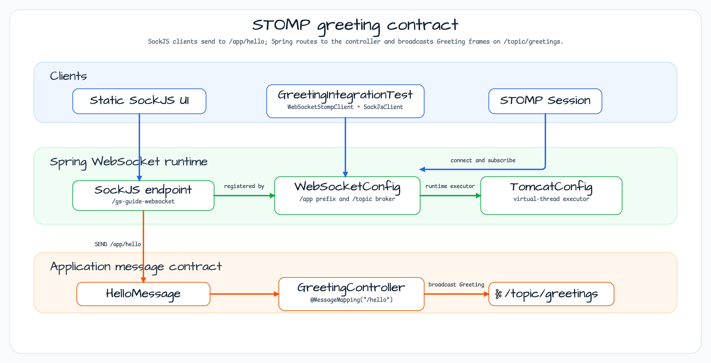
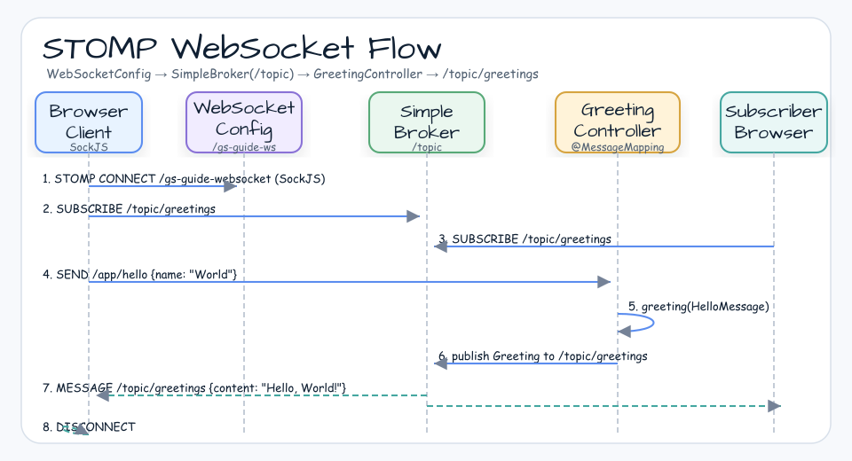

# STOMP WebSocket Example

[English](README.md) | 한국어

## 예제 시나리오

이 예제는 **STOMP WebSocket Example**을 실행 가능한 Spring Boot 애플리케이션 기능 워크숍 조각으로 다룹니다. 개발자가 먼저 확인할 경로인 모듈 설정, 샘플 또는 테스트 실행, 반복적인 인프라 코드를 줄여 주는 라이브러리와 프레임워크 API 관찰에 초점을 둡니다.

## 아키텍처 다이어그램



이 모듈은 샘플 진입점 또는 테스트 픽스처, bluetape4k 확장 계층, 예제가 사용하는 런타임 의존성을 중심으로 구성됩니다. README와 코드를 비교할 때는 `io.bluetape4k.workshop.springboot` 패키지를 기준으로 삼습니다.

## 흐름 다이어그램

1. `spring-boot-stomp-websocket`에 필요한 로컬 런타임을 준비합니다.
2. 예제 시나리오를 담당하는 애플리케이션, 컨트롤러, 서비스 또는 테스트 픽스처를 실행합니다.
3. 반복적인 인프라 작업을 bluetape4k 유틸리티 또는 Spring/Kotlin 통합에 위임합니다.
4. 샘플 출력, HTTP 응답, 저장소 상태, metric, trace 또는 테스트 기대값으로 보이는 결과를 검증합니다.

## 시퀀스 다이어그램

핵심 시퀀스는 호출자 또는 테스트 픽스처 -> 워크숍 어댑터 -> bluetape4k 헬퍼/API -> 외부 런타임 또는 인메모리 백엔드 -> 검증/응답 순서입니다. 이 모듈에 전용 시퀀스 자산이 있으면 아래 이미지가 상호작용 순서를 보여 줍니다. 없으면 소스 테스트가 실행 가능한 시퀀스의 기준입니다.



Spring Boot에서 STOMP 프로토콜을 사용하는 WebSocket 서버 예제입니다.
Virtual Threads가 활성화된 Tomcat에서 실행됩니다.

## 구성 요소

| 클래스 | 역할 |
|---|---|
| `WebSocketConfig` | STOMP 엔드포인트와 메시지 브로커를 구성합니다. |
| `TomcatConfig` | Tomcat에 Virtual Thread Executor를 적용합니다. |
| `GreetingController` | `/topic/greetings`로 `@MessageMapping("/hello")`를 발행합니다. |
| `HelloMessage` | 클라이언트에서 서버로 보내는 메시지 모델입니다. |
| `Greeting` | 서버에서 클라이언트로 보내는 응답 모델입니다. |

## STOMP 메시지 흐름


## 주요 설정

```kotlin
@Configuration
@EnableWebSocketMessageBroker
class WebSocketConfig : WebSocketMessageBrokerConfigurer {
    override fun registerStompEndpoints(registry: StompEndpointRegistry) {
        registry.addEndpoint("/gs-guide-websocket")
    }
    override fun configureMessageBroker(config: MessageBrokerRegistry) {
        config.enableSimpleBroker("/topic")
        config.setApplicationDestinationPrefixes("/app")
    }
}
```

## 실행

```bash
./gradlew :stomp-websocket:bootRun
```

## STOMP 프로토콜 개념

STOMP(Simple Text Oriented Messaging Protocol)는 WebSocket 위에서 동작하는 메시징 프로토콜입니다. 일반 WebSocket과 달리 목적지 기반 publish/subscribe 모델을 제공해 메시지 브로커와의 통합을 단순화합니다.

| 개념 | 설명 |
|---|---|
| **CONNECT** | 클라이언트가 서버에 STOMP 세션을 연결합니다. |
| **SEND** | 클라이언트가 서버로 메시지를 보냅니다(대상: `/app/...`). |
| **SUBSCRIBE** | 클라이언트가 특정 topic을 구독합니다(대상: `/topic/...`). |
| **MESSAGE** | 브로커가 구독자에게 메시지를 전달합니다. |
| **DISCONNECT** | 세션을 닫습니다. |

### 대상 Prefix

| Prefix | 역할 |
|---|---|
| `/app` | `@MessageMapping` 컨트롤러 메서드로 라우팅합니다. |
| `/topic` | SimpleBroker가 관리하는 구독 topic으로 브로드캐스트합니다. |

## 메시지 데이터 모델

```kotlin
// Client -> server
data class HelloMessage(val name: String)

// Server -> client
data class Greeting(val content: String)
```

## GreetingController 동작

```kotlin
@Controller
class GreetingController {
    @MessageMapping("/hello")           // Receives SEND /app/hello
    @SendTo("/topic/greetings")         // Broadcasts to /topic/greetings subscribers
    fun greeting(message: HelloMessage): Greeting {
        return Greeting("Hello, ${message.name}!")
    }
}
```

## Virtual Thread 통합

`TomcatConfig`는 WebSocket 핸들러가 Virtual Threads에서 실행되도록 Tomcat에 Virtual Thread Executor를 적용합니다. 이를 통해 스레드 풀 고갈 없이 많은 동시 연결을 효율적으로 처리할 수 있습니다.

## 테스트

`GreetingIntegrationTest`는 `StompSession`을 직접 만들고 `/app/hello`로 메시지를 보낸 뒤 `/topic/greetings` 구독을 통해 응답을 검증합니다.

## 참고

- [Spring STOMP WebSocket Guide](https://spring.io/guides/gs/messaging-stomp-websocket)
- [Official Spring WebSocket documentation](https://docs.spring.io/spring-framework/reference/web/websocket.html)
