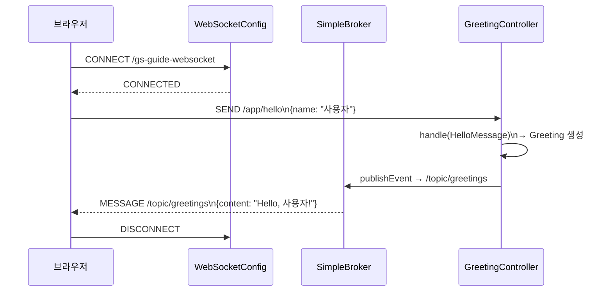

# STOMP WebSocket 예제

Spring Boot에서 STOMP 프로토콜을 사용하는 WebSocket 서버 예제입니다.
Virtual Thread를 적용한 Tomcat 위에서 동작합니다.

## 구성

| 클래스 | 역할 |
|---|---|
| `WebSocketConfig` | STOMP 엔드포인트 및 메시지 브로커 설정 |
| `TomcatConfig` | Tomcat에 Virtual Thread Executor 적용 |
| `GreetingController` | `@MessageMapping("/hello")` → `/topic/greetings` 발행 |
| `HelloMessage` | 클라이언트 → 서버 메시지 모델 |
| `Greeting` | 서버 → 클라이언트 응답 모델 |

## STOMP 메시지 흐름



## 핵심 설정

```kotlin
@Configuration
@EnableWebSocketMessageBroker
class WebSocketConfig : WebSocketMessageBrokerConfigurer {
    override fun registerStompEndpoints(registry: StompEndpointRegistry) {
        registry.addEndpoint("/gs-guide-websocket")
    }
    override fun configureMessageBroker(config: MessageBrokerRegistry) {
        config.enableSimpleBroker("/topic")
        config.setApplicationDestinationPrefixes("/app")
    }
}
```

## 실행

```bash
./gradlew :stomp-websocket:bootRun
```

## STOMP 프로토콜 개념

STOMP(Simple Text Oriented Messaging Protocol)는 WebSocket 위에서 동작하는 메시지 프로토콜입니다. 단순한 WebSocket과 달리 목적지(destination) 기반 발행/구독 모델을 제공하여 메시지 브로커와의 통합을 단순화합니다.

| 개념 | 설명 |
|---|---|
| **CONNECT** | 클라이언트가 서버에 STOMP 세션 연결 |
| **SEND** | 클라이언트 → 서버로 메시지 발송 (목적지: `/app/...`) |
| **SUBSCRIBE** | 클라이언트가 특정 토픽 구독 (목적지: `/topic/...`) |
| **MESSAGE** | 브로커가 구독자에게 메시지 전달 |
| **DISCONNECT** | 세션 종료 |

### 목적지 프리픽스

| 프리픽스 | 역할 |
|---|---|
| `/app` | `@MessageMapping` 컨트롤러 메서드로 라우팅 |
| `/topic` | SimpleBroker가 관리하는 구독 토픽으로 브로드캐스트 |

## 메시지 데이터 모델

```kotlin
// 클라이언트 → 서버
data class HelloMessage(val name: String)

// 서버 → 클라이언트
data class Greeting(val content: String)
```

## GreetingController 동작

```kotlin
@Controller
class GreetingController {
    @MessageMapping("/hello")           // SEND /app/hello 수신
    @SendTo("/topic/greetings")         // /topic/greetings 구독자에게 브로드캐스트
    fun greeting(message: HelloMessage): Greeting {
        return Greeting("Hello, ${message.name}!")
    }
}
```

## Virtual Thread 적용

`TomcatConfig`에서 Tomcat에 Virtual Thread Executor를 적용하여 WebSocket 핸들러가 Virtual Thread 위에서 실행됩니다. 이를 통해 대규모 동시 접속에서도 스레드 풀 고갈 없이 효율적으로 처리합니다.

## 테스트

`GreetingIntegrationTest`는 `StompSession`을 직접 생성하여 `/app/hello`로 메시지를 전송하고, `/topic/greetings` 구독을 통해 응답을 검증합니다.

## 참고

- [Spring STOMP WebSocket Guide](https://spring.io/guides/gs/messaging-stomp-websocket)
- [Spring WebSocket 공식 문서](https://docs.spring.io/spring-framework/reference/web/websocket.html)
