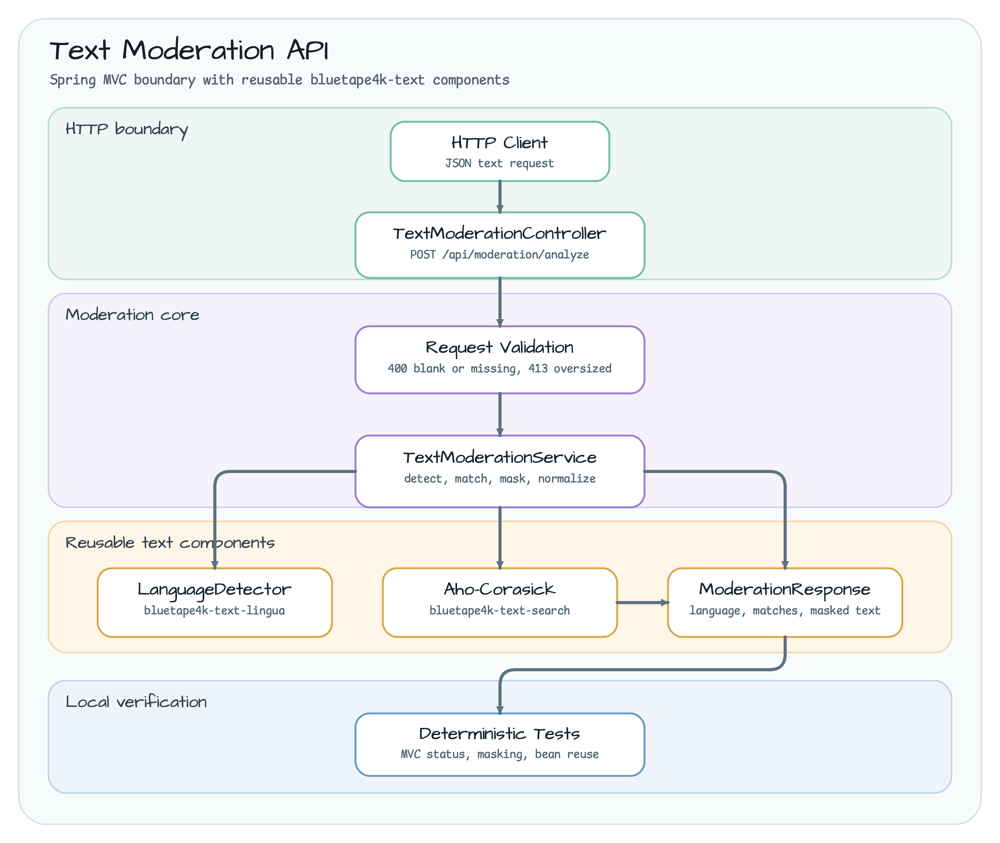
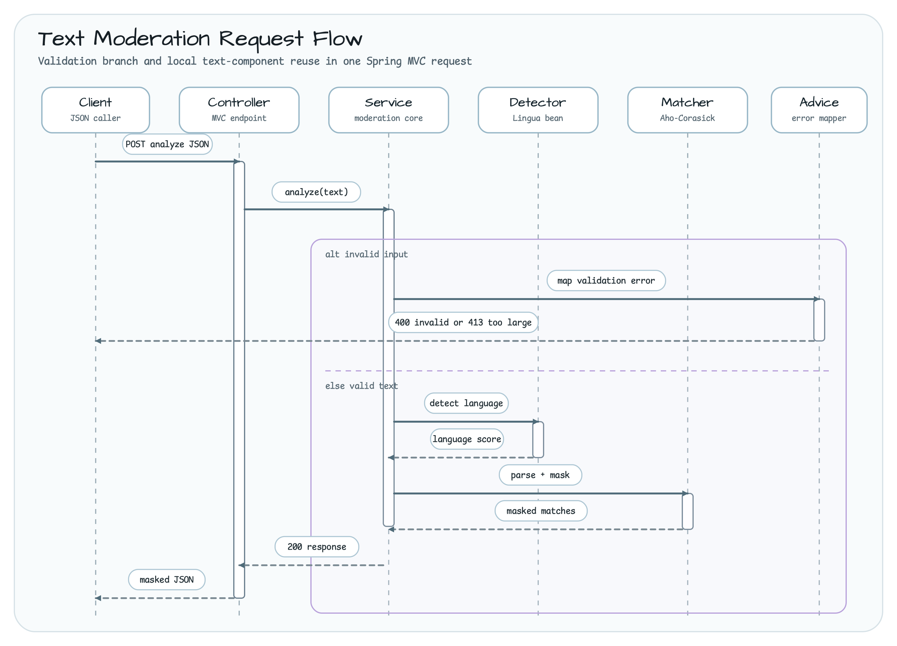

# spring-boot-text-moderation-api

[한국어](README.ko.md) | English

## Overview

**spring-boot-text-moderation-api** is a Spring Boot 4 MVC example for building
a deterministic web-safety text moderation boundary with `bluetape4k-text`.
It accepts JSON text, detects the likely language, matches configured blockwords
with an Aho-Corasick automaton, masks the unsafe terms, and returns a normalized
response.

The module stays local and deterministic. It does not call an external
moderation service, LLM, or remote classifier, so the tests can run as a focused
workshop smoke check.

## Architecture



The request moves top-to-bottom through a small MVC boundary: controller input,
request validation, a reusable moderation service, and two long-lived text
components built once by Spring configuration.

## Request Flow



The success path reuses the singleton `LanguageDetector` and captures one immutable
`VersionedModerationDictionary` snapshot for matching and masking. Invalid requests short-circuit
to `400 Bad Request`; oversized requests return `413 Content Too Large`.

## Endpoint

```text
POST /api/moderation/analyze
Content-Type: application/json

{
  "text": "Please block spam from this English request."
}
```

```bash
curl -s -X POST http://localhost:8080/api/moderation/analyze \
  -H 'Content-Type: application/json' \
  -d '{"text":"Please block spam from this English request."}'
```

Example response:

```json
{
  "detectedLanguage": "ENGLISH",
  "confidence": 0.98,
  "matchedTerms": ["spam"],
  "maskedText": "Please block **** from this English request.",
  "warnings": ["ABUSE_WORD_MATCHED"]
}
```

## Error Responses

Blank or missing text:

```bash
curl -s -X POST http://localhost:8080/api/moderation/analyze \
  -H 'Content-Type: application/json' \
  -d '{"text":"   "}'
```

```json
{
  "status": 400,
  "error": "Bad Request",
  "message": "text must not be blank"
}
```

Oversized text:

```bash
python3 - <<'PY' | curl -s -X POST http://localhost:8080/api/moderation/analyze \
  -H 'Content-Type: application/json' \
  --data-binary @-
import json
print(json.dumps({"text": "x" * 2001}))
PY
```

```json
{
  "status": 413,
  "error": "Content Too Large",
  "message": "text exceeds 2000 characters"
}
```

## Configuration

| Property | Default | Purpose |
|---|---:|---|
| `workshop.text-moderation.max-text-characters` | `2000` | Maximum accepted request text length |
| `workshop.text-moderation.blockwords` | `spam,badword,abuse,hate` | Terms registered in the moderation automaton |
| `workshop.text-moderation.normalization` | `NFC` | Unicode normalization applied to blockwords and request text (`NONE`, `NFC`, or `NFKC`) |

The default blockwords are intentionally small so learners can follow the full
flow from configuration to response.

## Runtime dictionary replacement

The management boundary stays at the service layer; this workshop does not expose a public reload
endpoint. An authenticated application-owned control plane can validate and publish a complete
candidate through these APIs while the existing HTTP response remains unchanged:

```kotlin
val v1 = service.analyzeWithVersion("spam")
service.reloadDictionary(DictionaryVersion("moderation-blockwords", 2)) {
    listOf("phishing", "malware")
}
val v2 = service.analyzeWithVersion("phishing")
service.rollbackDictionary()
```

Loader execution, bounded input validation, and Aho-Corasick construction finish before the new
`DictionarySnapshot` is published. Each request captures one snapshot, so parsing and masking use
the same revision. Failed or stale candidates preserve both the current dictionary and rollback
history. Logs contain only the dictionary name, revision, word count, and total character count;
raw blockwords and moderation text are never logged. The loader collection is copied and bounded
while iterating, and shared Lingua detector access is serialized for concurrent singleton calls.

Use NFKC only when compatibility characters are part of the moderation policy:

```yaml
workshop:
  text-moderation:
    normalization: NFKC
    blockwords:
      - "(\uC8FC)"
```

This configuration also detects source text containing the U+3231 compatibility character. The
automaton maps the normalized match back to the one-code-unit source span, so
`Company: \u3231 Bluetape` becomes
`Company: * Bluetape`. NFC remains the backward-compatible default. A normalization segment over
1,024 code units is rejected without echoing request text.

## Used Bluetape4k features

| Feature | Where | Why it matters |
|---|---|---|
| `bluetape4k-tokenizer-core` | `VersionedDictionary` and `DictionarySnapshot` | Atomically publishes completed blockword generations with bounded rollback history |
| `bluetape4k-text-search` | `ahoCorasick { ... }` | Builds one reusable multi-keyword matcher instead of scanning each word manually |
| `bluetape4k-text-lingua` | `allLanguageDetector { ... }` | Provides deterministic language detection without a remote API |
| `bluetape4k-logging` | `KLogging` and lazy `debug` logging | Records operational metadata without logging raw moderation text |
| `bluetape4k-junit5` / `bluetape4k-assertions` | Unit and MVC tests | Keeps the example deterministic and easy to validate locally |

## Run

```bash
./gradlew :spring-boot-text-moderation-api:bootRun
```

Then send the curl requests above to `http://localhost:8080`.

## Tests

```bash
./gradlew :spring-boot-text-moderation-api:test
```

The focused test suite verifies:

- `200 OK` masking and language detection
- Korean text detection without blockword matches
- `400 Bad Request` for blank or missing text
- `413 Content Too Large` for oversized text
- singleton reuse for the language detector and automaton beans
- reload, rollback, bounded history, and stale/failed candidate preservation
- concurrent requests observing only one complete old or new revision
- NFKC property binding, compatibility-character matching, and source-length masking

## Dependency Note

The module uses the root `bluetape4k-dependencies` 2.0.0 BOM and repository catalog aliases,
including a direct versionless `bluetape4k-text-core` dependency for `VersionedDictionary`. Do not
add a module-local version pin or a separate BOM for this example.
