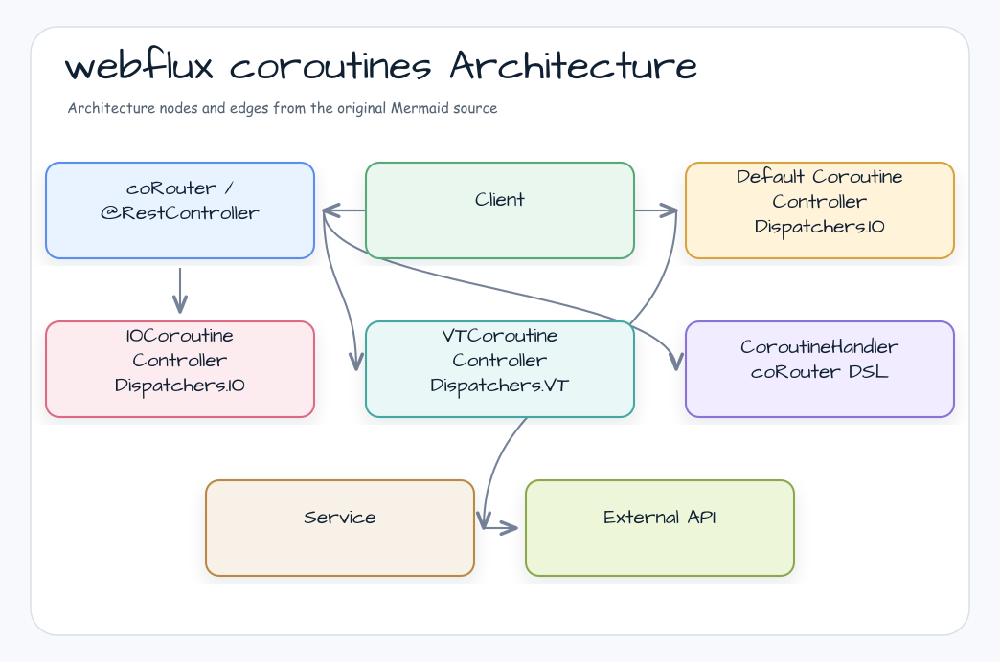
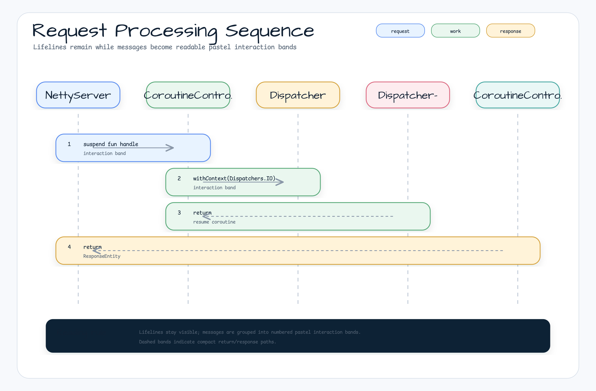

# Spring WebFlux + Coroutines

[English](README.md) | 한국어

## 예제 시나리오

이 예제는 **Spring WebFlux + Coroutines**를 실행 가능한 Spring Boot 애플리케이션 기능 워크샵 조각으로 다룹니다. 개발자가 먼저 확인할 흐름인 모듈 설정, 샘플 또는 테스트 실행, 반복적인 인프라 코드를 줄여 주는 라이브러리와 프레임워크 API 관찰에 초점을 둡니다.

## 아키텍처 다이어그램



이 모듈은 샘플 진입점 또는 테스트 픽스처, bluetape4k 확장 계층, 예제에서 사용하는 런타임 의존성을 중심으로 구성됩니다. 이 README와 코드를 비교할 때는 `io.bluetape4k.workshop.springboot` 패키지를 기준으로 삼으세요.

## 시퀀스 다이어그램



이 예제는 Spring WebFlux 환경에서 Kotlin Coroutines를 사용합니다.
bluetape4k `Dispatchers.VT`, `Flow<T>.async`, `Runtimex` 및 관련 유틸리티를 사용해 Virtual Thread 기반 리액티브 컨트롤러를 구성합니다.

## 구현 전략 비교

세 컨트롤러는 dispatcher 전략의 차이를 보여 줍니다.

| 컨트롤러 | Dispatcher 전략 | 설명 |
|---|---|---|
| `DefaultCoroutineController` | `Dispatchers.IO` | 기본 I/O dispatcher로 blocking 작업을 처리합니다 |
| `IOCoroutineController` | `Dispatchers.IO` (명시적) | I/O 중심 작업에 맞게 최적화했습니다 |
| `VTCoroutineController` | `Dispatchers.VT` | bluetape4k Virtual Thread CoroutineDispatcher |
| `CoroutineHandler` | `coRouter` DSL | 함수형 endpoint 스타일 |

## 사용된 bluetape4k 기능

| 기능 | Artifact | 코드 위치 | 이점 |
|---|---|---|---|
| `Dispatchers.VT` | `bluetape4k-coroutines` | `VTCoroutineController` | OS thread 없이 coroutine을 실행하는 Virtual Thread 기반 CoroutineDispatcher |
| `Flow<T>.async { }` | `bluetape4k-coroutines` | `VTCoroutineController.concurrentFlow()` | Flow element를 병렬로 변환하는 operator |
| `KLoggingChannel` | `bluetape4k-logging` | 모든 companion object | coroutine context를 포함하는 structured logging |
| `Base58.randomString()` | `bluetape4k-io` | `Banner.kt` | URL-safe random string 생성 |
| `Runtimex.availableProcessors` | `bluetape4k-core` | `NettyConfig.kt` | CPU core 수를 기준으로 event loop 크기 계산 |

## bluetape4k Before / After

### `Dispatchers.VT` vs 표준 Dispatcher

```kotlin
// Before — Standard Dispatchers.IO or manual ExecutorService
class CoroutineController : CoroutineScope by CoroutineScope(Dispatchers.IO) {
    // Or
    private val executor = Executors.newVirtualThreadPerTaskExecutor()
    val Dispatchers.VirtualThread: CoroutineDispatcher
        get() = executor.asCoroutineDispatcher()
}

// After — bluetape4k Dispatchers.VT (singleton, ready to use)
class VTCoroutineController(
    private val builder: WebClient.Builder,
) : CoroutineScope by CoroutineScope(Dispatchers.VT + CoroutineName("vt")) {
    // Virtual Thread per task, shared across the application
}
```

### `Flow<T>.async` vs 순차 Flow

```kotlin
// Before — Sequential processing (no parallelism)
fun sequentialFlow(): Flow<Banner> = flow {
    repeat(4) { emit(retrieveBanner()) }  // Runs 4 tasks sequentially
}

// After — Parallel transformation with bluetape4k .async { }
fun concurrentFlow(): Flow<Banner> =
    (0..3).asFlow()
        .async { retrieveBanner() }  // Runs 4 tasks concurrently while preserving order
```

### `Runtimex` vs `Runtime.getRuntime()`

```kotlin
// Before — Java Runtime API
val eventLoopSize = maxOf(Runtime.getRuntime().availableProcessors() * 8, 64)

// After — bluetape4k Runtimex (Kotlin property style)
val eventLoopSize = maxOf(Runtimex.availableProcessors * 8, 64)
```

## 고성능 Netty 설정

```kotlin
@Bean
fun reactorResourceFactory(): ReactorResourceFactory = ReactorResourceFactory().apply {
    isUseGlobalResources = false
    connectionProvider = ConnectionProvider.builder("http")
        .maxConnections(10_000)
        .maxIdleTime(Duration.ofSeconds(10))
        .build()
    loopResources = LoopResources.create(
        "event-loop",
        maxOf(Runtimex.availableProcessors * 8, 64),  // bluetape4k Runtimex
        true
    )
}
```

## 실행

```bash
./gradlew :webflux-coroutines:bootRun

# VT Dispatcher endpoints
curl http://localhost:8080/controller/vt/suspend
curl http://localhost:8080/controller/vt/concurrent-flow

# Functional router endpoint
curl http://localhost:8080/handler/banners
```

## 참고

- [Official Spring WebFlux + Coroutines documentation](https://docs.spring.io/spring-framework/reference/languages/kotlin/coroutines.html)
- [Reactor Meltdown explanation](https://blog.frankel.ch/project-reactor-meltdown/)
- [bluetape4k-coroutines](https://github.com/bluetape4k/bluetape4k-projects)
