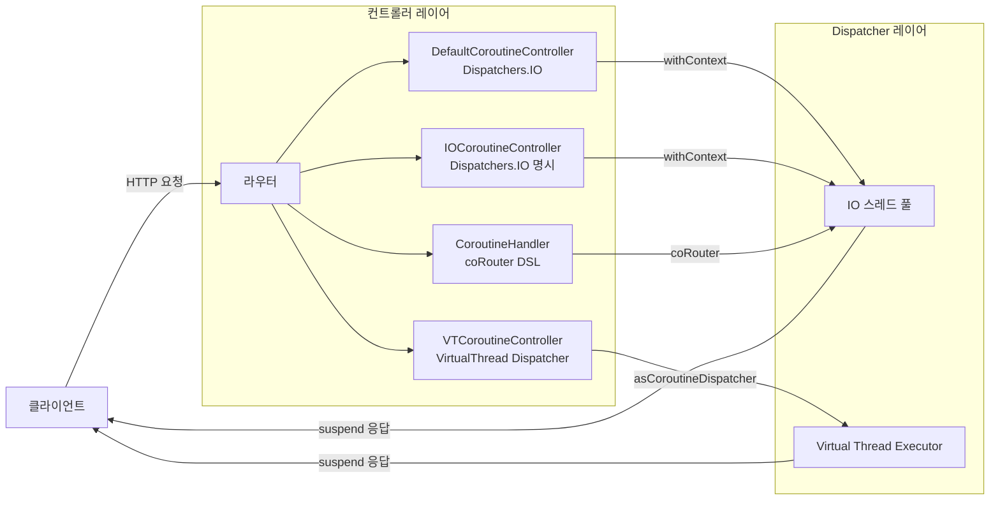
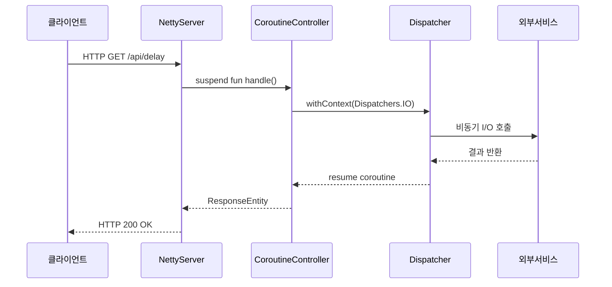

# Spring WebFlux + Coroutines

Spring WebFlux 환경에서 Kotlin Coroutines를 사용하는 예제입니다.
Reactor를 직접 다루면 잘못된 스레드 전환으로 Meltdown이 발생할 수 있는데, Coroutines를 활용하면 이를 안전하게 해결할 수 있습니다.

## 구현 방식 비교

세 가지 Controller로 Dispatcher 전략에 따른 차이를 보여줍니다:

| Controller | Dispatcher 전략 | 설명 |
|---|---|---|
| `DefaultCoroutineController` | `Dispatchers.IO` | 기본 I/O 디스패처로 블로킹 작업 처리 |
| `IOCoroutineController` | `Dispatchers.IO` (명시적) | I/O 집약적 작업에 최적화 |
| `VTCoroutineController` | Virtual Thread 기반 Dispatcher | Java Virtual Thread를 CoroutineDispatcher로 활용 |

또한 어노테이션 방식 외에 함수형 라우터(WebFlux Handler) 방식도 포함합니다:
- `CoroutineHandler` — `coRouter` DSL 기반 함수형 엔드포인트

## Dispatcher 전략 흐름



## 요청 처리 흐름



## Virtual Thread Dispatcher 설정

```kotlin
val Dispatchers.VirtualThread: CoroutineDispatcher
    get() = Executors.newVirtualThreadPerTaskExecutor().asCoroutineDispatcher()
```

## 실행

```bash
./gradlew :webflux-coroutines:bootRun
```

## 참고

- [Spring WebFlux + Coroutines 공식 문서](https://docs.spring.io/spring-framework/reference/languages/kotlin/coroutines.html)
- [Reactor Meltdown 설명](https://blog.frankel.ch/project-reactor-meltdown/)
