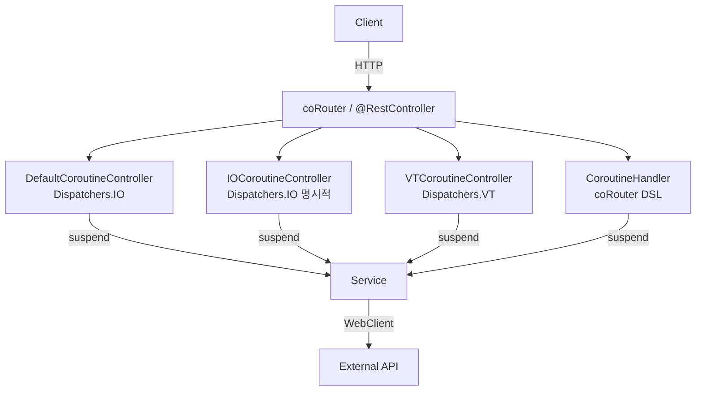

# Spring WebFlux + Coroutines

Spring WebFlux 환경에서 Kotlin Coroutines를 사용하는 예제입니다.
bluetape4k의 `Dispatchers.VT`, `Flow<T>.async`, `Runtimex` 등을 활용해 Virtual Thread 기반 반응형 컨트롤러를 구성합니다.

## 아키텍처


```mermaid
graph TD
    Client -->|HTTP| Router[coRouter / @RestController]
    Router --> DC[DefaultCoroutineController\nDispatchers.IO]
    Router --> IC[IOCoroutineController\nDispatchers.IO 명시적]
    Router --> VT[VTCoroutineController\nDispatchers.VT]
    Router --> CH[CoroutineHandler\ncoRouter DSL]
    DC & IC & VT & CH -->|suspend| Service
    Service -->|WebClient| External[External API]
```

## 구현 방식 비교

세 가지 Controller로 Dispatcher 전략에 따른 차이를 보여줍니다:

| Controller | Dispatcher 전략 | 설명 |
|---|---|---|
| `DefaultCoroutineController` | `Dispatchers.IO` | 기본 I/O 디스패처로 블로킹 작업 처리 |
| `IOCoroutineController` | `Dispatchers.IO` (명시적) | I/O 집약적 작업에 최적화 |
| `VTCoroutineController` | `Dispatchers.VT` | bluetape4k Virtual Thread CoroutineDispatcher |
| `CoroutineHandler` | `coRouter` DSL | 함수형 엔드포인트 방식 |

## 사용된 bluetape4k 기능

| 기능 | 아티팩트 | 코드 위치 | 이점 |
|---|---|---|---|
| `Dispatchers.VT` | `bluetape4k-coroutines` | `VTCoroutineController` | Virtual Thread 기반 CoroutineDispatcher — OS 스레드 없이 코루틴 실행 |
| `Flow<T>.async { }` | `bluetape4k-coroutines` | `VTCoroutineController.concurrentFlow()` | Flow 요소를 병렬로 변환하는 연산자 |
| `KLoggingChannel` | `bluetape4k-logging` | 모든 companion object | 코루틴 컨텍스트 포함 구조적 로깅 |
| `Base58.randomString()` | `bluetape4k-io` | `Banner.kt` | URL-safe 랜덤 문자열 생성 |
| `Runtimex.availableProcessors` | `bluetape4k-core` | `NettyConfig.kt` | CPU 코어 수 기반 이벤트루프 크기 계산 |

## bluetape4k Before / After

### `Dispatchers.VT` vs 표준 Dispatcher

```kotlin
// Before — 표준 Dispatchers.IO 또는 수동 ExecutorService
class CoroutineController : CoroutineScope by CoroutineScope(Dispatchers.IO) {
    // 또는
    private val executor = Executors.newVirtualThreadPerTaskExecutor()
    val Dispatchers.VirtualThread: CoroutineDispatcher
        get() = executor.asCoroutineDispatcher()
}

// After — bluetape4k Dispatchers.VT (싱글톤, 즉시 사용)
class VTCoroutineController(
    private val builder: WebClient.Builder,
) : CoroutineScope by CoroutineScope(Dispatchers.VT + CoroutineName("vt")) {
    // Virtual Thread per task, 앱 전체에서 공유
}
```

### `Flow<T>.async` vs 순차 flow

```kotlin
// Before — 순차 처리 (병렬 없음)
fun sequentialFlow(): Flow<Banner> = flow {
    repeat(4) { emit(retrieveBanner()) }  // 4개 순차 실행
}

// After — bluetape4k .async { } 로 병렬 변환
fun concurrentFlow(): Flow<Banner> =
    (0..3).asFlow()
        .async { retrieveBanner() }  // 4개 동시 실행 후 순서 유지
```

### `Runtimex` vs `Runtime.getRuntime()`

```kotlin
// Before — Java Runtime API
val eventLoopSize = maxOf(Runtime.getRuntime().availableProcessors() * 8, 64)

// After — bluetape4k Runtimex (Kotlin 프로퍼티 스타일)
val eventLoopSize = maxOf(Runtimex.availableProcessors * 8, 64)
```

## Netty 고성능 설정

```kotlin
@Bean
fun reactorResourceFactory(): ReactorResourceFactory = ReactorResourceFactory().apply {
    isUseGlobalResources = false
    connectionProvider = ConnectionProvider.builder("http")
        .maxConnections(10_000)
        .maxIdleTime(Duration.ofSeconds(10))
        .build()
    loopResources = LoopResources.create(
        "event-loop",
        maxOf(Runtimex.availableProcessors * 8, 64),  // bluetape4k Runtimex
        true
    )
}
```

## 실행

```bash
./gradlew :webflux-coroutines:bootRun

# VT Dispatcher 엔드포인트
curl http://localhost:8080/controller/vt/suspend
curl http://localhost:8080/controller/vt/concurrent-flow

# 함수형 라우터 엔드포인트
curl http://localhost:8080/handler/banners
```

## 참고

- [Spring WebFlux + Coroutines 공식 문서](https://docs.spring.io/spring-framework/reference/languages/kotlin/coroutines.html)
- [Reactor Meltdown 설명](https://blog.frankel.ch/project-reactor-meltdown/)
- [bluetape4k-coroutines](https://github.com/bluetape4k/bluetape4k-projects)
