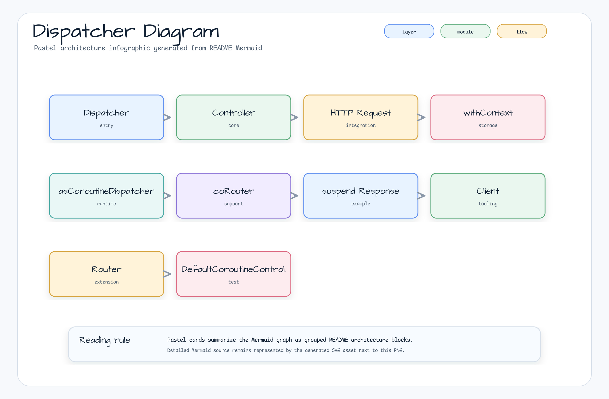

# Spring WebFlux + Coroutines

[한국어](README.ko.md) | English

## Example Scenario

This example exercises **Spring WebFlux + Coroutines** as a runnable Spring Boot application feature workshop slice. It focuses on the path a developer would inspect first: configure the module, run the sample or tests, and observe the library or framework APIs that remove repetitive infrastructure code.

## Architecture Diagram


The module is organized around the sample entry point or test fixture, the bluetape4k extension layer, and the runtime dependency used by the example. Keep the package under `io.bluetape4k.workshop.springboot` as the source of truth when comparing this README with the code.


## Flow Diagram

1. Prepare the local runtime required by `spring-boot-webflux-coroutines`.
2. Execute the application, controller, service, or test fixture that owns the example scenario.
3. Delegate repetitive infrastructure work to bluetape4k utilities or Spring/Kotlin integrations.
4. Assert the visible result through the sample output, HTTP response, repository state, metric, trace, or test expectation.



## Sequence Diagram

The core sequence is: caller or test fixture -> workshop adapter -> bluetape4k helper/API -> external runtime or in-memory backend -> assertion/response. When this module has a dedicated sequence asset, the image below shows that interaction order; otherwise the source tests are the authoritative executable sequence.


This example uses Kotlin Coroutines in a Spring WebFlux environment.
It uses bluetape4k `Dispatchers.VT`, `Flow<T>.async`, `Runtimex`, and related utilities to build Virtual Thread based reactive controllers.

## Architecture


## Implementation Strategy Comparison

Three controllers show the differences between dispatcher strategies:

| Controller | Dispatcher Strategy | Description |
|---|---|---|
| `DefaultCoroutineController` | `Dispatchers.IO` | Handles blocking work with the default I/O dispatcher |
| `IOCoroutineController` | `Dispatchers.IO` (explicit) | Optimized for I/O-intensive work |
| `VTCoroutineController` | `Dispatchers.VT` | bluetape4k Virtual Thread CoroutineDispatcher |
| `CoroutineHandler` | `coRouter` DSL | Functional endpoint style |

## bluetape4k Features Used

| Feature | Artifact | Code Location | Benefit |
|---|---|---|---|
| `Dispatchers.VT` | `bluetape4k-coroutines` | `VTCoroutineController` | Virtual Thread based CoroutineDispatcher that runs coroutines without OS threads |
| `Flow<T>.async { }` | `bluetape4k-coroutines` | `VTCoroutineController.concurrentFlow()` | Operator that transforms Flow elements in parallel |
| `KLoggingChannel` | `bluetape4k-logging` | All companion objects | Structured logging with coroutine context |
| `Base58.randomString()` | `bluetape4k-io` | `Banner.kt` | Generates URL-safe random strings |
| `Runtimex.availableProcessors` | `bluetape4k-core` | `NettyConfig.kt` | Calculates event loop size based on CPU core count |

## bluetape4k Before / After

### `Dispatchers.VT` vs Standard Dispatcher

```kotlin
// Before — Standard Dispatchers.IO or manual ExecutorService
class CoroutineController : CoroutineScope by CoroutineScope(Dispatchers.IO) {
    // Or
    private val executor = Executors.newVirtualThreadPerTaskExecutor()
    val Dispatchers.VirtualThread: CoroutineDispatcher
        get() = executor.asCoroutineDispatcher()
}

// After — bluetape4k Dispatchers.VT (singleton, ready to use)
class VTCoroutineController(
    private val builder: WebClient.Builder,
) : CoroutineScope by CoroutineScope(Dispatchers.VT + CoroutineName("vt")) {
    // Virtual Thread per task, shared across the application
}
```

### `Flow<T>.async` vs Sequential Flow

```kotlin
// Before — Sequential processing (no parallelism)
fun sequentialFlow(): Flow<Banner> = flow {
    repeat(4) { emit(retrieveBanner()) }  // Runs 4 tasks sequentially
}

// After — Parallel transformation with bluetape4k .async { }
fun concurrentFlow(): Flow<Banner> =
    (0..3).asFlow()
        .async { retrieveBanner() }  // Runs 4 tasks concurrently while preserving order
```

### `Runtimex` vs `Runtime.getRuntime()`

```kotlin
// Before — Java Runtime API
val eventLoopSize = maxOf(Runtime.getRuntime().availableProcessors() * 8, 64)

// After — bluetape4k Runtimex (Kotlin property style)
val eventLoopSize = maxOf(Runtimex.availableProcessors * 8, 64)
```

## High-Performance Netty Configuration

```kotlin
@Bean
fun reactorResourceFactory(): ReactorResourceFactory = ReactorResourceFactory().apply {
    isUseGlobalResources = false
    connectionProvider = ConnectionProvider.builder("http")
        .maxConnections(10_000)
        .maxIdleTime(Duration.ofSeconds(10))
        .build()
    loopResources = LoopResources.create(
        "event-loop",
        maxOf(Runtimex.availableProcessors * 8, 64),  // bluetape4k Runtimex
        true
    )
}
```

## Run

```bash
./gradlew :webflux-coroutines:bootRun

# VT Dispatcher endpoints
curl http://localhost:8080/controller/vt/suspend
curl http://localhost:8080/controller/vt/concurrent-flow

# Functional router endpoint
curl http://localhost:8080/handler/banners
```

## References

- [Official Spring WebFlux + Coroutines documentation](https://docs.spring.io/spring-framework/reference/languages/kotlin/coroutines.html)
- [Reactor Meltdown explanation](https://blog.frankel.ch/project-reactor-meltdown/)
- [bluetape4k-coroutines](https://github.com/bluetape4k/bluetape4k-projects)
