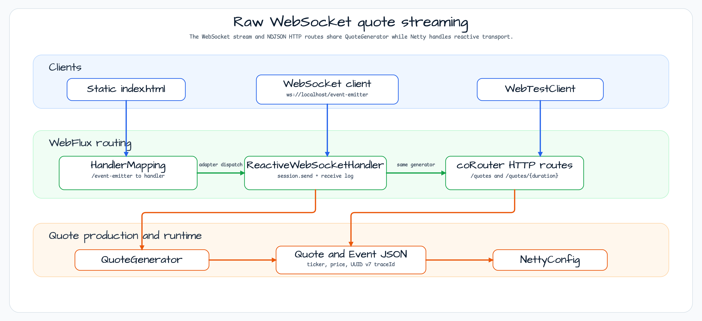
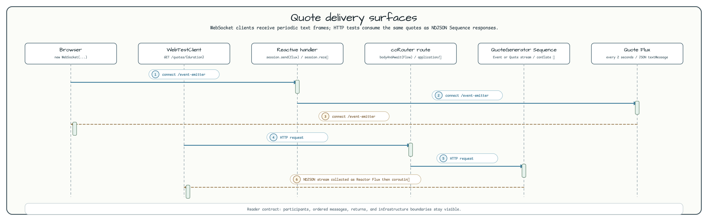

# Webflux & Websockets Demo

[English](README.md) | 한국어

## 이 예제가 보여 주는 것

이 모듈은 STOMP 없이 raw WebFlux WebSocket streaming을 보여 줍니다. 브라우저는 `/event-emitter`에
연결하고, `ReactiveWebSocketHandler`는 생성된 quote JSON을 WebSocket text message로 바꾸어 전송합니다.
같은 `QuoteGenerator`는 테스트가 사용하는 `/quotes` NDJSON HTTP route도 제공합니다.

## 아키텍처 다이어그램



아키텍처는 static page, WebSocket handler mapping, quote generation, NDJSON route, Netty runtime tuning을
나누어 보여 줍니다.

## Quote Streaming 흐름



원본 소스: [sample-webflux-websockets](https://github.com/ketangit/sample-webflux-websockets)

## 소개

이 예제는 WebSocket을 통한 비동기 quote 전달과 `application/x-ndjson` 기반 coroutine-friendly HTTP
streaming을 함께 보여 줍니다.

## 주요 구성 요소

| 클래스 | 역할 |
|---|---|
| `ReactiveWebSocketConfiguration` | handler를 `/event-emitter`에 매핑하고 `WebSocketHandlerAdapter` bean을 등록합니다 |
| `ReactiveWebSocketHandler` | `WebSocketSession`을 받아 Quote stream을 text message로 전송합니다 |
| `QuoteGenerator` | APPL, TSLA, GOOG 같은 7개 stock ticker의 가격을 주기적으로 생성하는 service입니다 |
| `SampleWebfluxRouter` | HTTP route를 설정합니다 |
| `NettyConfig` | Netty server를 설정합니다 |
| `Quote` | ticker, price, timestamp를 담는 data model입니다 |
| `Event` | traceId(UUID v7)와 Quote 목록을 결합하는 event wrapper입니다 |

## 데이터 모델

```kotlin
data class Quote(
    val ticker: String,
    val price: BigDecimal,
    val instant: Instant = Instant.now(),
)

data class Event(
    val id: String,       // UUID v7 based traceId
    val data: List<Quote>,
)
```

## WebSocket Handler 동작

`ReactiveWebSocketHandler`는 `QuoteGenerator.fetchQuoteStringAsFlux(Duration.ofSeconds(2))`가 2초마다 내보내는 Flux를 구독하고 session으로 전송하며, client에서 받은 메시지도 log로 남깁니다.

```kotlin
override fun handle(session: WebSocketSession): Mono<Void> {
    val flux = quoteGenerator
        .fetchQuoteStringAsFlux(Duration.ofSeconds(2))
        .map { quoteStr -> session.textMessage(quoteStr) }

    return session.send(flux)
        .and(session.receive().map { it.payloadAsText }.log())
}
```

`QuoteGenerator`는 Reactor `Flux`(동기)와 Kotlin `Flow`(coroutine) 스타일을 모두 제공합니다. backpressure 처리를 위해 `conflate()`를 적용하며, 이는 Flow의 `onBackpressureDrop()`과 같은 의미입니다.

## 실행 방법

```bash
./gradlew :webflux-websocket:bootRun
# WebSocket endpoint: ws://localhost:8080/event-emitter
```

## 참고

- [Official Spring WebFlux WebSocket documentation](https://docs.spring.io/spring-framework/reference/web/webflux-websocket.html)
- 원본 소스: [sample-webflux-websockets](https://github.com/ketangit/sample-webflux-websockets)
