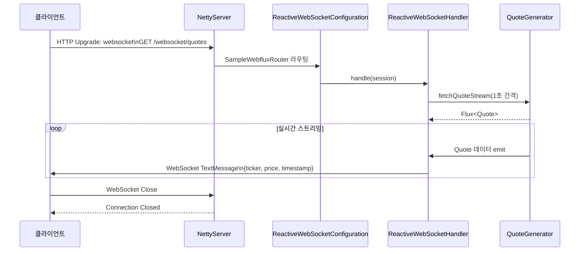

# Webflux & Websockets Demo

원본: [sample-webflux-websockets](https://github.com/ketangit/sample-webflux-websockets)

## 소개

Webflux의 비동기 방식으로 Websocket 통신을 하는 방식에 대한 예제입니다.

## WebSocket 연결 및 메시지 흐름



## 주요 컴포넌트

| 클래스 | 역할 |
|---|---|
| `ReactiveWebSocketConfiguration` | `/event-emitter` 경로에 핸들러 매핑, `WebSocketHandlerAdapter` 빈 등록 |
| `ReactiveWebSocketHandler` | `WebSocketSession`을 받아 Quote 스트림을 텍스트 메시지로 전송 |
| `QuoteGenerator` | 7개 주식 티커(APPL, TSLA, GOOG 등)의 가격을 주기적으로 생성하는 서비스 |
| `SampleWebfluxRouter` | HTTP 라우터 설정 |
| `NettyConfig` | Netty 서버 설정 |
| `Quote` | 티커, 가격, 타임스탬프를 포함하는 데이터 모델 |
| `Event` | traceId(UUID v7) + Quote 목록을 묶는 이벤트 래퍼 |

## 데이터 모델

```kotlin
data class Quote(
    val ticker: String,
    val price: BigDecimal,
    val instant: Instant = Instant.now(),
)

data class Event(
    val id: String,       // UUID v7 기반 traceId
    val data: List<Quote>,
)
```

## WebSocket 핸들러 동작 방식

`ReactiveWebSocketHandler`는 `QuoteGenerator.fetchQuoteStringAsFlux(Duration.ofSeconds(2))`로 2초 간격 Flux를 구독하여 세션에 전송하고, 동시에 클라이언트에서 수신되는 메시지도 로깅합니다.

```kotlin
override fun handle(session: WebSocketSession): Mono<Void> {
    val flux = quoteGenerator
        .fetchQuoteStringAsFlux(Duration.ofSeconds(2))
        .map { quoteStr -> session.textMessage(quoteStr) }

    return session.send(flux)
        .and(session.receive().map { it.payloadAsText }.log())
}
```

`QuoteGenerator`는 Reactor `Flux`(동기)와 Kotlin `Flow`(코루틴) 두 가지 방식을 모두 제공합니다. Backpressure 처리를 위해 `conflate()`(Flow의 `onBackpressureDrop()` 상당)를 적용합니다.

## 실행 방법

```bash
./gradlew :webflux-websocket:bootRun
# WebSocket 엔드포인트: ws://localhost:8080/event-emitter
```

## 참고

- [Spring WebFlux WebSocket 공식 문서](https://docs.spring.io/spring-framework/reference/web/webflux-websocket.html)
- 원본: [sample-webflux-websockets](https://github.com/ketangit/sample-webflux-websockets)
