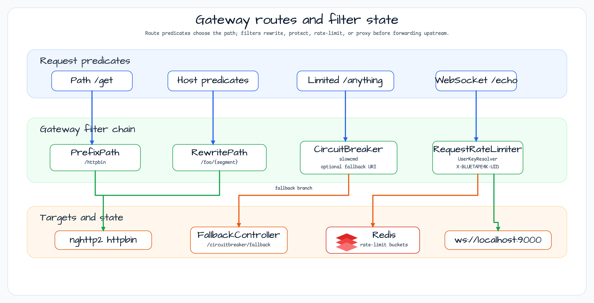
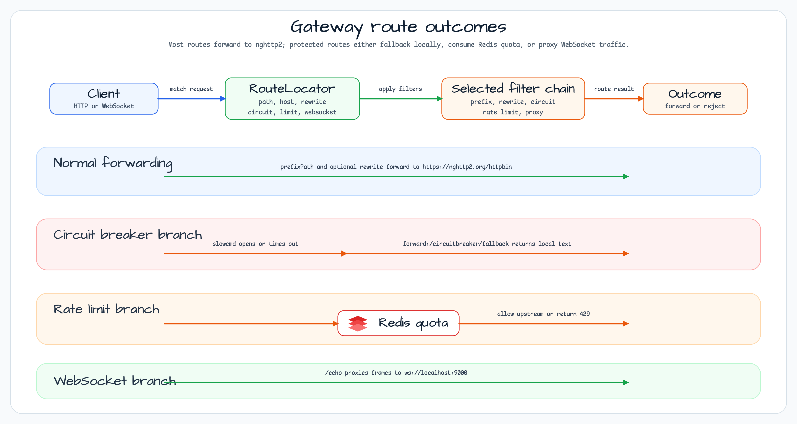

# Spring Cloud Gateway Sample

[English](README.md) | 한국어

## 이 예제가 보여 주는 것

이 모듈은 Spring Cloud Gateway가 route predicate와 filter를 Kotlin DSL로 조합하는 방식을 보여 줍니다. path routing, host routing, rewrite filter, Resilience4j circuit breaker fallback, Redis-backed request rate limiting, 간단한 WebSocket proxy route를 함께 확인합니다.

## 아키텍처 다이어그램



아키텍처는 route matching, filter behavior, upstream target, stateful rate-limit storage를 나누어 보여 줍니다.

## Route 흐름



## 참고 사항

이 예제는 Bucket4j를 사용하지 않습니다. Spring Cloud의 내장 Redis-backed Rate Limiter와 Resilience4j Circuit Breaker를 보여 줍니다.

## Routes

| Route | Match | Filters | Target |
|---|---|---|---|
| `path_route` | `GET /get` | `prefixPath("/httpbin")` | `https://nghttp2.org/` |
| `host_route` | `Host: *.myhost.org` | `prefixPath("/httpbin")` | `https://nghttp2.org/` |
| `rewrite_route` | `Host: *.rewrite.org` | prefix + `/foo/{segment}` rewrite | `https://nghttp2.org/` |
| `circuitbreaker_route` | `Host: *.circuitbreaker.org` | Resilience4j circuit breaker `slowcmd` | `https://nghttp2.org/` |
| `circuitbreaker_fallback_route` | `Host: *.circuitbreakerfallback.org` | circuit breaker + `forward:/circuitbreaker/fallback` | local fallback |
| `limit_route` | `Host: *.limited.org` and `/anything/**` | Redis `RequestRateLimiter` with `UserKeyResolver` | `https://nghttp2.org/` |
| `websocket_route` | `/echo` | WebSocket proxy | `ws://localhost:9000` |

## HTTP 샘플

```bash
http :8080/get
http :8080/headers Host:www.myhost.org
http :8080/foo/get Host:www.rewrite.org
http :8080/delay/3 Host:www.circuitbreakerfallback.org
http :8080/anything/1 Host:www.limited.org X-BLUETAPE4K-UID:user-a
```

## Websocket 샘플

[install wscat](https://www.npmjs.com/package/wscat)

한 terminal에서 websocket server를 실행합니다.

```
wscat --listen 9000
```

다른 terminal에서 gateway를 통해 연결하는 client를 실행합니다.

```
wscat --connect ws://localhost:8080/echo
```

server와 client 어느 쪽에서든 입력하면 message가 적절히 전달됩니다.

## Redis Rate Limiter 테스트 실행

redis가 localhost:6379에서 실행 중인지 확인하세요(brew, apt 또는 docker 사용).

그런 다음 `DemogatewayApplicationTests`를 실행합니다. 테스트가 통과하면 호출 중 하나가 429 TOO_MANY_REQUESTS HTTP status를 받았다는 뜻입니다.

## 리소스

- [Spring Cloud Gateway with Resilience4j circuit breaker](https://medium.com/@mahmoud.romeh/spring-cloud-gateway-with-resilience4j-circuit-breaker-4f46d86822f0)
- [spring-cloud-gateway sample](https://github.com/m-thirumal/spring-cloud-gateway)
