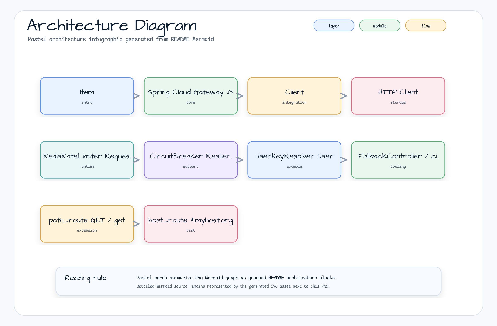

# Spring Cloud Gateway Sample

[한국어](README.ko.md) | English

## Example Scenario

This example exercises **Spring Cloud Gateway Sample** as a runnable Spring Cloud integration workshop slice. It focuses on the path a developer would inspect first: configure the module, run the sample or tests, and observe the library or framework APIs that remove repetitive infrastructure code.

## Architecture Diagram


The module is organized around the sample entry point or test fixture, the bluetape4k extension layer, and the runtime dependency used by the example. Keep the package under `io.bluetape4k.workshop.springcloud` as the source of truth when comparing this README with the code.



## Flow Diagram

1. Prepare the local runtime required by `spring-cloud-gateway-example`.
2. Execute the application, controller, service, or test fixture that owns the example scenario.
3. Delegate repetitive infrastructure work to bluetape4k utilities or Spring/Kotlin integrations.
4. Assert the visible result through the sample output, HTTP response, repository state, metric, trace, or test expectation.

## Sequence Diagram

The core sequence is: caller or test fixture -> workshop adapter -> bluetape4k helper/API -> external runtime or in-memory backend -> assertion/response. When this module has a dedicated sequence asset, the image below shows that interaction order; otherwise the source tests are the authoritative executable sequence.

## Architecture Diagram


## Notes

This example does not use Bucket4j. It demonstrates Spring Cloud's built-in
Redis-backed Rate Limiter and Resilience4j Circuit Breaker.

## Resources

-[Spring cloud gateway with Resilience4j circuit breaker](https://medium.com/@mahmoud.romeh/spring-cloud-gateway-with-resilience4j-circuit-breaker-4f46d86822f0)
-[spring-cloud-gateway](https://github.com/m-thirumal/spring-cloud-gateway)

Sample that shows a few different ways to route and showcases some filters.

Run `DemogatewayApplication`

## Samples

```
$ http :8080/get
HTTP/1.1 200 OK
Access-Control-Allow-Credentials: true
Access-Control-Allow-Origin: *
Cache-Control: no-cache, no-store, max-age=0, must-revalidate
Connection: keep-alive
Content-Length: 257
Content-Type: application/json
Date: Fri, 13 Oct 2017 15:36:12 GMT
Expires: 0
Pragma: no-cache
Server: meinheld/0.6.1
Via: 1.1 vegur
X-Content-Type-Options: nosniff
X-Frame-Options: DENY
X-Powered-By: Flask
X-Processed-Time: 0.00123405456543
X-XSS-Protection: 1 ; mode=block

{
    "args": {}, 
    "headers": {
        "Accept": "*/*", 
        "Accept-Encoding": "gzip, deflate", 
        "Connection": "close", 
        "Host": "httpbin.org", 
        "User-Agent": "HTTPie/0.9.8"
    }, 
    "origin": "207.107.158.66", 
    "url": "http://httpbin.org/get"
}

$ http :8080/headers Host:www.myhost.org
HTTP/1.1 200 OK
Access-Control-Allow-Credentials: true
Access-Control-Allow-Origin: *
Cache-Control: no-cache, no-store, max-age=0, must-revalidate
Connection: keep-alive
Content-Length: 175
Content-Type: application/json
Date: Fri, 13 Oct 2017 15:36:35 GMT
Expires: 0
Pragma: no-cache
Server: meinheld/0.6.1
Via: 1.1 vegur
X-Content-Type-Options: nosniff
X-Frame-Options: DENY
X-Powered-By: Flask
X-Processed-Time: 0.0012538433075
X-XSS-Protection: 1 ; mode=block

{
    "headers": {
        "Accept": "*/*", 
        "Accept-Encoding": "gzip, deflate", 
        "Connection": "close", 
        "Host": "httpbin.org", 
        "User-Agent": "HTTPie/0.9.8"
    }
}

$ http :8080/foo/get Host:www.rewrite.org
HTTP/1.1 200 OK
Access-Control-Allow-Credentials: true
Access-Control-Allow-Origin: *
Cache-Control: no-cache, no-store, max-age=0, must-revalidate
Connection: keep-alive
Content-Length: 257
Content-Type: application/json
Date: Fri, 13 Oct 2017 15:36:51 GMT
Expires: 0
Pragma: no-cache
Server: meinheld/0.6.1
Via: 1.1 vegur
X-Content-Type-Options: nosniff
X-Frame-Options: DENY
X-Powered-By: Flask
X-Processed-Time: 0.000664949417114
X-XSS-Protection: 1 ; mode=block

{
    "args": {}, 
    "headers": {
        "Accept": "*/*", 
        "Accept-Encoding": "gzip, deflate", 
        "Connection": "close", 
        "Host": "httpbin.org", 
        "User-Agent": "HTTPie/0.9.8"
    }, 
    "origin": "207.107.158.66", 
    "url": "http://httpbin.org/get"
}

$ http :8080/delay/2 Host:www.circuitbreaker.org
HTTP/1.1 504 Gateway Timeout
Cache-Control: no-cache, no-store, max-age=0, must-revalidate
Expires: 0
Pragma: no-cache
X-Content-Type-Options: nosniff
X-Frame-Options: DENY
X-XSS-Protection: 1 ; mode=block
content-length: 0

```

## Websocket Sample

[install wscat](https://www.npmjs.com/package/wscat)

In one terminal, run websocket server:

```
wscat --listen 9000
``` 

In another, run a client, connecting through gateway:

```
wscat --connect ws://localhost:8080/echo
```

type away in either server and client, messages will be passed appropriately.

## Running Redis Rate Limiter Test

Make sure redis is running on localhost:6379 (using brew or apt or docker).

Then run `DemogatewayApplicationTests`. It should pass which means one of the calls received a 429 TO_MANY_REQUESTS HTTP
status.
