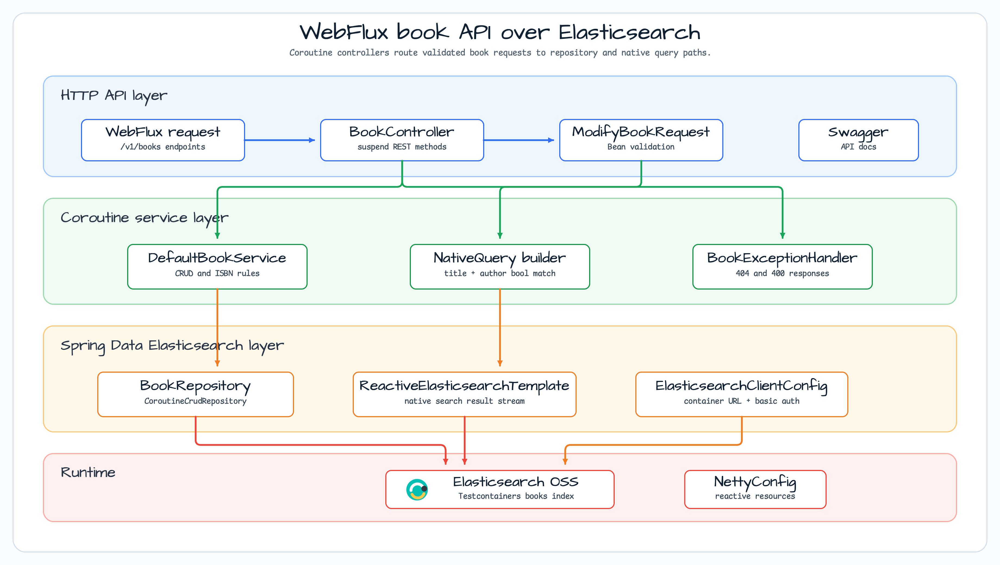
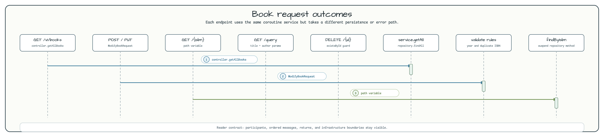

# Spring Data Elasticsearch WebFlux

[English](README.md) | 한국어

이 모듈은 Elasticsearch에 저장되는 `Book` 문서를 대상으로 coroutine 기반 WebFlux REST
API를 제공합니다. Spring WebFlux controller가 Kotlin coroutine service,
Spring Data coroutine repository, `ReactiveElasticsearchTemplate`을 호출하면서 request
path를 blocking하지 않는 구성을 보여 줍니다.

## 이 예제가 보여 주는 것

애플리케이션은 Testcontainers `ElasticsearchOssServer`를 시작하고, container URL로
Spring Data Elasticsearch client를 구성하며, reactive Elasticsearch repository와 auditing을
활성화합니다. HTTP 요청은 `BookController`로 들어와 validation과 service rule을 거친 뒤
`books` index에 저장됩니다.

## Request 흐름

Public API는 `/v1/books`를 중심으로 구성됩니다.

| Method | Path | Service operation |
|---|---|---|
| `GET` | `/v1/books` | `BookRepository.findAll()`로 모든 book을 조회합니다. |
| `POST` | `/v1/books` | `ModifyBookRequest`를 검증하고 중복 ISBN을 거부한 뒤 저장합니다. |
| `GET` | `/v1/books/{isbn}` | ISBN으로 book을 찾고 없으면 `404`를 반환합니다. |
| `GET` | `/v1/books/query?title=...&author=...` | title과 author match 조건으로 native bool query를 만듭니다. |
| `PUT` | `/v1/books/{id}` | 저장된 document의 id를 유지하면서 내용을 교체합니다. |
| `DELETE` | `/v1/books/{id}` | 존재하는 document를 삭제하고 없으면 `404`를 반환합니다. |

## Domain and validation

`Book` document는 `books` index에 `title`, `authorName`, `publicationYear`, `isbn`,
Spring Data document `id`로 저장됩니다. `ModifyBookRequest`는 blank field를 검증하고
`PublicationYearValidator`로 미래 publication year를 거부합니다.

`BookExceptionHandler`는 `BookNotFoundException`을 `404`로, duplicated ISBN을 `400`으로
매핑하므로 controller method는 request-to-service routing에 집중할 수 있습니다.

## Testing notes

Integration test는 `WebTestClient`를 사용하고, 각 테스트 전에 `books` index를 재생성하며,
write 이후 검색이 새 document를 볼 수 있도록 index를 refresh합니다. 테스트 class들은 현재
비활성화되어 있습니다. 이 sample line의 Elasticsearch Java client stack은 Jackson 2 기반인
반면 Spring Boot 4 baseline은 Jackson 3를 사용하기 때문입니다.

## 참고

- [Spring Data Elasticsearch Reference Documentation](https://docs.spring.io/spring-data/elasticsearch/reference/)
- [Spring WebFlux Reference Documentation](https://docs.spring.io/spring-framework/reference/web/webflux.html)
