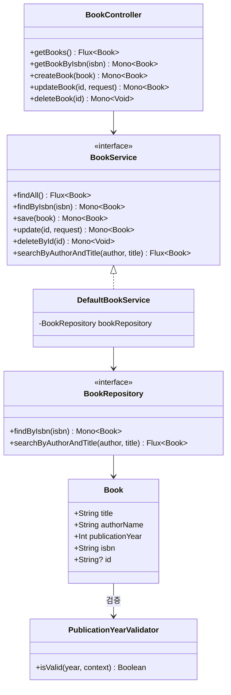
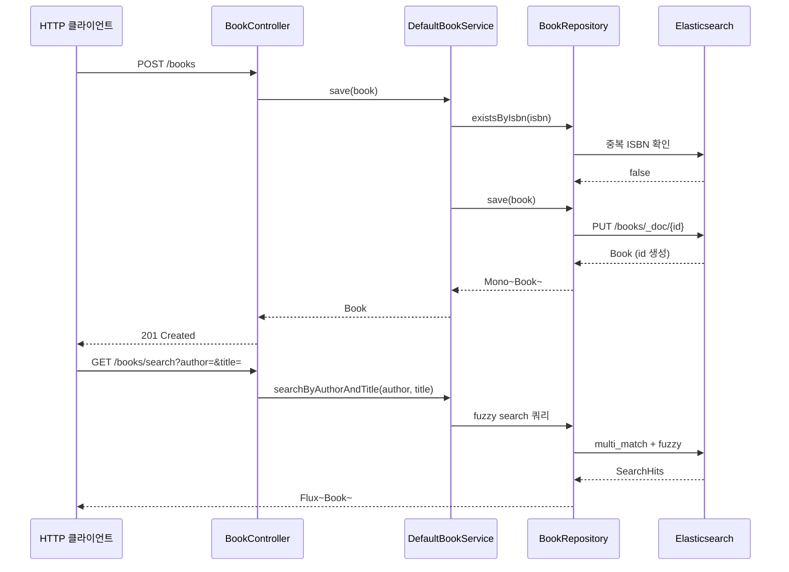

# Spring Data Elasticsearch Example with Spring Boot 4 and Elasticsearch 8

## 아키텍처 다이어그램

## Introduction

This example demonstrates how to use Spring Data Elasticsearch to do simple CRUD operations.

You can find the tutorial about this example at this
link: [Getting started with Spring Data Elasticsearch](https://www.geekyhacker.com/getting-started-with-spring-data-elasticsearch/)

For this example, we created a Book controller that allows doing the following operations with Elasticsearch:

- Get the list of all books
- Create a book
- Update a book by Id
- Delete a book by Id
- Search for a book by ISBN
- Fuzzy search for books by author and title

## 참고

- [Spring Data Elasticsearch - Reference Documentation](https://docs.spring.io/spring-data/elasticsearch/docs/current/reference/html/)
- [Spring Data Elasticsearch NativeSearchQuery 사용법](https://juntcom.tistory.com/149)
