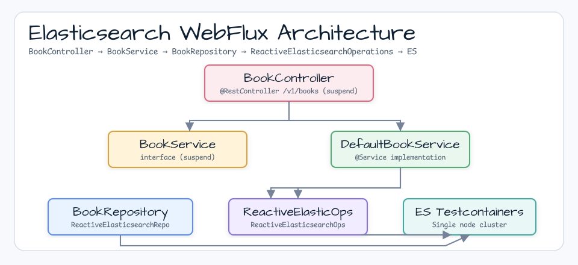
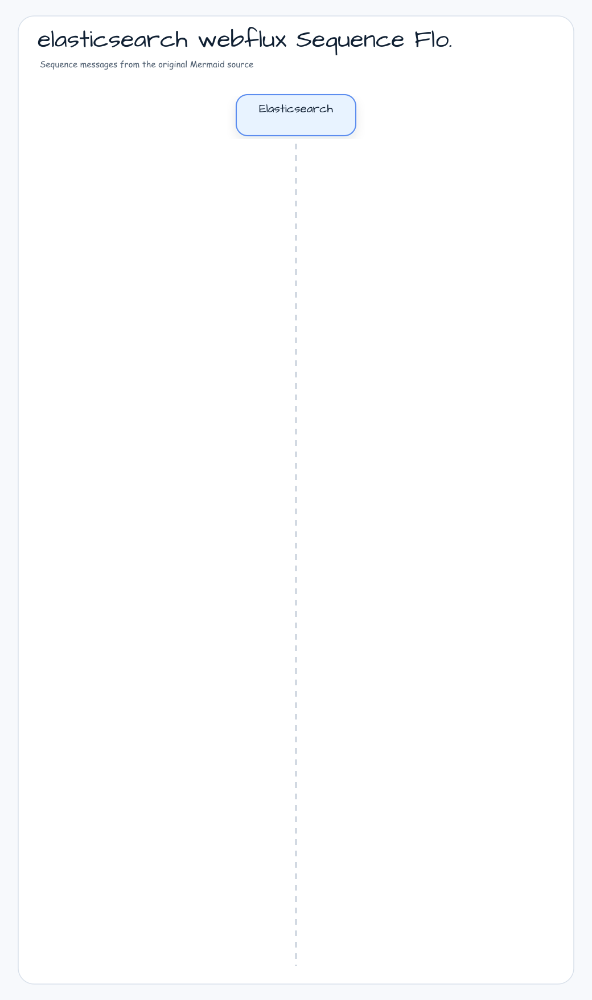

# Spring Data Elasticsearch Example with Spring Boot 4 and Elasticsearch 8

[한국어](README.ko.md) | English

## Example Scenario

This example exercises **Spring Data Elasticsearch Example with Spring Boot 4 and Elasticsearch 8** as a runnable Spring Data persistence workshop slice. It focuses on the path a developer would inspect first: configure the module, run the sample or tests, and observe the library or framework APIs that remove repetitive infrastructure code.

## Architecture Diagram

The module is organized around the sample entry point or test fixture, the bluetape4k extension layer, and the runtime dependency used by the example. Keep the package under `io.bluetape4k.workshop.springdata` as the source of truth when comparing this README with the code.

## Flow Diagram

1. Prepare the local runtime required by `spring-data-elasticsearch-webflux`.
2. Execute the application, controller, service, or test fixture that owns the example scenario.
3. Delegate repetitive infrastructure work to bluetape4k utilities or Spring/Kotlin integrations.
4. Assert the visible result through the sample output, HTTP response, repository state, metric, trace, or test expectation.

## Sequence Diagram

The core sequence is: caller or test fixture -> workshop adapter -> bluetape4k helper/API -> external runtime or in-memory backend -> assertion/response. When this module has a dedicated sequence asset, the image below shows that interaction order; otherwise the source tests are the authoritative executable sequence.

## 아키텍처 다이어그램

## Introduction

This example demonstrates how to use Spring Data Elasticsearch to do simple CRUD operations.

You can find the tutorial about this example at this
link: [Getting started with Spring Data Elasticsearch](https://www.geekyhacker.com/getting-started-with-spring-data-elasticsearch/)

For this example, we created a Book controller that allows doing the following operations with Elasticsearch:

- Get the list of all books
- Create a book
- Update a book by Id
- Delete a book by Id
- Search for a book by ISBN
- Fuzzy search for books by author and title

## 참고

- [Spring Data Elasticsearch - Reference Documentation](https://docs.spring.io/spring-data/elasticsearch/docs/current/reference/html/)
- [Spring Data Elasticsearch NativeSearchQuery 사용법](https://juntcom.tistory.com/149)
