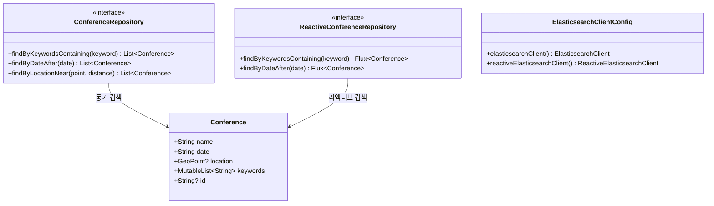
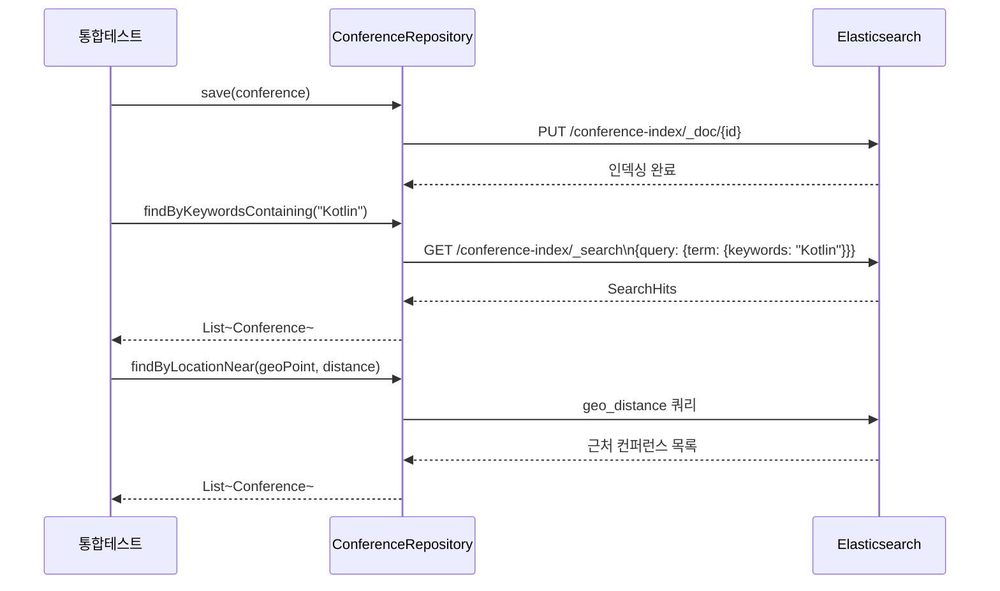

# Spring Data Elasticsearch - Demo

## 아키텍처 다이어그램

Spring Data Elasticsearch를 활용하는 동기(MVC) 방식 예제입니다.
Testcontainers로 Elasticsearch 컨테이너를 자동으로 구동하여 통합 테스트를 수행합니다.

## 주요 내용

- `@Document` 어노테이션을 이용한 Elasticsearch 문서 매핑
- `ElasticsearchRepository` 기반 CRUD 및 검색 메서드
- 커스텀 쿼리(`@Query`)와 Native Query 사용
- Spring MVC 컨트롤러를 통한 REST API 노출

## 참고

- [Spring Data Elasticsearch 공식 문서](https://docs.spring.io/spring-data/elasticsearch/reference/)
- WebFlux(Reactive) 방식은 [`spring-data/elasticsearch-webflux`](../elasticsearch-webflux) 모듈 참고
