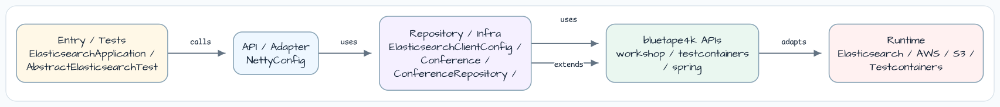
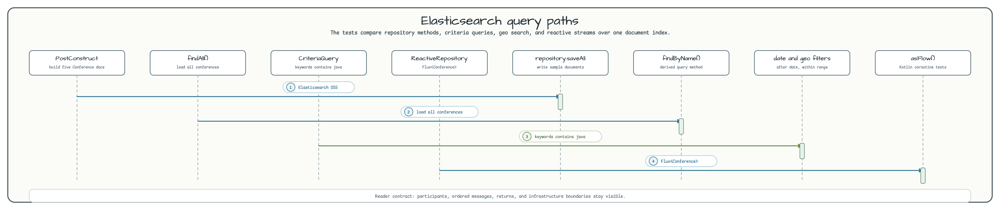

# Spring Data Elasticsearch

[한국어](README.ko.md) | English

This module shows a blocking Spring Data Elasticsearch sample backed by a Testcontainers
Elasticsearch OSS server. It loads conference documents at application startup, then
tests repository-derived queries and `ElasticsearchOperations` criteria queries against
the same `conference-index`.

## What this example shows

The application starts `ElasticsearchOssServer.Launcher.elasticsearchOssServer`, builds a
Spring Data client from that container URL, and persists five `Conference` documents from
`ElasticsearchApplication.insertSampleData()`. The synchronous repository is used for
startup data loading and basic search, while the reactive repository and reactive
operations are present so the same document model can be compared with the WebFlux-style
API surface.

## Query flow

The tests exercise three reader paths:

| Reader path | API | What it proves |
|---|---|---|
| Repository CRUD | `ConferenceRepository.findAll()` and `findByName()` | Spring Data maps `Conference` documents to `conference-index`. |
| Criteria query | `ElasticsearchOperations.search()` | Keyword/date and geo-distance filters can be expressed with `CriteriaQuery`. |
| Reactive repository | `ReactiveConferenceRepository` | Derived query methods can stream results as Reactor `Flux` and be consumed as Kotlin `Flow` in tests. |

The operations and reactive repository tests are currently disabled because the
Elasticsearch Java client used by this stack is still Jackson 2 based, while this Spring
Boot 4 sample line uses Jackson 3.

## Domain model

`Conference` is stored in `conference-index` with:

| Field | Mapping role |
|---|---|
| `id` | Spring Data document id |
| `name` | Conference title |
| `date` | `FieldType.Date` string used by date criteria |
| `location` | `GeoPoint` used by nearby searches |
| `keywords` | Tags used by repository and criteria filters |

## Key files

- `ElasticsearchApplication.kt` starts the container-backed sample and inserts the five conferences.
- `ElasticsearchClientConfig.kt` binds the Spring Data client to the Testcontainers URL with basic auth.
- `ConferenceRepository.kt` demonstrates blocking `ElasticsearchRepository` usage.
- `ReactiveConferenceRepository.kt` demonstrates derived reactive search methods.
- `ElasticsearchOperationsTest.kt` and `ReactiveElasticsearchOperationsTest.kt` show equivalent criteria searches.

## References

- [Spring Data Elasticsearch Reference Documentation](https://docs.spring.io/spring-data/elasticsearch/reference/)
- [Reactive variant in this repository](../elasticsearch-webflux)
