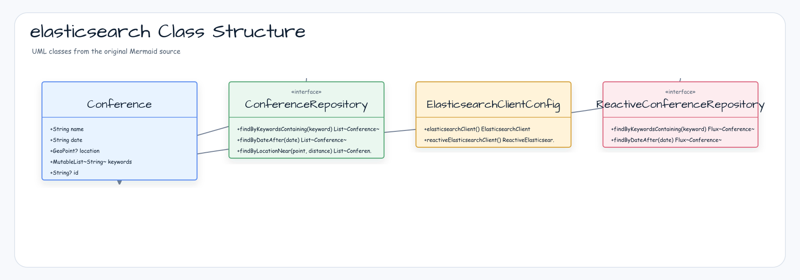
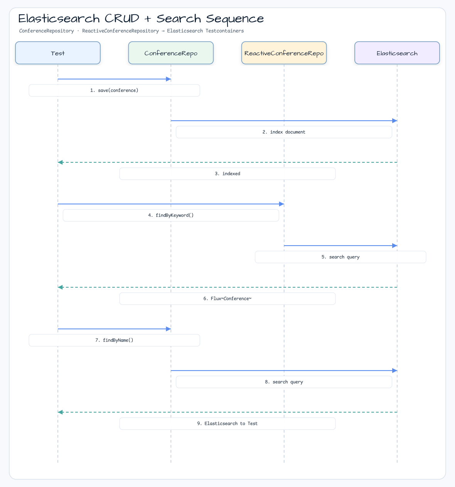

# Spring Data Elasticsearch - Demo

[한국어](README.ko.md) | English

## Example Scenario

This example exercises **Spring Data Elasticsearch - Demo** as a runnable Spring Data persistence workshop slice. It focuses on the path a developer would inspect first: configure the module, run the sample or tests, and observe the library or framework APIs that remove repetitive infrastructure code.

## Architecture Diagram

The module is organized around the sample entry point or test fixture, the bluetape4k extension layer, and the runtime dependency used by the example. Keep the package under `io.bluetape4k.workshop.springdata` as the source of truth when comparing this README with the code.

## Flow Diagram

1. Prepare the local runtime required by `spring-data-elasticsearch`.
2. Execute the application, controller, service, or test fixture that owns the example scenario.
3. Delegate repetitive infrastructure work to bluetape4k utilities or Spring/Kotlin integrations.
4. Assert the visible result through the sample output, HTTP response, repository state, metric, trace, or test expectation.

## Sequence Diagram

The core sequence is: caller or test fixture -> workshop adapter -> bluetape4k helper/API -> external runtime or in-memory backend -> assertion/response. When this module has a dedicated sequence asset, the image below shows that interaction order; otherwise the source tests are the authoritative executable sequence.

## 아키텍처 다이어그램

Spring Data Elasticsearch를 활용하는 동기(MVC) 방식 예제입니다.
Testcontainers로 Elasticsearch 컨테이너를 자동으로 구동하여 통합 테스트를 수행합니다.

## 주요 내용

- `@Document` 어노테이션을 이용한 Elasticsearch 문서 매핑
- `ElasticsearchRepository` 기반 CRUD 및 검색 메서드
- 커스텀 쿼리(`@Query`)와 Native Query 사용
- Spring MVC 컨트롤러를 통한 REST API 노출

## 참고

- [Spring Data Elasticsearch 공식 문서](https://docs.spring.io/spring-data/elasticsearch/reference/)
- WebFlux(Reactive) 방식은 [`spring-data/elasticsearch-webflux`](../elasticsearch-webflux) 모듈 참고
