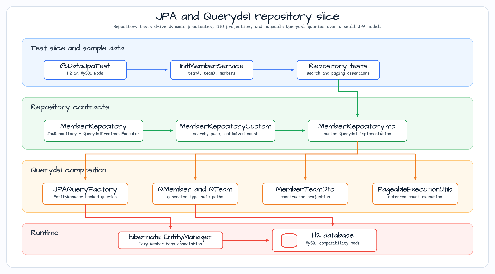
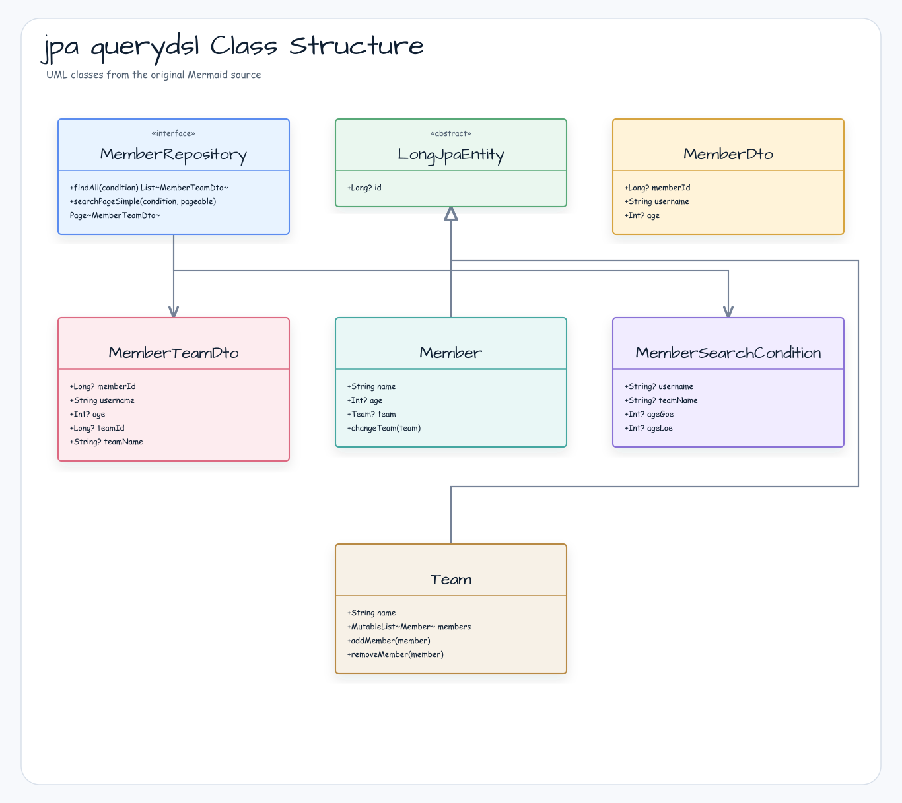
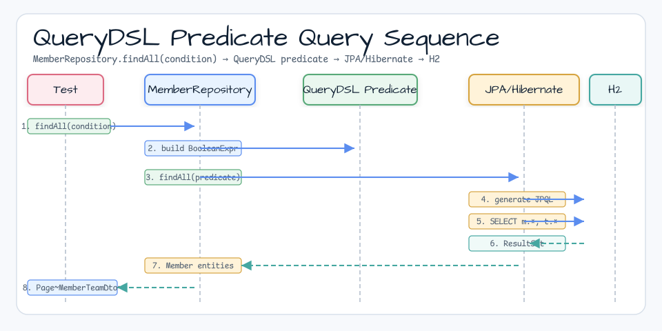

# JPA & QueryDSL Example

[English](README.md) | 한국어

## 예제 시나리오

이 예제는 **JPA & QueryDSL Example**을 실행 가능한 Spring Data 영속성 워크샵 조각으로 다룹니다. 개발자가 먼저 확인할 흐름인 모듈 설정, 샘플 또는 테스트 실행, 반복적인 인프라 코드를 줄여 주는 라이브러리와 프레임워크 API 관찰에 초점을 둡니다.

## 아키텍처 다이어그램

이 모듈은 샘플 진입점 또는 테스트 픽스처, bluetape4k 확장 계층, 예제에서 사용하는 런타임 의존성을 중심으로 구성됩니다. 이 README와 코드를 비교할 때는 `io.bluetape4k.workshop.springdata` 패키지를 기준으로 삼으세요.

## 흐름 다이어그램

1. `spring-data-jpa-querydsl`에 필요한 로컬 런타임을 준비합니다.
2. 예제 시나리오를 담당하는 애플리케이션, 컨트롤러, 서비스 또는 테스트 픽스처를 실행합니다.
3. 반복적인 인프라 작업은 bluetape4k 유틸리티 또는 Spring/Kotlin 통합에 위임합니다.
4. 샘플 출력, HTTP 응답, 저장소 상태, 메트릭, 트레이스 또는 테스트 기대값으로 보이는 결과를 검증합니다.

## 시퀀스 다이어그램

핵심 시퀀스는 호출자 또는 테스트 픽스처 -> 워크샵 어댑터 -> bluetape4k 헬퍼/API -> 외부 런타임 또는 인메모리 백엔드 -> 검증/응답 순서입니다. 전용 시퀀스 에셋이 있는 모듈은 아래 이미지가 상호작용 순서를 보여 주며, 없는 경우 소스 테스트가 실행 가능한 시퀀스의 기준입니다.

Spring Boot를 사용하는 JPA & QueryDSL 예제입니다.

## 아키텍처 다이어그램

