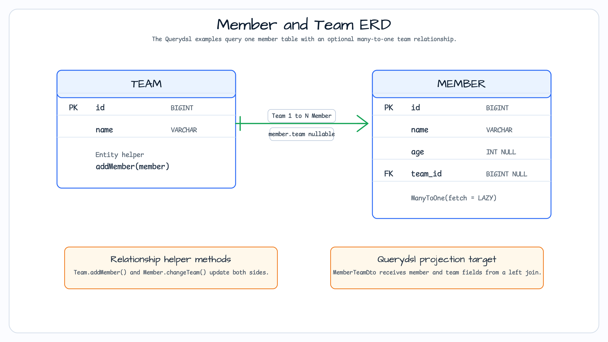

# JPA and Querydsl

[English](README.md) | 한국어

이 모듈은 Spring Data JPA repository와 Querydsl custom search logic을 함께 사용하는 예제입니다.
`Team`과 `Member`를 모델링하고, join query 결과를 DTO로 projection하며, pageable search에서
simple, deferred, optimized count 전략을 비교합니다.

## 이 예제가 보여 주는 것

`MemberRepository`는 Spring Data `JpaRepository`, `QuerydslPredicateExecutor`,
`MemberRepositoryCustom`을 조합합니다. Custom implementation은 `JPAQueryFactory`와 생성된
`QMember`/`QTeam` type을 사용해 `MemberSearchCondition`의 nullable condition을 동적
predicate로 조합합니다.

## Domain ERD

`Member`는 optional lazy `ManyToOne` 관계로 `Team`을 참조합니다. `Team.members`는
`Member.team`으로 mapping된 inverse collection이므로, sample domain model의
`Team.addMember()`와 `Member.changeTeam()`이 양방향 관계를 맞춥니다.

## Querydsl paths

| Path | Method | 보여 주는 내용 |
|---|---|---|
| Derived repository query | `findAllByName`, `findAllByTeam` | JPA entity에 대한 표준 Spring Data method-name query |
| Dynamic DTO search | `search(MemberSearchCondition)` | `leftJoin(member.team, team)`, nullable predicate, `MemberTeamDto` constructor projection |
| Simple page | `searchPageSimple` | content query와 deprecated `fetchCount()` count query를 분리 |
| Deferred count page | `searchPageComplex` | `PageableExecutionUtils.getPage()`로 가능한 경우 count query를 지연 |
| Optimized count page | `searchPageExtremeCountQuery` | full entity count 대신 distinct member id count 사용 |

## Test runtime

테스트는 `@DataJpaTest`를 사용하므로 embedded H2 database가 시작됩니다. JDBC URL은
`jdbc:mysql://localhost:3306/test;` 형태로 지정되어 이 slice에서 H2가 MySQL compatibility
mode로 동작합니다. `InitMemberService`는 repository test 전에 `teamA`, `teamB`, member
sample data를 준비합니다.

## 주요 파일

- `Member.kt`와 `Team.kt`는 JPA model과 relationship helper method를 정의합니다.
- `MemberRepository.kt`는 Spring Data와 custom Querydsl repository contract를 조합합니다.
- `MemberRepositoryImpl.kt`는 dynamic predicate, projection, sorting, paging을 구성합니다.
- `SpringRepositoryQuerydslSupport.kt`는 custom repository에서 재사용할 Querydsl support base를 보여 줍니다.
- `QuerydslExamples.kt`는 distinct, grouping, sorting, projection 같은 Querydsl 예제를 담고 있습니다.
