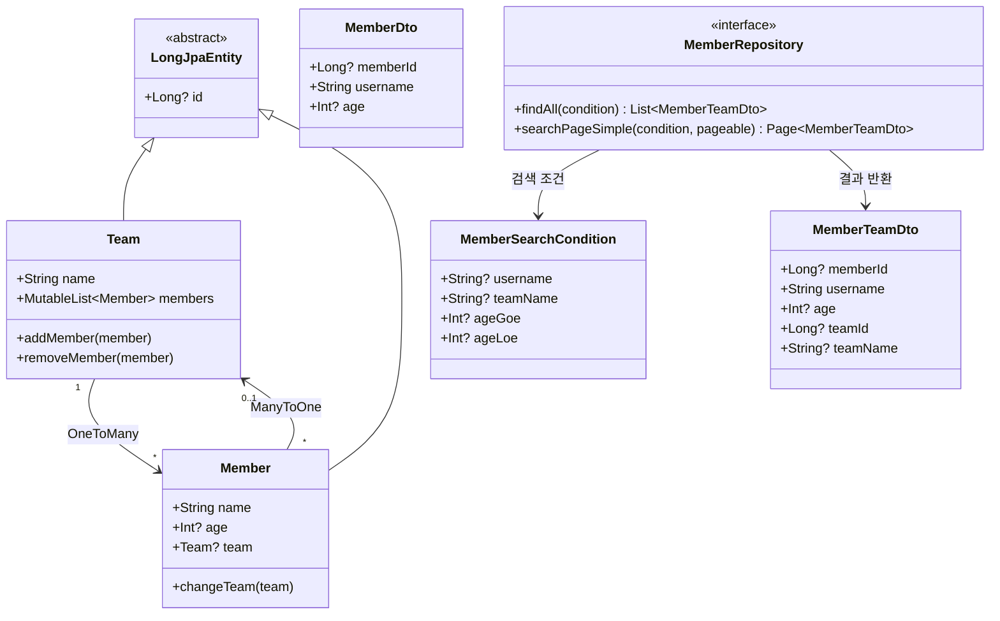
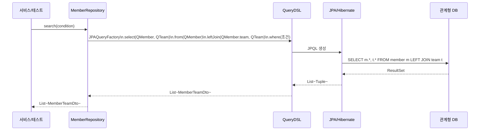

# JPA & QueryDSL Example

JPA & QueryDSL example using Spring Boot.

## 아키텍처 다이어그램

```mermaid
classDiagram
    class LongJpaEntity {
        <<abstract>>
        +Long? id
    }
    class Team {
        +String name
        +MutableList~Member~ members
        +addMember(member)
        +removeMember(member)
    }
    class Member {
        +String name
        +Int? age
        +Team? team
        +changeTeam(team)
    }
    class MemberDto {
        +Long? memberId
        +String username
        +Int? age
    }
    class MemberTeamDto {
        +Long? memberId
        +String username
        +Int? age
        +Long? teamId
        +String? teamName
    }
    class MemberSearchCondition {
        +String? username
        +String? teamName
        +Int? ageGoe
        +Int? ageLoe
    }
    class MemberRepository {
        <<interface>>
        +findAll(condition) List~MemberTeamDto~
        +searchPageSimple(condition, pageable) Page~MemberTeamDto~
    }

    LongJpaEntity <|-- Team
    LongJpaEntity <|-- Member
    Member "*" --> "0..1" Team : ManyToOne
    Team "1" --> "*" Member : OneToMany
    MemberRepository --> MemberSearchCondition : 검색 조건
    MemberRepository --> MemberTeamDto : 결과 반환
```

```mermaid
sequenceDiagram
    participant 서비스 as 서비스/테스트
    participant 저장소 as MemberRepository
    participant QSL as QueryDSL
    participant JPA as JPA/Hibernate
    participant DB as 관계형 DB

    서비스->>저장소: search(condition)
    저장소->>QSL: JPAQueryFactory\n.select(QMember, QTeam)\n.from(QMember)\n.leftJoin(QMember.team, QTeam)\n.where(조건)
    QSL->>JPA: JPQL 생성
    JPA->>DB: SELECT m.*, t.* FROM member m LEFT JOIN team t
    DB-->>JPA: ResultSet
    JPA-->>QSL: List~Tuple~
    QSL-->>저장소: List~MemberTeamDto~
    저장소-->>서비스: List~MemberTeamDto~
```
