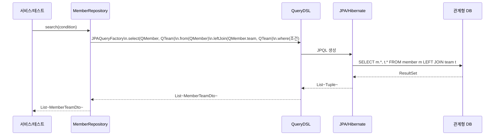

# JPA & QueryDSL Example

JPA & QueryDSL example using Spring Boot.

## 아키텍처 다이어그램

```mermaid
sequenceDiagram
    participant 서비스 as 서비스/테스트
    participant 저장소 as MemberRepository
    participant QSL as QueryDSL
    participant JPA as JPA/Hibernate
    participant DB as 관계형 DB

    서비스->>저장소: search(condition)
    저장소->>QSL: JPAQueryFactory\n.select(QMember, QTeam)\n.from(QMember)\n.leftJoin(QMember.team, QTeam)\n.where(조건)
    QSL->>JPA: JPQL 생성
    JPA->>DB: SELECT m.*, t.* FROM member m LEFT JOIN team t
    DB-->>JPA: ResultSet
    JPA-->>QSL: List~Tuple~
    QSL-->>저장소: List~MemberTeamDto~
    저장소-->>서비스: List~MemberTeamDto~
```
