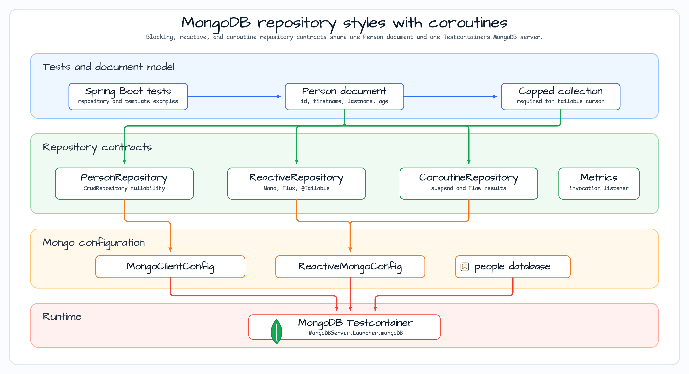
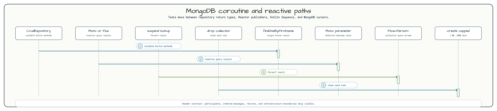

# Spring Data MongoDB Coroutines

[English](README.md) | 한국어

이 모듈은 같은 `Person` document를 대상으로 blocking, reactive, coroutine Spring Data
MongoDB repository 스타일을 비교합니다. Kotlin nullability, constructor defaulting,
reactive-to-coroutine adapter, tailable cursor 처리도 함께 보여 줍니다.

## 이 예제가 보여 주는 것



`MongoClientConfig`와 `ReactiveMongoConfig`는 모두 같은
`MongoDBServer.Launcher.mongoDB` Testcontainers instance에 연결하고 `people` database를
사용합니다. Domain package는 세 가지 repository contract를 노출하므로, document model을
바꾸지 않고 표준 `CrudRepository`, Reactor `ReactiveCrudRepository`, Kotlin
`CoroutineCrudRepository` 동작을 테스트에서 비교할 수 있습니다.

## Coroutine and reactive flow



| Path | API | 보여 주는 내용 |
|---|---|---|
| Blocking repository | `PersonRepository` | 일반 Spring Data repository에서 Kotlin nullability와 constructor defaulting |
| Reactive repository | `PersonReactiveRepository` | `Mono<Person>`, `Flux<Person>`, deferred `Mono<String>` parameter, tailable cursor stream |
| Coroutine repository | `PersonCoroutineRepository` | `suspend` single-result method와 `Flow<Person>` collection query |
| Reactive operations | `ReactiveMongoOperations` | 테스트에서 capped collection 구성, `insertAll`, `awaitSingle`, `asFlow()` 변환 |
| Repository metrics | `RepositoryMetricsConfiguration` | Repository factory bean에 invocation listener를 추가해 lightweight timing log 출력 |

## Person document

`Person`은 `@PersistenceCreator`와 default value를 사용합니다.

| Field | Role |
|---|---|
| `id` | MongoDB document id |
| `firstname` | `"Walter"` default를 가진 nullable name |
| `lastname` | empty-string default를 가진 nullable name |
| `age` | sample data에서 사용하는 integer age |

Reactive test fixture는 `@Tailable` repository method가 새 document를 stream할 수 있도록
각 테스트 전에 `Person` collection을 capped collection으로 재생성합니다.

## Build and test

```bash
./gradlew :spring-data:mongodb-coroutines:test
```

## 참고

- [Spring Data MongoDB Kotlin examples](https://github.com/spring-projects/spring-data-examples/tree/main/mongodb/kotlin)
- [Spring Data MongoDB reactive examples](https://github.com/spring-projects/spring-data-examples/tree/main/mongodb/reactive)
