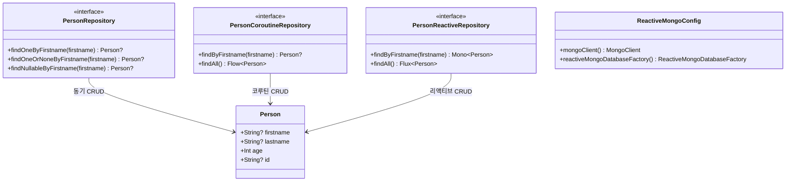
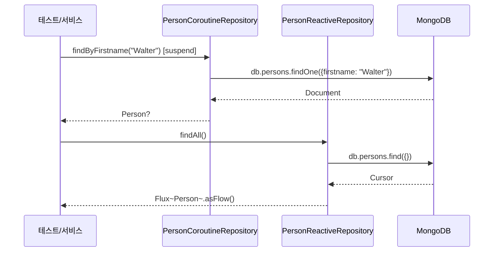

# mongodb-coroutine demo

## 아키텍처 다이어그램





MongoDB 관련 작업을 `Spring Data Mongo` 와 Kotlin Coroutines 으로 수행하는 예입니다.

## 참고

* [Spring Data MongoDB - Kotlin examples](https://github.com/spring-projects/spring-data-examples/tree/main/mongodb/kotlin)

* [Spring Data MongoDB - Reactive examples](https://github.com/spring-projects/spring-data-examples/tree/main/mongodb/reactive)

## 설명

## Value defaulting on entity construction

Kotlin allows defaulting for constructor- and method arguments.
Defaulting allows usage of substitute values if a field in the document is absent or simply `null`.
Spring Data inspects objects whether they are Kotlin types and uses the appropriate constructor.

```kotlin
data class Person(@Id val id: String?, val firstname: String? = "Walter", val lastname: String)

operations.insert<Document>().inCollection("person").one(Document("lastname", "White"))

val walter = operations.findOne<Document>(query(where("lastname").isEqualTo("White")), "person")

assertThat(walter.firstname).isEqualTo("Walter")
```

## Kotlin Extensions

Spring Data exposes methods accepting a target type to either query for or to project results values on.
Kotlin represents classes with its own type, `KClass` which can be an obstacle when attempting to obtain a Java `Class`
type.

Spring Data ships with extensions that add overloads for methods accepting a type parameter by either leveraging
generics or accepting `KClass` directly.

```kotlin
operations.getCollectionName<Person>()

operations.getCollectionName(Person::class)
```

## Nullability

Declaring repository interfaces using Kotlin allows expressing nullability constraints on arguments and return types.
Spring Data evaluates nullability of arguments and return types and reacts to these. Passing `null` to a non-nullable
argument raises an `IllegalArgumentException`, as you're already used to from Kotlin. Spring Data helps you also to
prevent `null` in query results. If you wish to return a nullable result, use Kotlin's nullability marker `?`. To
prevent `null` results, declare the return type of a query method as non-nullable. In the case a query yields no result,
a non-nullable query method throws `EmptyResultDataAccessException`.

```kotlin
interface PersonRepository: CrudRepository<Person, String> {

    /**
     * Query method declaring a nullable return type that allows to return null values.
     */
    fun findOneOrNoneByFirstname(firstname: String): Person?

    /**
     * Query method declaring a nullable argument.
     */
    fun findNullableByFirstname(firstname: String?): Person?

    /**
     * Query method requiring a result. Throws [org.springframework.dao.EmptyResultDataAccessException] if no result is found.
     */
    fun findOneByFirstname(firstname: String): Person
}
```

## Type-Safe Kotlin Mongo Query DSL

Using the `Criteria` extensions allows to write type-safe queries via an idiomatic API.

```kotlin
operations.find<Person>(Query(Person::firstname isEqualTo "Tyrion"))
```

## Coroutines and Flow support

```kotlin
runBlocking {
    operations.find<Person>(Query(where("firstname").isEqualTo("Tyrion"))).awaitSingle()
}
```

```kotlin
runBlocking {
    operations.findAll<Person>().asFlow().toList()
}
```
