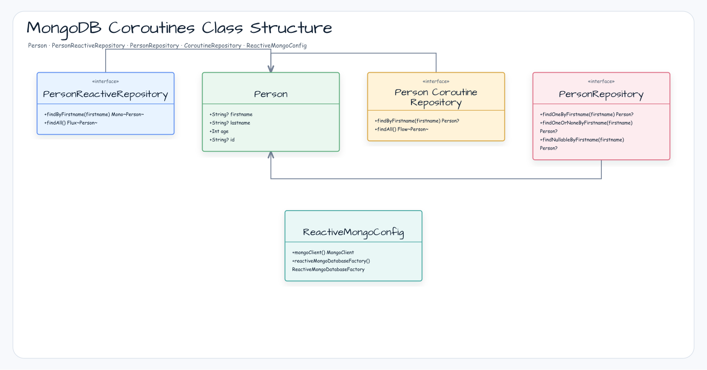
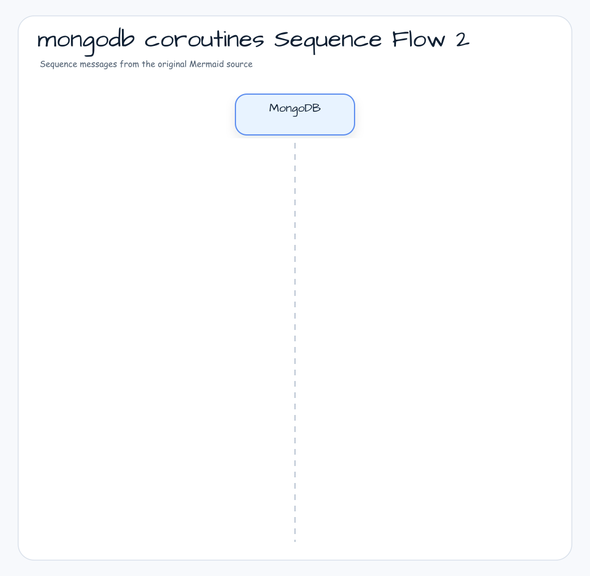

# mongodb-coroutine demo

[한국어](README.ko.md) | English

## Example Scenario

This example exercises **mongodb-coroutine demo** as a runnable Spring Data persistence workshop slice. It focuses on the path a developer would inspect first: configure the module, run the sample or tests, and observe the library or framework APIs that remove repetitive infrastructure code.

## Architecture Diagram


The module is organized around the sample entry point or test fixture, the bluetape4k extension layer, and the runtime dependency used by the example. Keep the package under `io.bluetape4k.workshop.springdata` as the source of truth when comparing this README with the code.



## Flow Diagram

1. Prepare the local runtime required by `spring-data-mongodb-coroutines`.
2. Execute the application, controller, service, or test fixture that owns the example scenario.
3. Delegate repetitive infrastructure work to bluetape4k utilities or Spring/Kotlin integrations.
4. Assert the visible result through the sample output, HTTP response, repository state, metric, trace, or test expectation.

## Sequence Diagram

The core sequence is: caller or test fixture -> workshop adapter -> bluetape4k helper/API -> external runtime or in-memory backend -> assertion/response. When this module has a dedicated sequence asset, the image below shows that interaction order; otherwise the source tests are the authoritative executable sequence.



## 아키텍처 다이어그램


MongoDB 관련 작업을 `Spring Data Mongo` 와 Kotlin Coroutines 으로 수행하는 예입니다.

## 참고

* [Spring Data MongoDB - Kotlin examples](https://github.com/spring-projects/spring-data-examples/tree/main/mongodb/kotlin)

* [Spring Data MongoDB - Reactive examples](https://github.com/spring-projects/spring-data-examples/tree/main/mongodb/reactive)

## 처리 흐름


## 설명

### Value defaulting on entity construction

Kotlin allows defaulting for constructor- and method arguments.
Defaulting allows usage of substitute values if a field in the document is absent or simply `null`.
Spring Data inspects objects whether they are Kotlin types and uses the appropriate constructor.

```kotlin
data class Person(@Id val id: String?, val firstname: String? = "Walter", val lastname: String)

operations.insert<Document>().inCollection("person").one(Document("lastname", "White"))

val walter = operations.findOne<Document>(query(where("lastname").isEqualTo("White")), "person")

assertThat(walter.firstname).isEqualTo("Walter")
```

### Kotlin Extensions

Spring Data exposes methods accepting a target type to either query for or to project results values on.
Kotlin represents classes with its own type, `KClass` which can be an obstacle when attempting to obtain a Java `Class` type.

Spring Data ships with extensions that add overloads for methods accepting a type parameter by either leveraging generics or accepting `KClass` directly.

```kotlin
operations.getCollectionName<Person>()
operations.getCollectionName(Person::class)
```

### Nullability

Declaring repository interfaces using Kotlin allows expressing nullability constraints on arguments and return types.
Spring Data evaluates nullability of arguments and return types and reacts to these. Passing `null` to a non-nullable argument raises an `IllegalArgumentException`. Spring Data helps you also to prevent `null` in query results. If you wish to return a nullable result, use Kotlin's nullability marker `?`.

```kotlin
interface PersonRepository: CrudRepository<Person, String> {
    fun findOneOrNoneByFirstname(firstname: String): Person?
    fun findNullableByFirstname(firstname: String?): Person?
    fun findOneByFirstname(firstname: String): Person
}
```

### Type-Safe Kotlin Mongo Query DSL

Using the `Criteria` extensions allows to write type-safe queries via an idiomatic API.

```kotlin
operations.find<Person>(Query(Person::firstname isEqualTo "Tyrion"))
```

### Coroutines and Flow support

```kotlin
// suspend 함수로 단일 결과 조회
val person = operations.findAll<Person>().awaitSingle()

// Flow로 스트리밍 조회 (backpressure 지원)
val persons = operations.findAll<Person>().asFlow().toList()
```

## 사용된 bluetape4k 기능

| 기능 | 아티팩트 | 코드 위치 | 이점 |
|---|---|---|---|
| `MongoDBServer.Launcher.mongoDB` | `bluetape4k-testcontainers` | `MongoClientConfig.kt`, `ReactiveMongoConfig.kt` | Testcontainers MongoDB 싱글톤 — JVM 전체에서 컨테이너 한 번만 기동 |
| `KLoggingChannel` | `bluetape4k-logging` | 모든 companion object | 코루틴 컨텍스트 포함 구조적 로깅 |
| `runSuspendIO { }` | `bluetape4k-junit5` | `FlowAndCoroutineTest` | `Dispatchers.IO`에서 suspend 테스트 실행 — IO 블로킹 없이 코루틴 테스트 |
| `Flow.log("label")` | `bluetape4k-coroutines` | `FlowAndCoroutineTest` | Flow 각 요소에 구조적 로그 출력 — 디버깅/추적 단순화 |
| `Fakers.faker` | `bluetape4k-junit5` | `AbstractMongodbTest` | 테스트 데이터 생성기 — 재사용 가능한 fake 인스턴스 제공 |
| `shouldBeEqualTo` | `bluetape4k-core` | 테스트 전체 | 가독성 높은 단언문 |

## bluetape4k Before / After

### `MongoDBServer.Launcher` vs 직접 컨테이너 생성

```kotlin
// Before — 테스트 클래스마다 새 MongoDBContainer 기동
@Testcontainers
class MyTest {
    companion object {
        @Container
        val mongo = MongoDBContainer("mongo:6.0")  // 매번 새 컨테이너
    }
}

// After — bluetape4k 싱글톤 런처 (JVM 전체에서 하나의 컨테이너 재사용)
class MongoClientConfig: AbstractMongoClientConfiguration() {
    override fun configureClientSettings(builder: MongoClientSettings.Builder) {
        builder.applyConnectionString(
            ConnectionString(MongoDBServer.Launcher.mongoDB.connectionString)
        )  // 이미 기동된 인스턴스를 반환 — 컨테이너 재기동 없음
    }
}
```

### `Flow.log("label")` vs 수동 로깅

```kotlin
// Before — 각 요소에 로그를 찍으려면 onEach + 수동 로그 호출
val persons = operations.findAll<Person>()
    .asFlow()
    .onEach { log.debug { "person=$it" } }
    .toList()

// After — bluetape4k Flow.log() (구조적 로그 자동)
val persons = operations.findAll<Person>().asFlow()
    .log("persons")   // 각 emit/complete/error 자동 로깅
    .toList()
```

### `runSuspendIO { }` vs runBlocking + Dispatchers.IO

```kotlin
// Before — 테스트에서 IO 디스패처 지정 및 블로킹 래핑
@Test
fun `find person`() {
    runBlocking(Dispatchers.IO) {
        val person = operations.insert<Person>().one(newPerson()).awaitSingle()
        // ...
    }
}

// After — bluetape4k runSuspendIO (JUnit 5 확장 + IO 디스패처 내장)
@Test
fun `find person`() = runSuspendIO {
    val person = operations.insert<Person>().one(newPerson()).awaitSingle()
    // 테스트 컨텍스트에서 바로 suspend 함수 호출 가능
}
```

## 취소·구조적 동시성·컨텍스트 전파

### `CoroutineCrudRepository` Flow와 취소 전파

`PersonCoroutineRepository.findAllByFirstname()` 이 반환하는 `Flow<Person>` 은
Reactor `Flux`를 `asFlow()` 로 변환한 것입니다. 코루틴 스코프가 취소되면 upstream `Flux`
구독도 즉시 취소되어 MongoDB 커서가 반환됩니다.

```kotlin
val job = launch {
    repository.findAllByFirstname("Tyrion")   // Flow<Person>
        .collect { person ->
            // 이 collect가 실행 중 job.cancel() 호출 시
            // Flow 수집 중단 + MongoDB 커서 자동 해제
        }
}
delay(50)
job.cancel()   // 취소 신호가 Flow → Flux → MongoDB 커서까지 전파됨
```

### `@Tailable` 커서와 백프레셔

`PersonCoroutineRepository.findWithTailableCursorBy()` 는 MongoDB tailable 커서를
`Flux<Person>` 으로 노출합니다. 이를 `.asFlow()` 로 변환하면 코루틴 백프레셔
(`buffer`, `conflate` 연산자)를 활용해 소비 속도를 제어할 수 있습니다.

```kotlin
repository.findWithTailableCursorBy()
    .asFlow()
    .buffer(capacity = 10)          // 최대 10개 버퍼링
    .collect { person ->
        processSlowly(person)       // 소비가 느려도 tailable 커서가 대기
    }
```

## 빌드 및 테스트

```bash
./gradlew :spring-data-mongodb-coroutines:test
```
