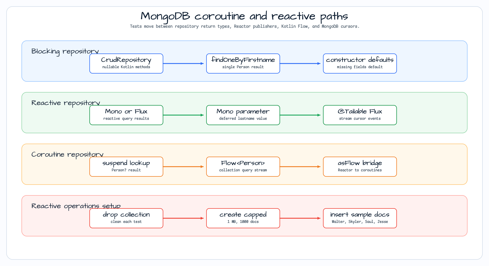

# Spring Data MongoDB Coroutines

[한국어](README.ko.md) | English

This module compares blocking, reactive, and coroutine Spring Data MongoDB repository
styles over the same `Person` document. It also demonstrates Kotlin nullability,
constructor defaulting, reactive-to-coroutine adapters, and tailable cursor handling.

## What this example shows


Both `MongoClientConfig` and `ReactiveMongoConfig` connect to the same
`MongoDBServer.Launcher.mongoDB` Testcontainers instance and use the `people` database.
The domain package exposes three repository contracts so tests can compare standard
`CrudRepository`, Reactor `ReactiveCrudRepository`, and Kotlin `CoroutineCrudRepository`
behavior without changing the document model.

## Coroutine and reactive flow



| Path | API | What it demonstrates |
|---|---|---|
| Blocking repository | `PersonRepository` | Kotlin nullability and constructor defaulting on ordinary Spring Data repositories. |
| Reactive repository | `PersonReactiveRepository` | `Mono<Person>`, `Flux<Person>`, deferred `Mono<String>` parameters, and tailable cursor streams. |
| Coroutine repository | `PersonCoroutineRepository` | `suspend` single-result methods and `Flow<Person>` collection queries. |
| Reactive operations | `ReactiveMongoOperations` | Capped collection setup, `insertAll`, `awaitSingle`, and `asFlow()` conversion in tests. |
| Repository metrics | `RepositoryMetricsConfiguration` | Adds an invocation listener to repository factory beans for lightweight timing logs. |

## Person document

`Person` uses `@PersistenceCreator` with default values:

| Field | Role |
|---|---|
| `id` | MongoDB document id |
| `firstname` | Nullable name with `"Walter"` default |
| `lastname` | Nullable name with empty-string default |
| `age` | Integer age used in sample data |

The reactive test fixture recreates the `Person` collection as capped before each test so
`@Tailable` repository methods can stream new documents.

## Build and test

```bash
./gradlew :spring-data:mongodb-coroutines:test
```

## References

- [Spring Data MongoDB Kotlin examples](https://github.com/spring-projects/spring-data-examples/tree/main/mongodb/kotlin)
- [Spring Data MongoDB reactive examples](https://github.com/spring-projects/spring-data-examples/tree/main/mongodb/reactive)
