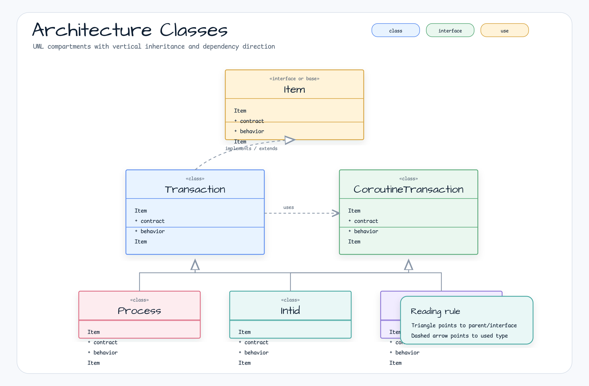
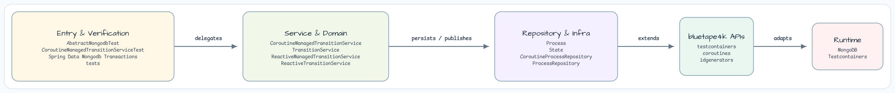
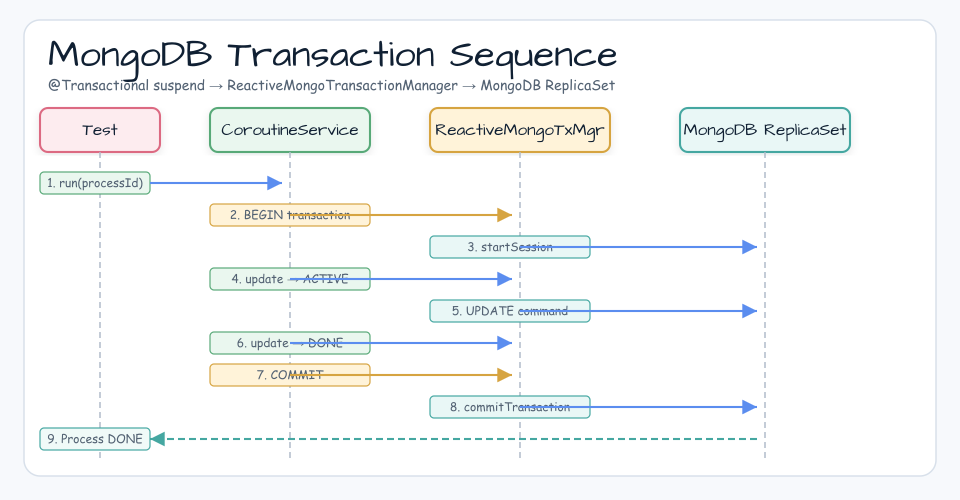
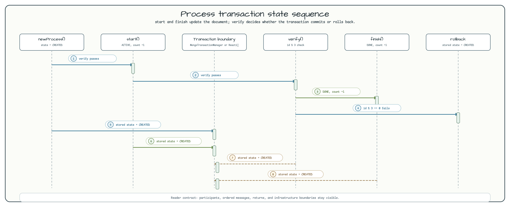

# mongo-transactions demo

[English](README.md) | 한국어

## 예제 시나리오

이 예제는 **mongo-transactions demo**를 실행 가능한 Spring Data 영속성 워크샵 조각으로 다룹니다. 개발자가 먼저 확인할 흐름인 모듈 설정, 샘플 또는 테스트 실행, 반복적인 인프라 코드를 줄여 주는 라이브러리와 프레임워크 API 관찰에 초점을 둡니다.

## 아키텍처 다이어그램



이 모듈은 샘플 진입점 또는 테스트 픽스처, bluetape4k 확장 계층, 예제에서 사용하는 런타임 의존성을 중심으로 구성됩니다. 이 README와 코드를 비교할 때는 `io.bluetape4k.workshop.springdata` 패키지를 기준으로 삼으세요.



## 흐름 다이어그램

1. `spring-data-mongodb-transactions`에 필요한 로컬 런타임을 준비합니다.
2. 예제 시나리오를 담당하는 애플리케이션, 컨트롤러, 서비스 또는 테스트 픽스처를 실행합니다.
3. 반복적인 인프라 작업은 bluetape4k 유틸리티 또는 Spring/Kotlin 통합에 위임합니다.
4. 샘플 출력, HTTP 응답, 저장소 상태, 메트릭, 트레이스 또는 테스트 기대값으로 보이는 결과를 검증합니다.

## 시퀀스 다이어그램

핵심 시퀀스는 호출자 또는 테스트 픽스처 -> 워크샵 어댑터 -> bluetape4k 헬퍼/API -> 외부 런타임 또는 인메모리 백엔드 -> 검증/응답 순서입니다. 전용 시퀀스 에셋이 있는 모듈은 아래 이미지가 상호작용 순서를 보여 주며, 없는 경우 소스 테스트가 실행 가능한 시퀀스의 기준입니다.



## 아키텍처 다이어그램


이 예제는 `Spring Data Mongo`와 Kotlin Coroutines로 MongoDB 작업을 수행합니다.

## 참고

* [Spring Data MongoDB - Transaction sample](https://github.com/spring-projects/spring-data-examples/tree/main/mongodb/transactions/README.md)

## 처리 흐름



## 설명

### Sample 실행

이 sample은 MongoDB Testcontainers container를 사용합니다.
`imperative` / `reactive` / `coroutine` package에 synchronous, reactive, coroutine transaction support를 검증하는 test가 들어 있습니다.

### Sync Transactions

`MongoTransactionManager`는 잘 알려진 Spring transaction support로 들어가는 gateway입니다.
`MongoTransactionManager`는 `ClientSession`을 thread에 bind합니다.

```kotlin
@Service
class TransitionService {
    @Transactional
    fun run(id: Int) {
        val process = lookup(id)
        if (process.state != State.CREATED) return
        start(process)
        verify(process)
        finish(process)
    }
}
```

### Programmatic Reactive Transactions

`ReactiveMongoTemplate`은 transaction 안에서 작업하기 위한 전용 method(`inTransaction()` 등)를 제공합니다.

```kotlin
@Service
class ReactiveTransitionService {
    fun run(id: Int): Mono<Int> =
        template.inTransaction().execute { action ->
            lookup(id)
                .filter { State.CREATED == it.state }
                .flatMap { process -> start(action, process) }
                .flatMap { this::verify }
                .flatMap { process -> finish(action, process) }
        }.next().map { it.id }
}
```

### Declarative Reactive Transactions

`ReactiveMongoTransactionManager`는 `ClientSession`을
`reactor.util.context.Context`에 추가합니다. `ReactiveMongoTemplate`은 session을 감지하고
해당 resource에서 동작합니다.

### Coroutine Transactions

`CoroutineManagedTransitionService`는 `@Transactional suspend fun`과
`ReactiveMongoTransactionManager`를 결합합니다.
`kotlinx-coroutines-reactor`의 `ReactorContext`가 Reactor Context(transaction session)를
coroutine context와 자동으로 연결합니다.

```kotlin
@Service
class CoroutineManagedTransitionService(
    private val repository: CoroutineProcessRepository,
    private val operations: ReactiveMongoOperations,
) {
    @Transactional
    suspend fun run(id: Int) {
        val process = lookup(id)
        if (process.state != State.CREATED) return
        start(process)   // update → ACTIVE
        verify(process)  // throws on id % 3 == 0 → triggers rollback
        finish(process)  // update → DONE
    }
}
```

## 사용된 bluetape4k 기능

| 기능 | Artifact | 코드 위치 | 이점 |
|---|---|---|---|
| `MongoDBServer.Launcher.mongoDB` | `bluetape4k-testcontainers` | `AbstractMongodbTest` | Testcontainers MongoDB singleton — replica set을 포함해 전체 JVM에서 공유됩니다 |
| `KLoggingChannel` | `bluetape4k-logging` | `CoroutineManagedTransitionService`, tests | coroutine context를 포함하는 structured logging |
| `log.debug { }` / `log.warn { }` | `bluetape4k-logging` | 모든 tests | lambda 기반 lazy log message — 비활성 log level에서는 string을 만들지 않습니다 |
| `uninitialized()` | `bluetape4k-core` | 모든 tests | `@Autowired` field의 `lateinit` 대체 — type-safe initialization marker |
| `shouldBeEqualTo`, `shouldNotBeNull` | `bluetape4k-core` | 모든 tests | 읽기 쉬운 assertion |
| `Fakers.faker` | `bluetape4k-junit5` | `AbstractMongodbTest` | Test data generator — 재사용 가능한 fake instance |

## bluetape4k Before / After

### `MongoDBServer.Launcher` vs 수동 Container 생성

```kotlin
// Before — create MongoClient directly in AbstractReactiveMongoConfiguration
class TestConfig: AbstractReactiveMongoConfiguration() {
    @Bean
    override fun reactiveMongoClient(): MongoClient {
        // manual connection string management — port collisions and cleanup responsibility
        return MongoClients.create("mongodb://localhost:27017")
    }
}

// After — bluetape4k singleton launcher (automatic cleanup)
abstract class AbstractMongodbTest {
    companion object: KLoggingChannel() {
        val mongodb by lazy { MongoDBServer.Launcher.mongoDB }
        fun createReactiveMongoClient() =
            MongoClients.create(mongodb.url)  // reuse the already-started instance
    }
}
```

### `uninitialized()` vs lateinit var

```kotlin
// Before — lateinit var (UnitializedPropertyAccessException if accessed before initialization)
@Autowired
private lateinit var managedTransitionService: CoroutineManagedTransitionService

// After — bluetape4k uninitialized() (type-safe marker with explicit intent)
@Autowired
private val managedTransitionService: CoroutineManagedTransitionService = uninitialized()
```

### `@Transactional suspend fun` vs Reactor-Chained Transactions

```kotlin
// Before — Reactor style (transaction composed with flatMap chaining)
fun run(id: Int): Mono<Int> =
    template.inTransaction().execute { action ->
        lookup(id)
            .filter { State.CREATED == it.state }
            .flatMap { start(action, it) }
            .flatMap { verify(it) }
            .flatMap { finish(action, it) }
    }.next().map { it.id }

// After — coroutine style (@Transactional suspend fun, sequential code)
@Transactional
suspend fun run(id: Int) {
    val process = lookup(id)
    if (process.state != State.CREATED) return
    start(process)    // automatic rollback when an exception occurs
    verify(process)   // id % 3 == 0 → IllegalStateException → rollback
    finish(process)
}
```

## Cancellation, Structured Concurrency, and Context Propagation

### `@Transactional` + Coroutine Context

`ReactiveMongoTransactionManager`는 transaction session을 Reactor `Context`에 저장합니다.
`kotlinx-coroutines-reactor`는 `ReactorContext` element를 통해 해당 context를 coroutine context와 연결하므로,
`@Transactional suspend fun` 안의 모든 `awaitSingle()` / `awaitFirst()` 호출이 같은 session에서 실행됩니다.

### Coroutine Cancellation과 Transaction Rollback

`@Transactional suspend fun` 실행 중 coroutine이 cancel되면(예: timeout 또는 parent-scope cancellation)
Spring AOP transaction interceptor가 `CancellationException`을 감지하고 transaction을 rollback합니다.

```kotlin
// timeout-driven cancellation -> automatic transaction rollback
withTimeout(500) {
    service.run(processId)  // CancellationException after 500ms -> rollback
}
```

### Test Verification Pattern

```kotlin
@Test
fun `coroutine transaction commit and rollback`() = runTest {
    repeat(10) {
        val process = managedTransitionService.newProcess()
        try {
            managedTransitionService.run(process.id)
            stateInDb(process) shouldBeEqualTo State.DONE       // verify commit
        } catch (e: IllegalStateException) {
            stateInDb(process) shouldBeEqualTo State.CREATED    // verify rollback
        }
    }
}
```

## 빌드와 테스트

```bash
./gradlew :spring-data-mongodb-transactions:test
```
