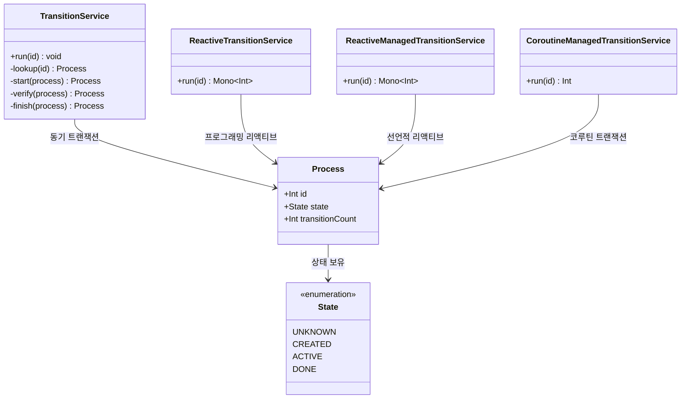
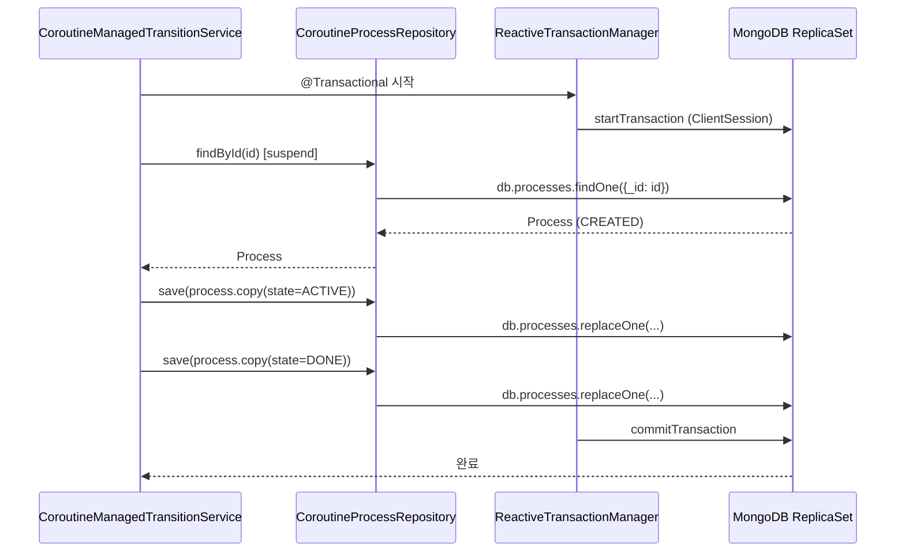

# mongo-transactions demo

## 아키텍처 다이어그램





MongoDB 관련 작업을 `Spring Data Mongo` 와 Kotlin Coroutines 으로 수행하는 예입니다.

## 참고

* [Spring Data MongoDB - Transaction sample](https://github.com/spring-projects/spring-data-examples/tree/main/mongodb/transactions/README.md)

## 설명

## Running the Sample

The sample uses multiple embedded MongoDB processes in
a [MongoDB replica set](https://docs.mongodb.com/manual/replication/).
It contains test for both the synchronous and the reactive transaction support in the `sync` / `reactive` packages.

You may run the examples directly from your IDE or use maven on the command line.

**INFO:** The operations to download the required MongoDB binaries and spin up the cluster can take some time. Please
be patient.

## Sync Transactions

`MongoTransactionManager` is the gateway to the well known Spring transaction support. It lets applications use
[the managed transaction features of Spring](http://docs.spring.io/spring/docs/{springVersion}/spring-framework-reference/data-access.html#transaction).
The `MongoTransactionManager` binds a `ClientSession` to the thread. `MongoTemplate` detects the session and operates
on these resources which are associated with the transaction accordingly. `MongoTemplate` can also participate in
other, ongoing transactions.

```java

@Configuration
static class Config extends AbstractMongoConfiguration {

    @Bean
    MongoTransactionManager transactionManager(MongoDbFactory dbFactory) {
        return new MongoTransactionManager(dbFactory);
    }

    // ...
}

@Component
public class TransitionService {

    @Transactional
    public void run(Integer id) {

        Process process = lookup(id);

        if (!State.CREATED.equals(process.getState())) {
            return;
        }

        start(process);
        verify(process);
        finish(process);
    }
}
```

## Programmatic Reactive transactions

`ReactiveMongoTemplate` offers dedicated methods (like `inTransaction()`) for operating within a transaction without
having to worry about the
commit/abort actions depending on the operations outcome.

**NOTE:** Please note that you cannot preform meta operations, like collection creation within a transaction.

```java

@Service
public class ReactiveTransitionService {

    public Mono<Integer> run(Integer id) {

        return template.inTransaction().execute(action -> {

            return lookup(id) //
                    .filter(State.CREATED::equals)
                    .flatMap(process -> start(action, process))
                    .flatMap(this::verify)
                    .flatMap(process -> finish(action, process));

        }).next().map(Process::getId);
    }
}
```

## Declarative Reactive transactions

`ReactiveMongoTransactionManager` is the gateway to the reactive Spring transaction support. It lets applications use
[the managed transaction features of Spring](http://docs.spring.io/spring/docs/{springVersion}/spring-framework-reference/data-access.html#transaction).
The `ReactiveMongoTransactionManager` adds the `ClientSession` to
the `reactor.util.context.Context`. `ReactiveMongoTemplate` detects the session and operates
on these resources which are associated with the transaction accordingly.

```java
@EnableTransactionManagement
class Config extends AbstractReactiveMongoConfiguration {

	@Bean
	ReactiveTransactionManager transactionManager(ReactiveMongoDatabaseFactory factory) {
		return new ReactiveMongoTransactionManager(factory);
	}
	
	// ...
}


@Service
class ReactiveManagedTransitionService {

	@Transactional
	public Mono<Integer> run(Integer id) {

		return lookup(id)
				.flatMap(process -> start(template, process))
				.flatMap(it -> verify(it)) //
				.flatMap(process -> finish(template, process))
				.map(Process::getId);
	}
