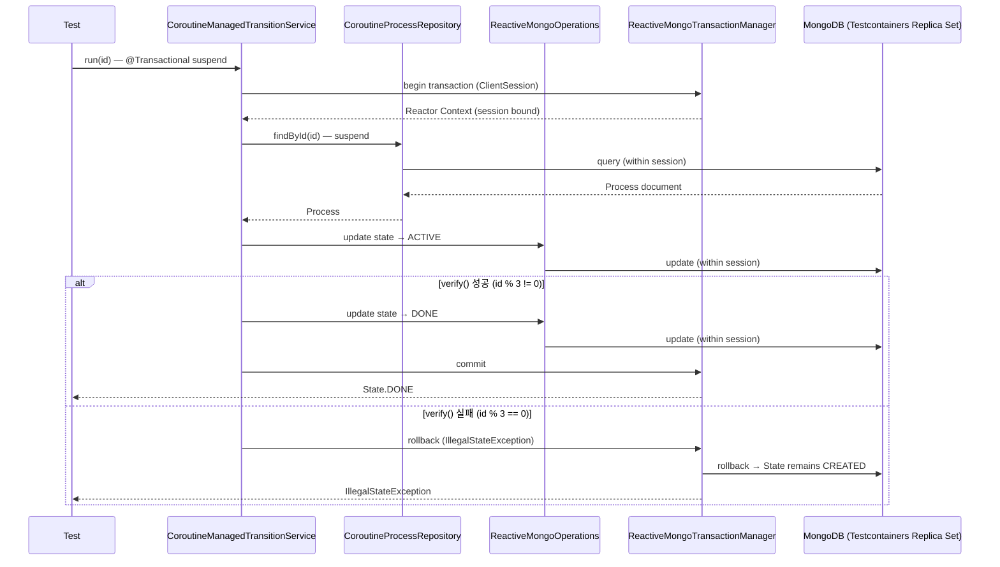

# mongo-transactions demo

[한국어](README.ko.md) | English

## Example Scenario

This example exercises **mongo-transactions demo** as a runnable Spring Data persistence workshop slice. It focuses on the path a developer would inspect first: configure the module, run the sample or tests, and observe the library or framework APIs that remove repetitive infrastructure code.

## Architecture Diagram

The module is organized around the sample entry point or test fixture, the bluetape4k extension layer, and the runtime dependency used by the example. Keep the package under `io.bluetape4k.workshop.springdata` as the source of truth when comparing this README with the code.


## Flow Diagram

1. Prepare the local runtime required by `spring-data-mongodb-transactions`.
2. Execute the application, controller, service, or test fixture that owns the example scenario.
3. Delegate repetitive infrastructure work to bluetape4k utilities or Spring/Kotlin integrations.
4. Assert the visible result through the sample output, HTTP response, repository state, metric, trace, or test expectation.

## Sequence Diagram

The core sequence is: caller or test fixture -> workshop adapter -> bluetape4k helper/API -> external runtime or in-memory backend -> assertion/response. When this module has a dedicated sequence asset, the image below shows that interaction order; otherwise the source tests are the authoritative executable sequence.


## 아키텍처 다이어그램


MongoDB 관련 작업을 `Spring Data Mongo` 와 Kotlin Coroutines 으로 수행하는 예입니다.

## 참고

* [Spring Data MongoDB - Transaction sample](https://github.com/spring-projects/spring-data-examples/tree/main/mongodb/transactions/README.md)

## 처리 흐름


```mermaid
sequenceDiagram
    participant Test
    participant Service as CoroutineManagedTransitionService
    participant Repo as CoroutineProcessRepository
    participant ReactiveOps as ReactiveMongoOperations
    participant TxMgr as ReactiveMongoTransactionManager
    participant DB as MongoDB (Testcontainers Replica Set)

    Test->>Service: run(id) — @Transactional suspend
    Service->>TxMgr: begin transaction (ClientSession)
    TxMgr-->>Service: Reactor Context (session bound)

    Service->>Repo: findById(id) — suspend
    Repo->>DB: query (within session)
    DB-->>Repo: Process document
    Repo-->>Service: Process

    Service->>ReactiveOps: update state → ACTIVE
    ReactiveOps->>DB: update (within session)

    alt verify() 성공 (id % 3 != 0)
        Service->>ReactiveOps: update state → DONE
        ReactiveOps->>DB: update (within session)
        Service->>TxMgr: commit
        TxMgr-->>Test: State.DONE
    else verify() 실패 (id % 3 == 0)
        Service->>TxMgr: rollback (IllegalStateException)
        TxMgr->>DB: rollback → State remains CREATED
        TxMgr-->>Test: IllegalStateException
    end
```

## 설명

### Running the Sample

The sample uses a MongoDB Testcontainers container.
It contains tests for synchronous, reactive, and coroutine transaction support
in the `imperative` / `reactive` / `coroutine` packages.

### Sync Transactions

`MongoTransactionManager` is the gateway to the well known Spring transaction support.
The `MongoTransactionManager` binds a `ClientSession` to the thread.

```kotlin
@Service
class TransitionService {
    @Transactional
    fun run(id: Int) {
        val process = lookup(id)
        if (process.state != State.CREATED) return
        start(process)
        verify(process)
        finish(process)
    }
}
```

### Programmatic Reactive Transactions

`ReactiveMongoTemplate` offers dedicated methods (like `inTransaction()`) for operating within a transaction.

```kotlin
@Service
class ReactiveTransitionService {
    fun run(id: Int): Mono<Int> =
        template.inTransaction().execute { action ->
            lookup(id)
                .filter { State.CREATED == it.state }
                .flatMap { process -> start(action, process) }
                .flatMap { this::verify }
                .flatMap { process -> finish(action, process) }
        }.next().map { it.id }
}
```

### Declarative Reactive Transactions

`ReactiveMongoTransactionManager` adds the `ClientSession` to
the `reactor.util.context.Context`. `ReactiveMongoTemplate` detects the session and operates
on these resources accordingly.

### Coroutine Transactions

`CoroutineManagedTransitionService`는 `@Transactional suspend fun` 과
`ReactiveMongoTransactionManager` 를 조합합니다.
`kotlinx-coroutines-reactor`의 `ReactorContext` 가 Reactor Context (트랜잭션 세션)를
코루틴 컨텍스트와 자동으로 연결합니다.

```kotlin
@Service
class CoroutineManagedTransitionService(
    private val repository: CoroutineProcessRepository,
    private val operations: ReactiveMongoOperations,
) {
    @Transactional
    suspend fun run(id: Int) {
        val process = lookup(id)
        if (process.state != State.CREATED) return
        start(process)   // update → ACTIVE
        verify(process)  // throws on id % 3 == 0 → triggers rollback
        finish(process)  // update → DONE
    }
}
```

## 사용된 bluetape4k 기능

| 기능 | 아티팩트 | 코드 위치 | 이점 |
|---|---|---|---|
| `MongoDBServer.Launcher.mongoDB` | `bluetape4k-testcontainers` | `AbstractMongodbTest` | Testcontainers MongoDB 싱글톤 — 레플리카 셋 포함 JVM 전체 공유 |
| `KLoggingChannel` | `bluetape4k-logging` | `CoroutineManagedTransitionService`, 테스트 | 코루틴 컨텍스트 포함 구조적 로깅 |
| `log.debug { }` / `log.warn { }` | `bluetape4k-logging` | 테스트 전체 | 람다 기반 지연 평가 로그 메시지 — 비활성 레벨에서 문자열 생성 없음 |
| `uninitialized()` | `bluetape4k-core` | 테스트 전체 | `@Autowired` 필드의 lateinit 대체 — 타입 안전 초기화 마커 |
| `shouldBeEqualTo`, `shouldNotBeNull` | `bluetape4k-core` | 테스트 전체 | 가독성 높은 단언문 |
| `Fakers.faker` | `bluetape4k-junit5` | `AbstractMongodbTest` | 테스트 데이터 생성기 — 재사용 가능한 fake 인스턴스 |

## bluetape4k Before / After

### `MongoDBServer.Launcher` vs 직접 컨테이너 생성

```kotlin
// Before — AbstractReactiveMongoConfiguration에서 직접 MongoClient 생성
class TestConfig: AbstractReactiveMongoConfiguration() {
    @Bean
    override fun reactiveMongoClient(): MongoClient {
        // 직접 연결 문자열 관리 — 포트 충돌, 클린업 책임
        return MongoClients.create("mongodb://localhost:27017")
    }
}

// After — bluetape4k 싱글톤 런처 (클린업 자동)
abstract class AbstractMongodbTest {
    companion object: KLoggingChannel() {
        val mongodb by lazy { MongoDBServer.Launcher.mongoDB }
        fun createReactiveMongoClient() =
            MongoClients.create(mongodb.url)  // 한 번 기동된 인스턴스 재사용
    }
}
```

### `uninitialized()` vs lateinit var

```kotlin
// Before — lateinit var (초기화 전 접근 시 UnitializedPropertyAccessException)
@Autowired
private lateinit var managedTransitionService: CoroutineManagedTransitionService

// After — bluetape4k uninitialized() (타입 안전 마커, 명시적 의도 표현)
@Autowired
private val managedTransitionService: CoroutineManagedTransitionService = uninitialized()
```

### `@Transactional suspend fun` vs Reactor 체이닝 트랜잭션

```kotlin
// Before — Reactor 방식 (flatMap 체이닝으로 트랜잭션 구성)
fun run(id: Int): Mono<Int> =
    template.inTransaction().execute { action ->
        lookup(id)
            .filter { State.CREATED == it.state }
            .flatMap { start(action, it) }
            .flatMap { verify(it) }
            .flatMap { finish(action, it) }
    }.next().map { it.id }

// After — 코루틴 방식 (@Transactional suspend fun, 순차 코드)
@Transactional
suspend fun run(id: Int) {
    val process = lookup(id)
    if (process.state != State.CREATED) return
    start(process)    // 예외 발생 시 자동 rollback
    verify(process)   // id % 3 == 0 → IllegalStateException → rollback
    finish(process)
}
```

## 취소·구조적 동시성·컨텍스트 전파

### `@Transactional` + 코루틴 컨텍스트

`ReactiveMongoTransactionManager`는 트랜잭션 세션을 Reactor `Context` 에 저장합니다.
`kotlinx-coroutines-reactor`는 `ReactorContext` 요소를 통해 이 Context 를
코루틴 컨텍스트와 연결하므로, `@Transactional suspend fun` 내부에서 호출된
모든 `awaitSingle()` / `awaitFirst()` 이 동일 세션에서 실행됩니다.

### 코루틴 취소와 트랜잭션 롤백

`@Transactional suspend fun` 실행 중 코루틴이 취소되면 (예: timeout 또는 부모 스코프 취소),
Spring AOP 트랜잭션 인터셉터가 `CancellationException` 을 감지하고 롤백을 수행합니다.

```kotlin
// 타임아웃으로 인한 취소 → 트랜잭션 자동 롤백
withTimeout(500) {
    service.run(processId)  // 500ms 초과 시 CancellationException → rollback
}
```

### 테스트에서의 검증 패턴

```kotlin
@Test
fun `coroutine transaction commit and rollback`() = runTest {
    repeat(10) {
        val process = managedTransitionService.newProcess()
        try {
            managedTransitionService.run(process.id)
            stateInDb(process) shouldBeEqualTo State.DONE       // 커밋 확인
        } catch (e: IllegalStateException) {
            stateInDb(process) shouldBeEqualTo State.CREATED    // 롤백 확인
        }
    }
}
```

## 빌드 및 테스트

```bash
./gradlew :spring-data-mongodb-transactions:test
```
