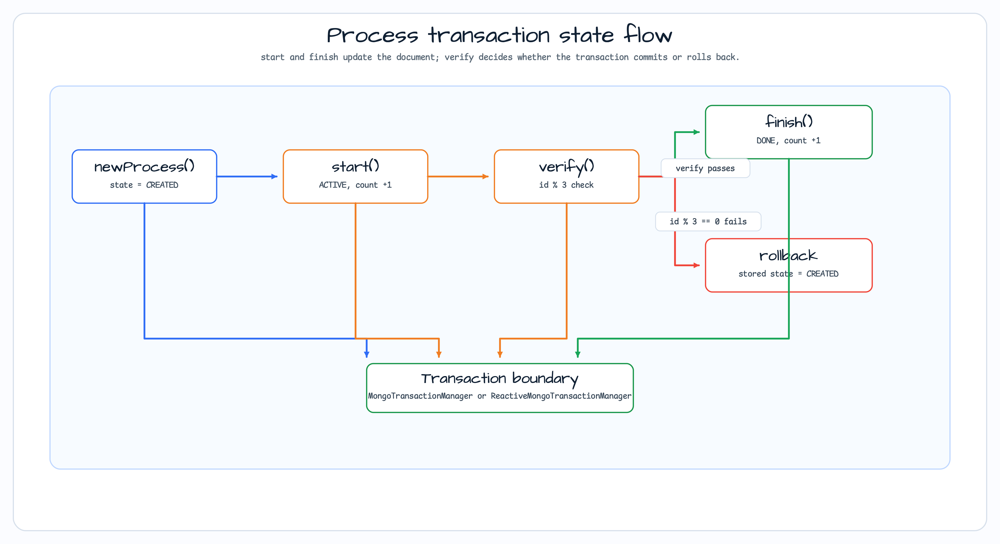

# Spring Data MongoDB Transactions

[한국어](README.ko.md) | English

This module compares imperative, reactive, and coroutine MongoDB transaction styles over
the same `Process` state machine. Each service creates a process in `CREATED`, moves it
through `ACTIVE`, and either commits `DONE` or rolls back to `CREATED` when verification
fails.

## What this example shows


The tests share `MongoDBServer.Launcher.mongoDB` and create either blocking or reactive
Mongo clients. Imperative tests install `MongoTransactionManager`; reactive and coroutine
tests install `ReactiveMongoTransactionManager`.

## Transaction state flow



| Style | Service | Transaction boundary |
|---|---|---|
| Imperative | `TransitionService` | `@Transactional fun run(id)` with `MongoTransactionManager`. |
| Reactive chain | `ReactiveTransitionService` | Reactor chain without a declarative transaction boundary. |
| Reactive managed | `ReactiveManagedTransitionService` | `@Transactional fun run(id): Mono<Int>` with Reactor context session binding. |
| Coroutine managed | `CoroutineManagedTransitionService` | `@Transactional suspend fun run(id)` with Reactor context bridged into coroutine execution. |

`verify(process)` throws for every third process id. Successful runs persist `DONE`;
failed runs keep the stored document at `CREATED`, proving rollback.

## Process document

| Field | Role |
|---|---|
| `id` | Integer process id generated by an atomic counter |
| `state` | `UNKNOWN`, `CREATED`, `ACTIVE`, or `DONE` |
| `transitionCount` | Incremented by `start()` and `finish()` updates |

## Build and test

```bash
./gradlew :spring-data:mongodb-transactions:test
```

## Reference

- [Spring Data MongoDB transaction sample](https://github.com/spring-projects/spring-data-examples/tree/main/mongodb/transactions/README.md)
